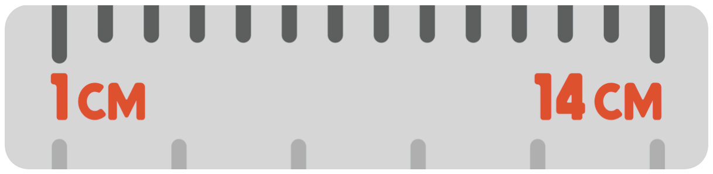
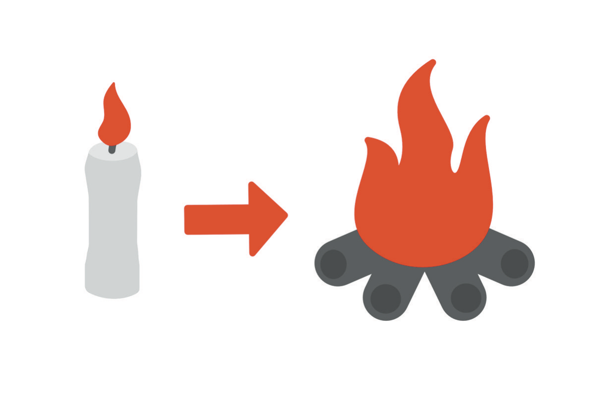

# Fourteen Centimeters

Fourteen centimeters.

In most contexts it is an unremarkable measurement, about the length of a pencil, something you could span with your hand. Inside the abdomen of a child who was not yet two years old, it was enormous.

I noticed that one side of my son Adrian's abdomen looked different from the other. He seemed perfectly healthy otherwise: running around, climbing on things, behaving exactly like a toddler who had no reason to believe anything was wrong with him. Still, the asymmetry bothered me.

I was a physician, which in that situation was both helpful and terrible. Medical training gives you a vocabulary for things you would sometimes prefer not to understand. When something looks abnormal, your mind starts generating possibilities. Most of them are benign. A few are not. I wanted the benign ones, badly, and I could feel myself reaching for them the way you reach for a handrail.

Imaging showed a mass in his abdomen measuring approximately fourteen centimeters.

There are moments when time behaves strangely, when a few seconds contain an entire future. I looked at the images and understood enough to be afraid. On the screen it was pushing his small organs aside, and it was all I could see. Adrian's illness was far outside my specialty: I knew enough to understand how serious it was and nothing about how to fix it. That night I stayed up reading whatever I could find, hoping more knowledge might make it easier to digest. It did not.

The mass was eventually diagnosed as clear cell sarcoma of the kidney, a pediatric kidney cancer so rare that it affects roughly a dozen or so children a year in the United States and Canada, according to the cooperative group that studies these tumors.[^intro-1] Within about two weeks Adrian went from healthy toddler to cancer patient with a surgical date. The tumor came out in one piece. A week later he began vomiting green bile, and the cause turned out to be an intussusception, in which one segment of the bowel telescopes into the next and obstructs it, so the surgeons went back in.[^intro-2] After surgery came radiation, and after radiation came more than six months of chemotherapy, a regimen that would be hard on the body of a healthy adult, let alone a boy still small enough to be carried in my arms.

Most of my adult life had gone into learning medicine, and suddenly I was on the other side of it. I knew what a central line was and why a fever during chemotherapy could become an emergency, why blood counts mattered, why a child with a severely suppressed immune system could end up admitted for an infection that another child would shake off at home in front of Cocomelon. Knowledge did not make any of it easier. In some ways it made the uncertainty worse, because I could see every branch of the decision tree and had no way to prune it. In the hours when he slept, exhausted from treatment, I worried the way parents worry: whether he would make it to his next birthday, and whether I would be strong enough to see him through it.

Medicine had trained me to solve problems in sequence. Examine the patient, gather data, generate a differential diagnosis, order the appropriate tests, make a plan, reassess. There is great comfort in the idea that if you understand a problem well enough you can control it, and I had built a career on that comfort. Then my child got cancer, and I discovered the boundary between knowledge and control. I could read everything ever published about his disease, understand the protocol, talk with his physicians as a colleague, advocate for him, and make sure nothing important was missed. What I could not do was guarantee that my son would live. That was unbearable, and it was one of the first times in my life when achievement stopped working as a defense.

## The Achievement Machine

Achieving things had been my talent for as long as I could remember. I grew up in a family where education mattered; my parents were Vietnamese immigrants who built careers in health care, medicine ran through the family tree, and science came naturally to me. Berkeley came first, then medical school at the University of Michigan, then surgical training, then dermatology, then fellowship. For years there was always another mountain conveniently waiting behind the one I had just climbed, and that structure suited me. Give me an objective and I will work backward from it. Tell me there are a thousand pages to learn and I will make a study schedule. Put a difficult problem in front of me and my natural response is not to retreat but to lean forward.

That trait has served me extraordinarily well, and it has also gotten me into trouble. There is a point at which confidence becomes overconfidence, action becomes compulsion, and ambition becomes identity. A hammer is a useful tool. It should not be your response to every object in the house. For much of my life achievement was my hammer: if I was unhappy I looked for another goal, if I felt uncertain I gathered more information, if I wanted freedom I tried to make more money, if I wanted control I built more systems. This works remarkably well until you encounter something that cannot be outworked. Cancer was one of those things, and it forced me to consider a possibility that had barely occurred to me before: that a meaningful life might not simply be the result of solving enough problems.

* * *

That question eventually became the first edition of this book. I began thinking seriously about burnout, particularly among physicians, because medicine is an almost perfect laboratory for studying high achievement. The profession selects for people who can delay gratification for absurd lengths of time. Study now and enjoy yourself later. Work hard in high school so you can get into a good college, work hard in college so you can get into medical school, work hard in medical school so you can match into residency, survive residency and fellowship so you can finally become an attending physician. Then you arrive, and some of us look around and think, *This is it?*

Founders know a version of this feeling, and so do lawyers, executives, athletes, academics, creators, and anyone else who organizes life around the next milestone. You tell yourself that the next achievement will change something fundamental. When the company reaches a certain valuation you will relax; when you make partner you will have arrived. When you buy the house, lose the weight, publish the book, get the title, sell the company, or reach the number, you will finally be able to exhale. Then the milestone comes and you feel something, and it lasts an hour, or a week, and your mind quietly moves the finish line.

The first *Burn-In* was my attempt to understand that cycle. The basic idea was that burnout feels as though life is burning us from the outside in: jobs, administrators, schedules, money, family, bureaucracies, and other people all seem to be applying heat from every direction. My response was to reverse the direction. Burn in. Turn inward. Develop enough awareness, agency, gratitude, and emotional strength that the external world no longer dictates your internal state. I pointed out, with the pleasure of a man who believes he has noticed something, that the word *burnout* has the word *out* in it. I still believe in that idea, more strongly today than I did then. But I understand it differently.

## I Was Wrong About Something Important

The first time I wrote this book, I leaned too far into the idea that the solution was internal. Change your mindset, take responsibility, let go of resentment, stop seeing yourself as a victim, choose happiness. There is truth in all of those ideas, and there is also a dangerous distortion hiding inside them, which is that the outside really is on fire some of the time. Some of the time you are being exploited, the business is failing, the relationship is unhealthy, someone lied to you, you are sick, or your brain is not functioning the way it should. Some of the time the organization needs to change, not your attitude toward the organization, and the correct response to an intolerable situation is not to become more tolerant but to leave.

The distinction matters. I used to believe that personal responsibility meant that if I was suffering, I should immediately look inward for the solution. Today I would put it differently: personal responsibility means being willing to see reality accurately enough to decide what to do next. That may require inner change or outer change, and usually some of both. Agency is not the belief that everything is your fault. Agency is the belief that your next move still belongs to you. I learned that distinction the hard way.

* * *

When I wrote the first edition of *Burn-In*, I believed I had created substantial financial security through real-estate investing, and I thought I had solved one part of the burnout equation. Money meant options. Options meant freedom. Freedom meant I would never again feel trapped by a career, an employer, a schedule, or a circumstance. That was the theory, and I wrote it down with some pride.

Then parts of the financial world I had built began to unravel. Several of the commercial real-estate transactions I had entered were connected to a person I had trusted, and that person was later convicted of federal bank fraud and sentenced to prison. Long before I knew how that story would resolve, I became terrified that the consequences would destroy me financially. I believed I could be exposed to liabilities approaching ten million dollars. I imagined bankruptcy, and I imagined losing everything. More importantly, I began to believe that losing everything would prove something about me: that I had been arrogant, that I had squandered the opportunities I had been given, that despite all the degrees and training and work, I had failed. The financial problem became an identity problem, and then the identity problem became something much more serious.

I became depressed, and for a long time I hid how bad it was. The work continued. So did the problem solving, the calls with lawyers, and the functioning, well enough that most people had no idea what was happening inside me. Eventually functioning was no longer enough. There is a chapter later in this book about what happened next, and I will tell you the truth about it. For now it is enough to say that I survived something I should not have survived, and that afterward I had to reconsider nearly everything I thought I knew about withstanding hard things, including what I had written in the first version of this book.

## High Performance Has a Blind Spot

There is a particular reason I am writing Version 2.0 for ambitious people. High performers have tremendous advantages during adversity: we are resourceful, we know how to learn, we tolerate discomfort, and we keep moving when other people stop. The problem is that strengths create blind spots precisely because they work so often. If pushing harder has solved ninety percent of the difficult problems in your life, pushing harder becomes automatic. When you are known as the person who can handle anything, admitting that you cannot handle something becomes psychologically threatening. Uncertainty begins to feel irresponsible once everyone depends on your confidence. And if success has always restored your self-esteem, failure can feel like more than an event; it can feel like the disappearance of the person you thought you were.

That is what I did not understand the first time. The highest performer in the room is often the person least likely to admit that the current strategy is killing them, because they can still produce, still lead, still smile. The machinery is running. Nobody is looking at the temperature gauge.

* * *

Another thing I understand differently now is the word *burnout* itself. We use it casually. "I'm burned out" can mean that someone is exhausted, or hates their job, or has been working too many hours for too many months. It can also mean that someone is depressed, or anxious, or sleeping three hours a night and making increasingly erratic decisions. Those are not the same problem, and one danger of labeling every form of suffering "burnout" is that burnout sounds relatively safe. It sounds occupational, temporary, fixable with a vacation.

I believed for years that I understood burnout because I had experienced it in surgical training, and at one point during that period I thought about jumping from a parking garage. In the first edition I wrote about that thought and then minimized it, telling myself and the reader that it was not "real" suicidality because I did not believe I would actually do it. Years later, I would jump from a parking garage. There are sentences from your younger self that become almost unbearable to reread, and that is one of mine. I include it here because revision should not mean pretending the first version never existed, and because the contradiction taught me something. Being intelligent does not make you objective about yourself. Medical knowledge did not protect me from rationalizing what was happening in my own mind, high achievement did not protect me from illness, meditation did not make me invulnerable, money did not make me safe, and confidence did not mean I was right. None of those things was worthless. The lesson was that none of them should have been asked to carry the entire weight of a human life.

## The New Question

The first edition asked how we avoid burning out. I think there is a better question now: how do we build a life that can hold our fire without being consumed by it? I do not want you to extinguish your ambition, and I certainly have not extinguished mine. Building is still what I love most: ideas, technology, medicine, making something where nothing existed before, and the company of people who refuse to accept that the current version of the world is the final version. Ambition is not the enemy. But ambition needs a container. Fire inside a fireplace heats a house; the same fire on the living-room floor burns it down.

What contains ambition turns out to be ordinary: self-knowledge and a body that is looked after; relationships with people who can tell you the truth; humility; financial margin; boundaries; systems that do not depend on your mood; rest; meaning; the ability to change your mind and to say you were wrong; and enough identity outside your work that one professional disaster does not erase the entire person. None of that is an obstacle to high performance. It is infrastructure for it.

This book, then, is not about becoming less ambitious. It is about becoming harder to destroy. Not invulnerable; that fantasy caused enough problems. Harder to destroy means connected enough to be found, aware enough to read your own temperature gauge, and able to take a hit without deciding that the hit defines everything that follows. We will talk about achievement and ego, because I know both intimately. Money gets a chapter, but not because I am going to teach you how to build a real-estate portfolio; it deserves a place in any serious conversation about freedom, but it is a tool, not a verdict on whether your life is working. Mindset gets its due without becoming magical thinking. And we will talk about failure and shame, depression and mental illness, suicide and survival, work and fatherhood, relationships and health, risk and recovery, and what it means to build again after your own certainty has been shattered.

Some of the ideas from the first edition remain almost exactly as I wrote them. Keep a beginner's mind. Be kind. Think critically for yourself. I need them more now than when I first put them on the page, especially the last one, so think critically about this book too. You do not need another guru, and you do not need me to tell you exactly how to live. Take what helps, question what does not, and modify the framework until it fits the life in front of you rather than the life somebody else is selling. Nobody needs you to become me. What I hope is that you become more fully yourself, without requiring the external world to constantly certify that the person you are becoming is worthy.

* * *

I still love the metaphor that gave this book its name. A small flame is fragile; a draft can extinguish it. Feed it, protect it, give it the right environment, and it becomes stronger, until eventually it produces warmth and light far beyond itself. That is the image I had when I first wrote about burning in.

I understand the metaphor differently now. The point was never to build an infinitely large fire, because too much fire destroys. The harder task is learning what your fire is for: when it needs fuel and when it needs air, when it is spreading somewhere it should not, when someone else's fire is burning through your walls, when you need help putting something out, and which parts of your life deserve heat and which deserve quiet. What I want to explore with you is not how to escape your life, or win every game, or become permanently happy, but how to remain present in a life that will inevitably contain victories, losses, uncertainty, love, pain, mistakes, beauty, consequences, and second chances. How to build a life you can stay in.

Fourteen centimeters began the first version of this story. I thought my son's cancer had taught me everything I needed to know about uncertainty, and it had taught me a great deal. Life had more to teach me.

This is the version of the book I had to survive to write.
