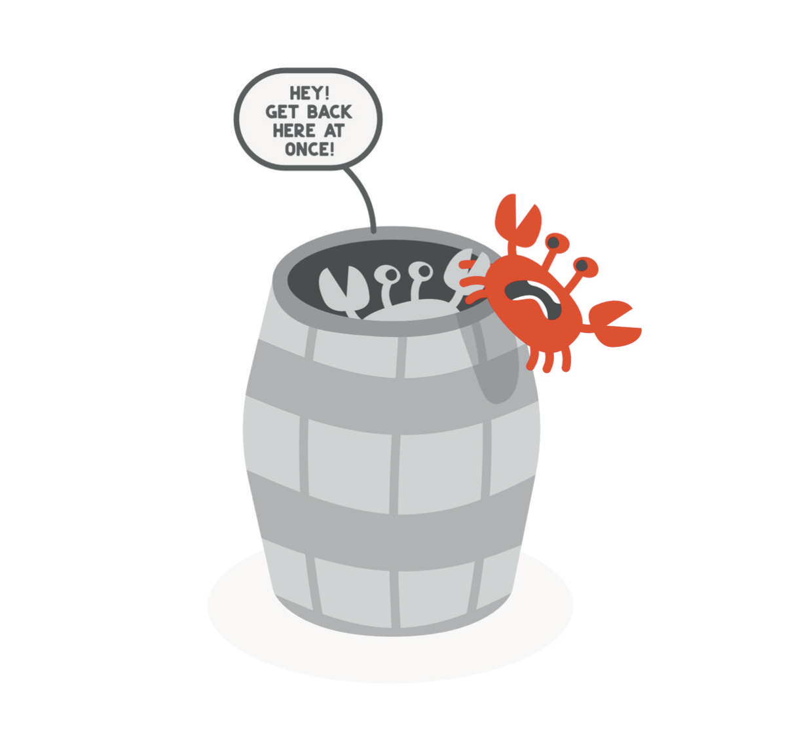

# Where Am I Going?

The first thing that broke was not a test. I had spent most of my life preparing for the possibility that a test would break me, and I had a study schedule ready for it. What broke instead was something I had never thought to protect, because I had never noticed I had it: control over my own hours, my own body, and my own mouth. To explain that, I have to back up a little, into the clinical years of medical school, because the thing that would take me apart in residency was already visible there, and I had already found a way to call it training.

Medical school is often described as drinking from a fire hose, and the description is accurate but incomplete, since a fire hose at least points in one direction. The material in the preclinical years is roughly what you meet in upper-level college biology, biochemistry and genetics and the rest, except that where a college course gives you a semester, medical school gives you a week. Then it gives you another week, with a new subject in it, and then another. There is no moment when the volume relents so that you can consolidate; you consolidate or you do not, and the next week arrives either way. Many schools grade those years pass or no pass, which takes some of the edge off, until you learn that honors and high pass also exist and that some of your classmates have organized their lives around them. You spend nearly all your waking time with the same few dozen people, partly because there is no time to know anyone else, and most of them will help you. There are study groups, shared notes, a real generosity. And a few of them are not, as they say on reality television, there to make friends. Every medical school has its stories of gunners, the students trying to beat everyone on the curve, and the stories usually involve pages torn out of a library textbook the night before an exam. I never saw it done. I saw enough to believe it happens.

I have to be honest about which side of that line I was on, because in the first edition I put myself on the right side of it and added an exclamation point. On my pediatrics rotation I was reading a great deal, and during a friend's patient presentation I spoke up with what I knew, and kept speaking, and by the end of it I had made the residents feel bad about themselves and my friend feel worse. I wrote, in 2021, that this was totally unintentional. It was unintentional in the sense that I did not set out to hurt anybody. It was entirely intentional in the sense that I set out to be seen, because I was insecure enough that week to need it, and being seen at somebody else's expense is the whole definition of showing off. Afterward I could not understand why everyone had gone cold on me. The gunner never can.

* * *

That episode was my introduction to the fact that the rules had changed and nobody had circulated the memo. For as long as I could remember, my life had been tests, grades, and projects: absorb an enormous quantity of material, then demonstrate to my professors and to myself that I knew it better than anyone in the room. That skill is not nothing; it got me into the room. But the clinical years run on a different game, and the game is this: a medical student in a hospital is not useful to anyone. You cannot write orders, you cannot operate, you know too little to be trusted with a patient and too much to be left alone, and everyone around you is working at the edge of their capacity. What you can do is make the resident's life easier. Pull the labs before anyone asks for them. Write the note. Know where the family is sitting. Do the scut work cheerfully, and the resident will say a good word to the attending, and the attending will write your evaluation, and your evaluation will help decide where you spend the next several years of your life. Being the smartest person on the team is not enough. You have to be the most helpful person, and the nicest, and preferably invisible until the moment you are needed.

I did not get it. Science had always come naturally to me, and this was not science; it was a set of social rules that nobody would state out loud, and I had spent my entire life in classrooms where the rules were printed on the syllabus. Looking back, what those rotations demanded was surrender, which is a word I would have rejected at the time. For two years my lectures had been recorded, so I never went to them. I watched them at double speed at home when I felt like it, ate what I wanted when I wanted, and went to martial arts or the gym twice a day. Without noticing, I had built a life in which every hour answered to me. Then rotations began and I had to be in the hospital at four in the morning, on the dot, to pre-round on the surgical patients before the residents arrived, which means checking every patient's overnight vitals and labs and drains so that you can present them in ninety seconds to people who have not slept either. The sun was not up. Nobody cared what I wanted for breakfast. "It just sucks" is what I wrote in the first edition, and I stand by the clinical precision of that sentence. You lose control of your own time and your own space, and the loss is not described as a loss. It is described as training.

There is a theory of this, which I absorbed at the time and which I now think deserves more suspicion than I gave it: that you are being broken down so that you can be built back up as a doctor. Some of that is true. Judgment under fatigue has to be learned somewhere, and there is no way to learn it while rested. But breaking a person down is also simply what happens when you take away their control, and calling it a curriculum does not change what it does to them.

The first job most medical students get on a surgical rotation is to cut a suture. The surgeon ties the knot, lifts the two tails, says "cut," and you cut them to the correct length, which is a length nobody has told you and which changes from surgeon to surgeon. Your hands shake, because the surgeon is a tough guy who is ready to come down on you for one wrong move, and because your hands have not yet learned that they are hands in an operating room. Your palms sweat inside the gloves. *Am I going to do this right? Is this cut going to decide the rest of my career?* Over a cut. And not a cut in a patient's skin or muscle, either, but a piece of thread, with scissors, which is a skill they teach in kindergarten. There I stood in what amounted to the twentieth grade, afraid that a skill I had mastered twenty years earlier might suddenly fail me and undo everything I had built on top of it.

* * *

In the first edition I asked, more or less, why some doctors have to be jerks, and whether it is in a surgeon's nature or only in a surgeon's training, and I left the question open because I did not know. I still do not know, but I can describe the culture more exactly now. Quizzes in medicine are not graded privately. You are roasted in front of your peers. Say there are four of you rotating on surgery, and the attending takes you aside and asks what exits the inferior vena cava at this level, and which renal artery comes off the aorta first, the left or the right. Or he asks for the causes of pancreatitis, and when someone offers scorpion sting, he says, "Great job. Which species?" Four students race to answer, because the point of the exercise is not the answer. The point is to establish, in front of the attending, which of the four of you deserves to be there. The term for this is "pimping," and the term tells you most of what you need to know about the energy in those rooms, regardless of anybody's gender. Sometimes the questions were clinically relevant anatomy or etiology. Sometimes they were "Why are flamingos pink?" or "Which eighties musician is responsible for this terrible song I insist on playing in the operating room whenever I do a major case?" I answered a fair number of them correctly. I still do not know the song.

For me there was an additional layer, and it took me years to see it as a layer rather than as a defect. I come from an Asian family, and in the culture I was raised in, children are seen and not heard. You show respect by being quiet and reserved and by not making a scene. Western medicine rewards the opposite: the person who speaks up, who sounds confident, who has the answer out of his mouth before he has finished having it. If you are quiet, people conclude that you do not know, or are not paying attention, or are not a team player. If you were raised to believe that shouting out answers is rude, you will never seem smart, no matter how much you know. This was hard for me, and it stayed hard for a long time. I was shy, and it took years to find a voice that carried in those rooms, and longer to learn to use it not only when I knew the answer but when I saw something that was not right. I had been taught not to rock the boat. Boats in hospitals sometimes need rocking.

I want to say something fairer about that culture than I said the first time, and then something harsher. The fairer thing is that pimping has a function. Medicine is practiced under pressure, in front of other people, with incomplete information, and a person who cannot think while being watched cannot do the job. Being wrong out loud and surviving it is a skill, and the operating room is where I learned it. The harsher thing is what else it taught. When the reward goes to the student who always has the answer, you learn very quickly never to be seen not having one. You learn to look composed while lost. You learn that the appearance of competence is scored and the admission of trouble is not, and you learn it in your mid-twenties, while you are still deciding what kind of person to be. I got very good at that lesson, better than I was at anatomy, and I did not think of it as a lesson at all. I thought of it as professionalism.

* * *

I matched at Indiana University, into an integrated plastic and reconstructive surgery residency, which is one of the more competitive things a medical student can match into and which I had wanted with the whole of the machine I described in the last chapter. Six years. That was where I would learn everything a plastic surgeon needs to know, and where, I had decided, I would become a master of reconstructive burn surgery, the kind of work that had opened a man's hand in Ann Arbor.

Here is what I learned about burn surgery from inside it. Most of it is not reconstruction. Most of it is acute care: when somebody comes in from a fire, the work the surgeons do in the first days and weeks is what keeps that person alive, and it is skin grafting, critical care, and fluid management, hour after hour. Skin is an organ, and when a large area of it is gone the body can no longer hold its fluid in or keep infection out, so you replace what you can with grafts and manage the rest with lines and numbers. The operations are not pretty little flaps. They are massive grafts, performed in an operating room kept hot because a patient without skin cannot keep himself warm, and you are surrounded: the anesthesiologist, the residents, the scrub techs, the perioperative nurses, and after that the ICU team who will carry the patient through the night. I could see that even if I one day became captain of that ship, I would not have anything like total control over the work. What I would have was total responsibility.

Imagine a twenty-year-old kid burned in a fiery car crash, and imagine being the one who sits down with his family to talk about withdrawing support, because even if he survives, what survives will be a life of constant pain, unable to walk or eat or move or breathe on his own. That conversation is part of the job. It is a necessary part, and there are surgeons who do it with a grace I admire, and I could see myself doing it for thirty years and could not find, anywhere in me, the wish to. For as long as I could remember, this work had been central to my idea of who I was, what I was meant to be doing, and where my life was going.

And I was miserable.

I remember thinking, more than once, *Is this what I signed up for?* I wanted out. In the first edition I described how badly I wanted out in a few sentences that I am going to reproduce almost exactly as I wrote them, because what I did with them matters more than what they say.

> I just wanted to escape. It was so bad that I remember, at one point, thinking, *I should just jump off the top floor of this parking garage and be out of it.* That was a dark moment. I've never had major depressive disorder. As a physician, I know all the diagnostic criteria for clinical depression. Looking back, I can say that it probably wasn't a true moment of suicidal ideation—I don't think I would have actually done it.

Years later I jumped from a parking garage, and that story belongs to Chapter 5, where I will tell it plainly and once. What I want to do here is read the paragraph above the way I would read a note in a chart, because I have read thousands of them and I know what a careful clinician's note looks like and what a defensive one looks like. Here is the sequence. A thought of jumping from a specific place, a place I was standing in, phrased as a course of action. Then, in the very next sentence, a diagnosis excluded: never had major depressive disorder. Then the credential: I know the criteria. Then the verdict, delivered with the hedge that makes it sound judicious: probably not true ideation, I don't think I would have done it. And then, a few lines later in the original, the reassurance that I was not in the kind of crisis that would have required admission to a psychiatric ward, as though the only two states available to a person were fine and committed. If a patient had said those sentences to me in that order, I would have recognized every one of them. They are what people say when they want you to stop asking.

The man who wrote that paragraph had every advantage a person can have in looking at his own mind, and he used all of them to look away. What intelligence and training gave me was not objectivity. It was vocabulary, and vocabulary is exactly what you need to dismiss something with precision. A layperson who has had that thought can only say "I'm fine," and the people who love him can hear how thin it is. A physician can say "this does not meet criteria" and then list the criteria, and the listing sounds like an examination. It was not an examination. It was a verdict, reached before the exam began, with the exam's own language borrowed to announce it. The diagnostic criteria for depression are a tool for looking at a person. I used them as a reason not to look at one, and the person was me. I would have failed a medical student for ruling out a diagnosis without examining the patient. I did it to myself, in print, and then I recorded the audiobook.

I do not think the paragraph was a lie. It was the best account available to a man who needed it to be true, and I notice now that the paragraph knows better than its author. It says, in the middle, that just because I was not in crisis "doesn't mean it's something I can brush off," and then in the next paragraph it brushes it off. It pivots to a statistic about the profession, and from the statistic to gratitude that my own struggles were not as severe as some of my colleagues', and from gratitude to "my mission" of confronting physician burnout. That is the reflex I described in the last chapter, running at full speed. A thought about ending my life became, within four sentences, evidence of a problem in other people and a cause I could lead. The conversion was so smooth that I did not notice it was a conversion. A mission is a wonderful place to put a thought you do not want to have.

About that statistic. In the first edition I quoted a figure for the number of physicians who die by suicide each year, with a comparison to the general population, and attributed both to a study I had not read. I could not find the study when I went looking for it for this edition, and I am not going to repeat the figure. What the better evidence says is less dramatic and more useful. A 2024 meta-analysis in the *BMJ* pooled thirty-nine studies from twenty countries and found that male physicians die by suicide at roughly the same rate as the general population, while female physicians die at a rate about three-quarters higher; the rates have declined over the decades, but in the most recent period female physicians were still about 24 percent more likely to die by suicide than the general population.[^c02-1] I mention the correction for two reasons. One is that I asked you in the Introduction to think critically about this book, and that has to include the parts I got wrong. The other is that a statistic about a profession is a way of not talking about a person. The false number let me place myself, comfortably, on the safe side of a large and tragic problem. The real ones say only that being a physician protects no one, and that some of my colleagues are at markedly higher risk than others, and neither fact had anything to say about the resident in the garage. He was not a data point. He was a person with a specific thought in a specific place, and he had already decided not to take himself seriously.

* * *

What I was searching for at the time was escape, and I went looking for it the way I went looking for everything, which was methodically. I emailed an old pathology professor from medical school. My reasoning was that a specialty in which I never spoke to a patient might be less taxing, mentally and emotionally, than one in which I told families their sons would not walk again. Pathology is not an easier specialty; it is a different one, and I knew that. But what I heard back, from him and from the people he put me in touch with, told me something I have never forgotten: their department regularly fielded inquiries from burned-out residents looking for a way out of clinical medicine. I was not an original. I was a type, and the type was common enough that pathologists had a routine for it.

I did not actually want to be a pathologist. I had another idea, and it was an old one. Before I matched into plastic surgery I had considered dermatology. The hours are good, the pay is good, and you are unlikely to be called in at two in the morning to a car fire. What had held me back was what I believed plastics offered and dermatology did not: the chance to change someone's life in an operating room. I loved the geometry of the work, and I still do. Designing a flap is a problem in tension and blood supply, in which you have to move skin from where there is some to where there is none without killing it on the way, and when it is done right the eye cannot find the seam. My training was teaching me to do this across the whole body, from cleft lips to hand surgery to breast reconstruction. As an intern I had the rare privilege of standing in on a joint case with neurosurgery on a two-year-old with craniosynostosis, a skull whose seams have fused too early, so that the bone has to be taken apart and reshaped to give the brain room to grow, and my job was to protect that brain with my hands while the reshaping happened. I have never since been unclear about why people do this work.

And yet the more I thought about it, the more clearly I saw that I did not want to do every kind of surgery. I wanted to master a few operations and do them very often and very well. That is a different ambition from the one I arrived with, and it took me some time to admit it was mine, because the one I arrived with was more impressive.

Plastics and dermatology overlap enough that it was not difficult to get to know the chair of the dermatology department at Indiana, Steve Wolverton, whose name carried some clout because he had written a well-known pharmacology textbook. One day I said to him, more or less, "I don't think I'm happy in plastic surgery. I think I'm supposed to be a dermatologist." That is a strange sentence to say out loud to the chair of a department you do not belong to. He took me under his wing anyway, and that led, through a series of conversations I will spare you, to a dermatology residency in Washington, DC, in a newly opened position at Howard University Hospital that the Veterans Affairs medical center was generously funding. From there I came home to California for a fellowship in Mohs micrographic surgery, which became my specialty.

Here is what Mohs surgery is. A patient comes in with a skin cancer on the nose, or the ear, or somewhere else on the face where every millimeter matters. The surgeon removes it, then reads the margins personally under the microscope, while the patient waits, to see whether all of the cancer came out. If it did not, the surgeon goes back for more, but only where the slide says to. When the margins are clear, the reconstruction begins, and the reconstruction is exactly the part of plastic surgery I had fallen in love with: local flaps, designed on the spot, to restore a nose's contour and its breathing after a large cancer has come out of it. It was the perfect hybrid of dermatology and the thing that had drawn me to plastics in the first place. It was also fast. A DIEP flap, in which a woman's own abdominal tissue is moved with its blood vessels to rebuild both breasts after mastectomy, is one of the great operations of my former specialty, and it can take twenty hours. A reconstruction after skin cancer takes ten or twenty minutes. The patient goes home the same day with the cancer gone and a face that still looks like a face. This was work that changed lives, and it was work I could finish before lunch, and that turned out to be a far better match for who I actually was than the work I had thought I was for.

* * *

Leaving plastic surgery was not something I did lightly, and I did not do it alone. Once the idea had a shape, I went looking for people who had been where I was, plastic surgeons much further along in their careers, and I asked them two things: whether they were happy, and whether, given the chance to do it all again, they would make the same choices. A lot of them were candid with me. A lot of them said, "Probably not."

One of them, Adam, told me: "I'm fifty-five years old, and I don't have a family. I don't have kids. Going back, did I make the right decisions? I don't know." Another, Bill, was the father of a resident I had rotated with back in Michigan; his son had followed him into plastic surgery, which you would think was a vote of confidence in the life. Bill said, "I didn't spend a lot of time with my children when they were young, and so I feel like I missed out on them growing up. That is something that I regret."

This was years before Adrian was born. I had no children to miss and no particular plan for having them, and I still heard those two men clearly, because what they were describing was not a regret about surgery. It was a regret about a life arranged around surgery, and I could already feel my own life beginning to arrange itself the same way. I have thought about them often since, and more often since Adrian. Had I not listened to the part of me that knew I was on the wrong road, I would have been a different father, if I had been one at all, and I have no confidence that I would have liked him.

I want to be precise about what I was choosing, because in the first edition I framed it as intuition, tuning out the noise to hear what I really needed, and that is true but incomplete. Leaving an integrated plastics residency for dermatology is, on paper, a step down. It looks like quitting. To the part of the profession that keeps score, it looks like a man who could not take it, and I knew people would read it that way, and some did. What I was actually doing was the first thing in my adult life that ran against the machine. I was choosing a life over a résumé. I did not have those words at the time; I had a feeling of misery and a feeling of relief, and I followed the relief, and it was the right call, and I would make it again tomorrow. I also want to admit that I made it the way I made everything, decisively and with a plan, and that I took from the experience exactly the wrong lesson, which was that I possessed a reliable instinct for when to leave.

* * *

I said I would come back to the culture I trained in, and I want to do it with a picture from the first edition that I still like. If you have been to a seafood restaurant or a fish market and seen a bunch of crabs in a barrel, you may have noticed that there is no lid. There does not need to be one. Any individual crab could climb out, but as soon as it gains a little height, another grabs it with its pincers and pulls it back down, and the barrel stays full until the cook arrives. Crabs do not know any better. Humans do, and we run our training programs that way regardless. The senior residents pull on the juniors because they were pulled on; the attendings who were roasted do the roasting; the medical students learn that the way up is to make sure the student beside them is a little lower. What I asked in the first edition, and still ask, is what would happen if we worked together to get out of the damn barrel.

Since then I have come to think the barrel is not mainly a story about mean people. It is a story about a structure. Nobody in a barrel designed the barrel, and most of the individual crabs, lifted out and interviewed, would tell you they were only trying to climb. A national survey series found that 62.8 percent of American physicians reported at least one symptom of burnout in 2021, the year the first edition came out, and that the figure was 45.2 percent two years later, and you do not arrive at numbers like those by adding up individual weakness.[^c02-2] You arrive at them through hours, hierarchy, and a culture that scores composure and penalizes candor. I want to hold both halves of this at once, because the first edition could not. The culture was real, and it was not the whole story, since a good many of the pincers holding me down in those years were my own. The one who decided that four in the morning was an insult rather than a shift was me. The one who heard "which species of scorpion" as a verdict on his worth was me. Outside and inside both mattered, and the first edition, having been written by a man who believed he had climbed out, mostly wanted to talk about the inside.

By the time I finished fellowship I had done a hard thing correctly, and I knew it. I had left the specialty I told everyone I was for, and left it well; I had found work that fit my hands and my temperament, that changed a person's life before lunch and let me read my own margins and repair my own defects and go home. I had listened to two older surgeons and taken their regrets seriously years before I had anything to lose. By any reasonable measure that is a good outcome, and I drew from it the conclusion that a young man with my history was always going to draw. I concluded that I was now safe. The hard part of my life had been the choosing, and the choosing was done, and a life chosen correctly would hold. What I had not noticed was that in choosing the life I had also agreed to terms, and that the terms were the same ones every ambitious person I have ever met signs without reading. The next chapter is about what they say.
