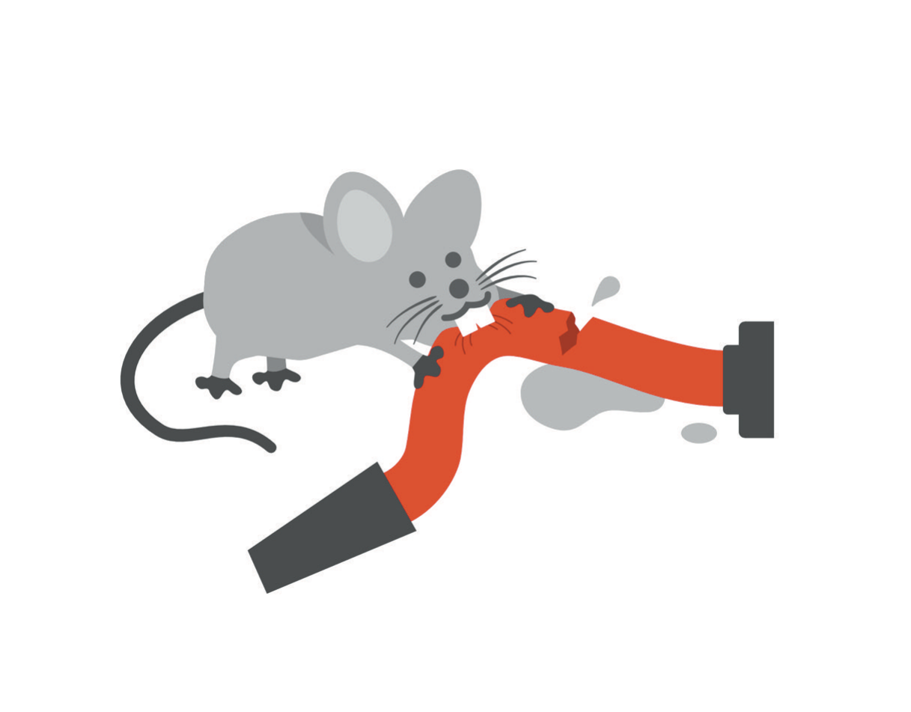

# The Achievement Bargain

The salary was exciting. I want to admit that plainly, because the first edition of this book was a little coy about it, and because anyone who has finished a long training and received the first real paycheck at the end of it knows exactly the feeling I mean. For a decade and a half I had been a student, then a resident, then a fellow, all of them job titles that mean "person who is paid very little to work very hard on the promise of later." Later had finally arrived, with a direct deposit attached. I had chosen well. I had left a specialty that was making me miserable for one that fit me, trained in a procedure I loved, and picked a town where my skills were needed and a house was within reach. Anyone looking at my life from the outside would have said, correctly, that I had made it.

What I did not see, and could not have seen, was that "making it" is a phrase from a contract I had never read. I had been performing under its terms since the yearbook, and before the yearbook, and I had never once asked what the terms were, because nobody had ever shown them to me. Nobody signs this contract. You are enrolled in it, the way you are enrolled in kindergarten, and it renews every year by the simple fact that you keep showing up. This chapter is about that contract. I have come to call it the achievement bargain, and I think most ambitious people are party to some version of it whether or not they ever set foot in a medical school. Medicine just happens to print it in unusually large type.

Read as a contract, the terms are not complicated. You give up the present in installments: your twenties, your sleep, your evenings, the years in which your body forgives everything you do to it. In return you receive a title, an income, and a promise that at some point you will feel the way the title sounds. The fine print, which I did not read for thirty years, says that the date of arrival will be set by the other party, that the other party may move it, and that the other party is you.

* * *

Here is the arithmetic, as I put it in 2021. Most people finish high school, which is twelve years of school. Some go on to college, which adds four. For doctors, double it. I went to the equivalent of the 25th grade, and I was not joking when I wrote that, or not only joking. Twelve years, four more, four more, then residency and fellowship, and at the end of it a man in his thirties who had spent every year since the age of five inside an institution that told him where to be, when to be there, and what he would be tested on next. That is a great deal of practice at being told. Medical training calls the result discipline, and some of it is. Some of it is simply the habit of handing your time to whoever is standing at the front of the room.

The previous chapter described what those years felt like from the inside, and I am not going to repeat the misery. What I want to look at here is the structure, because the structure is the bargain, and the bargain is not unique to medicine. Every long apprenticeship has the same shape. You give up the present, in a series of installments that each look reasonable, in exchange for a future in which you will finally be the person all of this was for. An associate gives up her thirties for partnership. The founder gives up his sleep and most of his friendships for a valuation. A resident gives up the decade in which his college roommates learned to cook, bought furniture, and figured out what a retirement account was, for the right to be called an attending. In every case the installments are small enough to pay and the promised return is large enough to justify them, which is what makes it a bargain rather than a robbery. Nobody would sign up for the whole thing at once. You sign up for one more year.

The installments include money, and it is worth being concrete about that, because the first edition was, and because the concreteness holds up. When I was a resident in Washington, DC, my salary was low enough that I qualified for affordable housing, and I took it. I did not get a credit card until I had finished medical school. That kept me out of the trap of spending money I did not have, and it also meant that I spent years not building a credit history, which is one of those small facts about adult life that everyone around you seems to have absorbed at twenty-two and that nobody in a hospital ever mentions. Nobody in a hospital mentions money at all. Professors do not talk about what they make. Students whose parents are paying the bills are not encouraged to say so. It is faintly disreputable to be interested in the subject, as if wanting to live in a house and provide for a family were a distraction from the calling. I wanted to do good for society. I also wanted a house. The training had a great deal to say about the first and nothing at all about the second, and eighty-hour weeks do not leave room to learn on your own what the curriculum leaves out.

In the first edition I turned this into a complaint about how doctors are set up to fail, and I followed it with two pages about administrators, insurers, and the media's rich-doctor stereotype. I will give all of that one sentence now: some of it is true, and none of it is the point. The point is what the years do to a person's sense of what is normal. If you spend your twenties getting by when you are capable of much more, getting by becomes the baseline, and "more" becomes a place you will visit later, once you have earned it. Later is the load-bearing word in the whole bargain. It is where you store everything you are not doing now.

Medicine runs this experiment at a scale that gets measured. When the first edition came out in 2021, a national survey of US physicians found that 62.8 percent reported at least one symptom of burnout, up from 38.2 percent the year before; by 2023 the figure had fallen to 45.2 percent, roughly where it had stood in 2011.[^c03-1] I quote those numbers for one reason. They move with the world. A figure that jumps by more than twenty points in a single year and then falls back is not measuring a character flaw in the people surveyed, and the first edition, which located the entire problem inside the reader's head, had no way to account for it.

* * *

Then you arrive, and the bargain pays out, and for a while it is everything it promised. I remember the pleasure of that first year in practice: doing the exact operation I had trained for, on patients who needed it, in a town where nobody else was doing it. I am not going to pretend the money was incidental. After a decade of scrimping, income is a physical sensation, and the sensation is wonderful.

I should say something here about what the trained person tends to do with his freedom, because it surprised me when I noticed it in myself and in my colleagues. For many people who make it through the gauntlet, the easiest next step is to take a job with a large medical employer, and the appeal of that job is not mainly the salary. It is that it is more of the same. You work when they tell you to work, you see the patients they assign to you, and you get, in short, what you get. To someone who has spent twenty-five grades being told where to stand, being told where to stand is restful. That is the bargain's second clause, and it is written in smaller type than the first: the years do not only defer your life, they make you good at deferring it, and skill at deferral does not switch off on graduation day.

And then, as I wrote in 2021 with what I now recognize as the authority of a man about two years into it, the bloom wears off. Trust me, I wrote, it does wear off. You start to get angry about things you did not expect: the paperwork attached to a simple visit, the bureaucracy you were never taught to see, the administrator who overrules you and who would not last a day in your shoes. Relationships turn adversarial, with patients who will not listen and employers who do not see it your way. And the purchases start. Why shouldn't I have a nice car? Why shouldn't I have the house with the extra rooms? I have earned it. That sentence, I have earned it, is the bargain's receipt, and a person who has deferred for twenty-five grades will present it for everything.

I understood all of this in 2021, and I said so, and I said it about other doctors. What I did not understand was why. I thought the problem was that nobody had taught us about money, or that the systems we worked inside were badly designed, and both of those things are true. The deeper problem is that the bargain does not end when it pays out. It is not built to. Arrival is not a state you enter; it is an event that happens once, lasts about a week, and is followed by a quiet renegotiation in which the mind, having received exactly what it was promised, discovers that it meant something slightly different. The attending job was supposed to be it. Then the practice had to grow. Then there was a house, and then a bigger one. A person who has been trained for twenty-five years to treat the present as a down payment on the future does not know how to stop making payments. He knows only how to find the next thing to make them toward.

I have watched this happen to people who never set foot in a hospital. A friend of mine sold his company, an outcome he had worked toward for the better part of a decade and had described, the whole time, as the thing that would finally let him breathe. Within a month he was back at a desk building the next one. When I asked him why, he did not talk about money. He said that sitting still felt like dying, and he said it without irony, as a plain description of a physical state. Lawyers who make partner describe a version of the same thing: partnership turns out to be a job with a larger draw and a smaller life. Physicians who finish paying off their loans feel, for about a week, free, and then find something else to owe. The specifics vary; the structure does not. What you were working toward turns out to have been a place to put your working, and when it is gone, the working needs a new home more urgently than you need a rest.

The first edition had a name for the grammar of this. Have, do, be. First I must have the thing, then I will do the thing, then I will be happy. Once you have a million dollars, you will take the vacation, and then you will be happy; once you have ten million, you will retire, and then you will be happy. I pointed out that if you are unhappy making three hundred thousand dollars a year, you are not going to be substantially happier making a million or ten million, because the money does not change who you are or where you are standing. That paragraph still seems correct to me. I would add only that I wrote it while doing precisely what it describes, and that the man writing it could not see this, because his number had quietly changed units. The number was no longer a salary. It was a portfolio, and a portfolio does not feel like a have-do-be number while you are building it. Building one feels like prudence. That is the bargain's best disguise. It lets you diagnose the disease in everyone around you, accurately, while you are running a fever.

* * *

There is a Vietnamese proverb my family would recognize, and I quoted it in the first edition, though I garbled it. *Không ai giàu ba họ, không ai khó ba đời.* No one stays rich for three generations, and no one stays poor for three generations. I told it in 2021 as a warning about the far end of the cycle: the grandson who inherits a practice he never wanted, the trust fund that seems bottomless until it is not, the kid at the club ordering bottle service with money he did not earn. The middle of the cycle got a gentler treatment. The second generation, I wrote, had seen the struggle up close and was determined to make its parents proud, and I wrote that sentence as if it described a family other than mine. I was pointing, as usual, at someone else.

What I hear in the proverb now is a schedule, and my place on it. Someone leaves. The next one makes the leaving worth it. The one after that forgets. My grandparents and my parents left a country, a language, and a war so that the generation after them would have what they had not, a story the first chapter of this book tells and I will not retell here. I was that generation. Nobody in my family ever said that my job was to make their sacrifice worth it, and nobody had to. It was in the air of the house, in the framed diplomas and the dinner tables full of physician relatives, and it was the most honorable version of the achievement bargain I know. That is exactly what made it so hard to see as a bargain. When the debt you are working off is love, and the creditors are your parents, and the currency is the one thing you happen to be extraordinarily good at, the arrangement does not feel like a deal. It feels like who you are.

The trouble with a debt of that kind is that no statement ever arrives. You never learn what the balance is, so you never learn when it is paid. Berkeley did not pay it. Michigan did not. Not fellowship, not the first practice, not the first book. Each one felt, for about a week, like the payment that would clear the account, and each one turned out to have been a minimum payment on a balance that quietly compounded. The immigrant child's version of the bargain has the same clause as the founder's and the associate's, written in warmer ink: the terms can be renegotiated at any time by the party you cannot see, and the party you cannot see is you.

* * *

The bargain has to be paid in something, and it is paid out of whatever is not on the scoreboard. Sleep goes first, because sleep is the only line item in a resident's day that nobody is grading. Then the body. In January 2020, a few months after Adrian was born, I looked in the mirror and did not see myself. The man there was the heaviest I had ever been. Chapter 9 is about the body and returns to that mirror, so I will not linger; what interests me here is the accounting. By then I had been giving people health advice for a living for years, and I had let my own body become the account I drew on when the others were overdrawn, because a body does not appear on a résumé and cannot file a complaint. Neither can the people you love, or not for a long time. They go third. The bargain consumes, in order, the things that cannot be measured by the people who are measuring you, and it does this so gradually that each withdrawal looks like a reasonable trade.

I told a story in the first edition about a rat. I had trouble with the refrigerator in a house I had recently moved into, and I called my handyman, who pulled the refrigerator away from the wall and found that a rat had gotten into the walls and chewed through the water line, because chewing hoses is what rats do and the refrigerator seemed like a good source of water, which rats, like every living thing, need. The rat got its drink. It also put air in the line, and once there is air in a water line the water stops running, so the rat had destroyed the very thing it came for. In 2021 I told that story about people who chase money no matter where it comes from, leaving trails of destruction behind them. I was, once again, describing other people.

I read the story differently now, because I have been the rat. The rat was not greedy. The rat was thirsty, and it went at the nearest supply with the only tool it had, and the supply happened to be the thing that kept it alive. Achievers do this. We do not mainly consume other people's resources to feed the next goal; we consume our own. Sleep goes to finish the project, the friendship goes to make the deadline, the body goes to get through the year, and each bite is locally rational: this one night, this one missed dinner, this one quarter. Water comes out. The goal gets fed. What we cannot see, from inside the wall, is that the hose we are chewing is our own supply line, and that the water stops when the air gets in, not gradually but all at once.

* * *

What was the bargain for? I asked myself that question seriously only after it had stopped working, and the answer, when it came, was not achievement. Achievement was the currency. What I was buying with it was safety. Somewhere very early I had learned that being very good at things was how I knew I was all right, and the bargain simply scaled that up: if I was good enough, credentialed enough, successful enough, then nothing could touch me. Nobody could take a summa cum laude away. Nobody could un-match me. A man who has never failed at anything that mattered comes to believe, without ever saying it, that failure is a thing that happens to people who have not worked hard enough, and that he has worked hard enough. That belief is the bargain's real product. The salary and the title are packaging.

By then the bargain had also done its quietest work, which is on grammar. I did not do surgery; I was a surgeon. I did not invest; I was an investor. Ask a physician at a party what he does and he will tell you what he is, and he will not notice the substitution, because it happened so long ago and was rewarded so consistently. When your work is what you do, a bad year is a bad year. When your work is what you are, a bad year is a verdict, and it is a verdict on the only self you have. None of this was visible to me in 2021, when the number of zeroes in my bank account was, as I wrote, irrelevant to who I was. The zeroes had never been threatened. Neither had anything else that I could not outwork.

I want to be fair to the bargain, because it works. It worked for me for more than thirty years, and it produced things I am proud of and would not undo: the training, the hands, the operation I can do in my sleep, the patients who kept their noses. Deferred gratification is not a disease. The capacity to trade the present for the future is one of the most useful things a human being can learn, and I would not want a surgeon who lacked it. Nothing is wrong with the bargain as a bargain. What went wrong is that it was the only deal I knew how to make, and that I had come to believe it covered everything.

It covers everything that responds to effort, which for a person like me had been, for a very long time, everything that had ever happened to him. Then one side of my son's abdomen looked different from the other, and I met the first thing I could not outwork, and I converted even that into a lesson within a year and wrote a book about it. The bargain survived. It would take something else, later, to break it, and I will get there. First I have to tell you about the machinery that kept me from seeing any of this while it was happening. I would have called that machinery confidence, and I would have meant it as a compliment. The next chapter is about ego, about confidence, and about the difference between the two, which I did not know existed.
