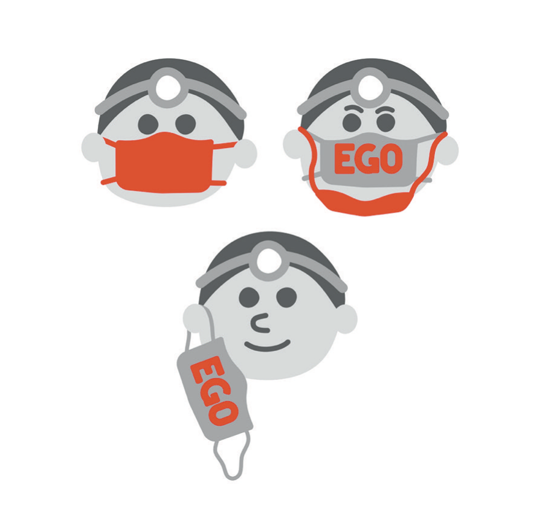
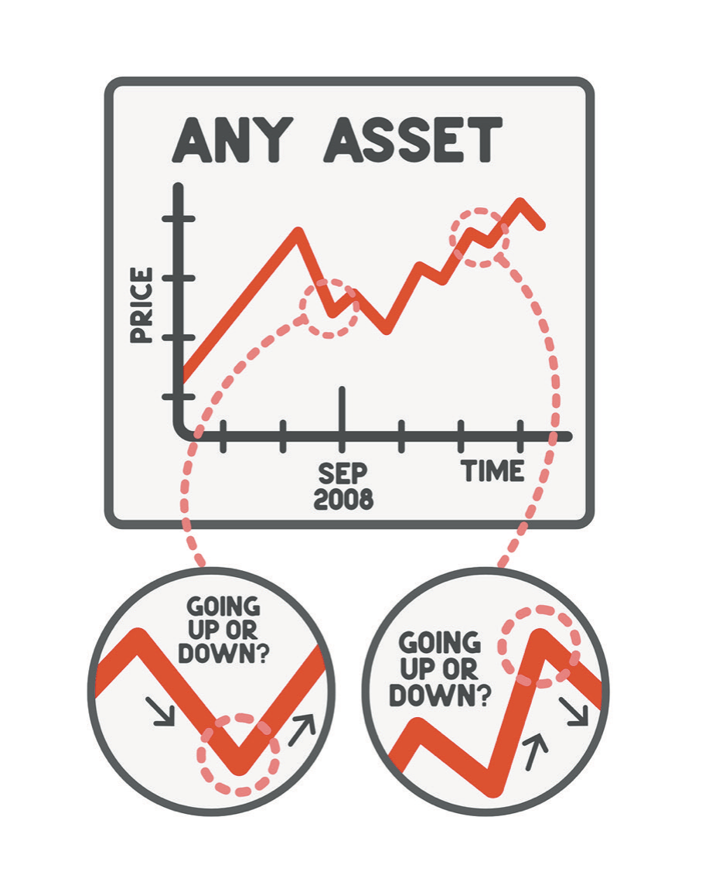

# Ego, Confidence, and Blind Spots

If you are rolling your eyes because here comes another doctor telling you to shed your ego and live a life of service, you are not entirely wrong, and I am going to get there. First I want to defend the thing.

My ego is why any of this happened. Ego is what printed "Berkeley, Class of 2010" under a seventeen-year-old's face before a single admission letter existed. Ego is what made a bad organic chemistry grade intolerable rather than merely disappointing; I had an idea of myself as the guy who gets the good grade, and watching that idea take damage felt like holding a bunch of balloons and seeing one of them pop. The pop was useful. It sent me to the tutor and the practice problems and, eventually, back to the top of the class. Stress and pressure get a bad name in books like this one, and I am not convinced they deserve it. Something has to make you get up. For a long time, and still on plenty of mornings, the thing that gets me up is a self-image that would be embarrassed by the alternative.

There is a version of ego that shows up in my clinic every week, and it is not vanity. When I walk into a room to meet someone whose skin cancer I am about to remove, I have a few minutes to accomplish something that has no shortcut. The patient might be ninety years old, somebody's mother, somebody's grandmother, with her daughter sitting in the corner chair watching me closely. I am proposing to cut that woman's face. Nothing about the situation is natural; human beings are not built to hand a stranger a knife and a nose. What has to happen in those minutes is that a person who does not know me decides to trust me, and the raw material I have for that is everything I have ever read and every operation I have ever done and the plain fact that I believe I can do this well. That belief is ego. Without it I would be a man mumbling about margins, and she would feel it, and she would be right to.

Medical school is a place where egos abound, for better and worse. Everybody there wants to impress the attending, absorb the most, be the one who shows the most promise. That is ego, and if you removed it from the building the building would not run. So I want to be precise about which part of it is the problem, because "have less ego" is useless advice, roughly on the level of "be less tall."

Consider Beyoncé, who is not a person I would have expected to end up in this book. In 2011 she performed at the Billboard Music Awards with a wall of video duplicates of herself behind her, and the routine required her body to stay in exact sync with the recorded versions, with no do-overs and nowhere to hide.[^c04-1] The rehearsals for it appear in a documentary she directed two years later, and they are punishing: the same moves, over and over, a person at the top of her profession grinding through repetition that a lesser artist would have delegated or simplified. Then, on camera before the show, she says she may have bitten off more than she can chew. She sounds tired. She admits she does not know whether it is going to work.

Does Beyoncé have a big ego? Obviously. She also has the other thing, the part that says out loud, to a camera, that she is not sure. Watch what would have happened without it. A performer with the same ambition and none of the doubt stages the same expensive spectacle and does not rehearse it into the ground, because why would she; she is Beyoncé, and people will come regardless. The audience can always tell. That is the failure mode, and it is not too much ego. It is ego that has stopped taking in information.

* * *

You do not have to look far in medicine for the version that has stopped taking in information. A certain kind of surgeon believes he is God's gift to the earth, and I have written before that some of them seem to need a servant trailing behind them holding a little velvet pillow at exactly the right height, not too hot and not too cold, Goldilocks style. There is a reason the playboy plastic surgeon with the obnoxious red sports car is a stereotype, and I say that with love for my plastic surgery friends and colleagues, with whom I hit the interview trail and now share patients.

The problem is not personality. It is what an unchecked ego does to a team. These are the people who create cultures where it is acceptable to scream at nurses and interns and anyone who looks at them wrong. They steamroll patients rather than spend the extra four minutes that would put a frightened person at ease. They believe nobody in the room is as smart as they are, which is occasionally true and never relevant. And they are the ones who might, on the wrong day, take off the wrong leg, because the patient is asleep and cannot advocate for himself and nobody else in that room feels safe saying, "Doctor, I think we're on the left."

The first step in not being that guy is accepting that you are not always right. Can you tell me, with complete confidence, that you have never made a mistake, that you have the answers? Get a grip, dude. You are one set of eyeballs and one brain, carrying whatever you happen to have lived through, whatever textbooks you read, whatever media you consumed. I know, because I have been there, and I thought I knew it all. I did not, and neither do you. Happily, the correction costs almost nothing. Take the humility pill and you will find more joy in your own life, and you will find that people respect you more, because what you were getting before was not respect. It was fear wearing respect's clothes.

I learned that from a nurse, in the worst possible way, which is the only way I seem to learn anything.

It was early in my plastic surgery residency. She paged me about a patient in serious pain who needed something ordered. Consider my qualifications for that page: medical school, a childhood spent around physicians, a lifetime of preparation aimed precisely at moments like it. I was terrified. The opioid dose would not come to me, and neither would enough confidence in my own assessment of the pain to commit to a number. So I took a long time getting back to her, because I was looking it up and hemming and hawing and, in the end, running it past my senior resident, which is what I did with every question I had that year. There was a patient in a bed in pain the entire time.

I am sure she was furious with me. She had a suffering patient and a new doctor who could not produce an answer, and she had seen this movie every July of her career. Nurses joke about it publicly; scroll through their feeds around the end of June and you will find the annual warning that if you have a choice, do not get sick on July 1, because that is the day the new residents start. It stings when you are the new resident, because you have worked so hard to get there and you are about to work eighty hours a week trying to be good. It also occurs to me now that I never once tried to imagine the other side: twenty years on a unit, and every summer a fresh batch of twenty-six-year-olds arrives to tell you how to do your job.

At the end of the rotation I bought a cake for the nurses, which is the standard gesture. Then I took that particular nurse aside and said something that was not standard. I told her I remembered when I started, that I had not known what I was doing, and that it had been wrong of me to handle it that way.

She was floored. She thanked me, and then she said the sentence that has stayed with me for more than a decade: no doctor had ever done that.

I have thought about that reaction for years, and what I keep landing on is that it is a small indictment of an entire profession. Not because the apology was hard; it took ninety seconds. Because in a career spanning decades, nobody had spent the ninety seconds. Doctors and nurses spend an enormous amount of energy bickering and sniping across a line that should not exist, and the ego required to maintain it is expensive and, as far as I can tell, purchases nothing.

The reason it took me until the end of a rotation to say ninety seconds' worth of true sentences is that I did not have the skill. Humility gets discussed as though it were a temperament, something you either have or do not, when in practice it is a set of specific and learnable moves. Saying I do not know, out loud, in front of people who expect you to know. Asking the person with twenty years on the unit what she would do, and then doing it. Naming the thing you got wrong before anyone else has to name it for you, which is both decent and, incidentally, the only version that anyone believes. None of those came naturally to me at twenty-six. All of them are cheaper than the alternative, and every one of them would have been available to me for free on the night she paged.

There is a challenge I put to readers in the first edition, and I still like it, so I will put it to you in a plainer form. Think of a time you were locked into a power struggle at work, the kind where the actual subject stopped mattering somewhere in the second week. Now run it twice. Once with the other person setting their position down, and once with you setting yours down first. Most people find the first version easy to imagine and the second one physically uncomfortable, and the discomfort is the finding. It tells you roughly what the position is costing to hold.

I can give you the version from an operating room, because it is the one I care most about. A scrub tech who has done four thousand of these cases says, quietly, "Doctor, are you sure about that flap?" There are two available responses. One of them protects my standing in the room for the next ninety seconds. The other is to stop, look again, and say either "You're right" or "Here's why I'm doing it this way," both of which are answers rather than defenses. What makes the second response hard is not that it is complicated. It is that some part of me experiences a question as a challenge to whether I belong at the head of the table, and that part is neither the surgeon nor the adult.

* * *

The larger correction came later, and it came in a way I still cannot fully explain.

I had started meditating at home, and I wanted to take it more seriously, so I went on a retreat in the fall of 2020. I did not know what to expect, and my expectations were not high; I was a very logical guy who wanted a randomized controlled trial before believing much of anything. Sitting there, in whatever state that was, something came through with more clarity than any thought I have ever had. I am not going to make a claim about its source. What it said was: *you don't know shit*.

I laughed. Then I sat with it, and the longer I sat the more it looked like a gift rather than an insult. What I had been handed was permission to not know things, which sounds trivial and is not, particularly for someone whose entire identity was built on knowing them. For a few days afterward I was noticeably different at work, to the point that my office staff commented on it. "You're being uncharacteristically nice today. What happened?" I was not ready to explain a meditation retreat to my front desk, so I told them it was the new car, a white Tesla with the falcon-wing doors that draw attention in a Modesto parking lot. I had opened this chapter's ancestor in the first edition by asking why we get so excited about new cars, and then within a few pages I told my staff that a new car had changed my personality. The irony was not lost on me. It is still not lost on me.

A few months later there was a second retreat, and something happened there that I am going to leave to Chapter 9, which is where the practice belongs. The part that belongs here is what it did to the ego. For a while, on a mattress in a room full of breathing strangers, the constant low effort of being a particular person with a particular reputation was simply set down, and the relief of that was out of all proportion to anything I had expected. I had not known how much I was carrying, which is the standard finding whenever anyone puts anything down.

What I took from it at the time, and got wrong, was that something in me had been permanently rearranged. I told people so. What had actually happened is that I had visited a place. Years later I would find out how little the visit protected me, and that is not a knock on the place. It is a fact about visiting.

Ram Dass has a line I keep returning to. He was born Richard Alpert, became a tenured psychology professor at Harvard, went to India in the 1960s, and came back a different person with a different name and a book that introduced a lot of Westerners to ideas they had not encountered. In 1997 he had a stroke that left him dependent on other people for the rest of his life. He came to describe it as grace: "I don't wish you the stroke," he said, "but I wish you the grace from the stroke."[^c04-2]

I loved that line in 2021, and I used it to justify a sentence of my own that I now want to take back.

I wrote, more than once, that Adrian's cancer was one of the best things that ever happened to me. I understand what I was reaching for. Something in me did change during those months, and the change was real and I am not sorry to have it. But that sentence, as written, says that a two-year-old's kidney cancer was good, and it was not good. It was a catastrophe that happened to a child who did not consent to teach his father anything. The growth that followed was mine; the cancer was his. I got the grace, and he got the central line, the radiation field across his spine, the feeding tube, the hair. Ram Dass, notice, was talking about his own stroke. He did not say it about somebody else's.

There is a version of gratitude that becomes a way of not looking at things, and that sentence is where mine crossed over. In the first edition I described my superpower as the ability to find the grace in every moment, and I meant it as a triumph. I no longer think it was a lie, exactly. I think it was a real capacity that had quietly taken on a second job. Finding grace in a moment is a wonderful thing to be able to do. Being *unable to sit in a moment without finding grace in it* is a different thing entirely, and from the outside they look identical, including from the inside.

* * *

Now the part I could not have written in 2021, because it requires knowing how the story goes.

Confidence and judgment are not the same faculty, and nothing in my training taught me to tell them apart. Confidence is a feeling about your own competence. Judgment is the accuracy of your assessment of a situation. In a field where you have thousands of repetitions, the two run together closely enough that you can treat them as one thing: when I feel certain about a margin under the microscope, I am usually right, and my certainty is data. That is what expertise is. Ten thousand cases have calibrated the feeling.

The trouble is that the feeling travels and the calibration does not. My confidence is a Mohs surgeon's confidence. It was built by removing skin cancers from faces and reading the slides myself and being told by reality, within the hour, whether I was right. Take that same feeling into a conference room where somebody is explaining a commercial real-estate structure, and it is worth precisely nothing, and it does not feel like nothing. It feels exactly the way it feels in the operating room, because it is the same feeling. It is generated by the same person.

It is worth being technical about how a feeling gets calibrated, because the requirements are strict and almost nothing in adult life meets them. You need repetitions, many of them. The feedback has to be fast, so the answer arrives while you still remember what you were thinking, and it has to be unambiguous, a yes or a no rather than a maybe. Finally, the environment must stay roughly the same between repetitions, so that what you learned last time still applies this time. Mohs surgery meets all four. I take a layer, I read it myself within the hour, and the slide tells me whether my judgment about that margin was correct, hundreds of times a year, on tissue that behaves the same way in March as it did in January. That is a training set.

Now score a commercial property deal on the same four criteria. The repetitions are few. The feedback arrives in years rather than hours. It is ambiguous when it arrives, because a deal that went badly can be blamed on the market and a deal that went well can be credited to your genius, and both explanations survive contact with the evidence. And the environment does not hold still; interest rates and credit conditions and everybody else's appetite for risk change underneath you. On all four counts, that domain cannot calibrate anybody. It can only make them feel calibrated, which it does very efficiently, because the feeling is generated internally and does not require permission from reality.

It did not help that the years in question made everyone look correct. Draw a chart of any asset over that stretch and it goes up and to the right, which means every decision anyone made was validated within a few months, and validation is the fuel my whole system runs on. In the first edition I mocked amateur stock pickers at some length, asking whether they had ever read a balance sheet, whether they really thought they could beat the quants with fiber-optic lines into the exchange. It is a good passage. I was writing it while making decisions in another asset class using nothing more rigorous than the confidence of a man whose charts had all gone up.

I also had a piece of received wisdom that I repeated in that book with real enthusiasm: you are the average of the five people you spend the most time with, so if you want to grow, get yourself into rooms with people worth ten or a hundred times what you are worth. I did that. Some of what I found there was genuinely valuable, and I met people who were generous with their time in ways they had no obligation to be. Here is what I did not understand. Proximity to people with large numbers is not competence, it is proximity. And a room where everyone's chart is pointing the same direction has a defect that nobody in it can see, which is that it has no mechanism for telling you that you are wrong. Everyone there is being confirmed at the same time by the same conditions. The advice should have a second half: get in rooms with people who are further along than you, *and keep at least one person in your life whose job is not to be excited*. I had the first half. I did not have the second half, and I had spent years arranging my life so that the second half would be hard to find.

One of the people connected to those rooms would later be convicted of bank fraud in federal court. I am getting ahead of the story, and I will tell it properly in its own place.

What I want to leave here is the shape of the blind spot, because the shape is the useful part and it generalizes past me. A blind spot is not a thing you are missing. It is a place where your instrument reads normal. My instrument for evaluating situations was a feeling of certainty that had been carefully calibrated by a decade of surgical repetitions, and it reported *normal* in rooms it had never been tested in. Expertise did that. Not arrogance, exactly, and not stupidity. Expertise, doing precisely what expertise is supposed to do, in a context where it did not apply.

Everything in this part of the book has been building toward one setup: a man taught early that being excellent is how you earn your place, carrying a bargain that fused his identity to his output, running a reflex that converted every piece of bad news into gratitude before he had finished reading it, and equipped with a confidence that felt like knowledge in rooms where he knew nothing. Each of those, taken alone, is a strength. I would not remove any of them from a young person I cared about.

Assembled, they make a person who cannot be told anything by anyone, including by himself.

If there is anything usable in this chapter, it is that the correction cannot come from introspection, and I say that as someone who introspects for a living and enjoys it. A blind spot cannot be found by looking harder in the direction you are already looking; that is what makes it one. It has to be reported to you by somebody outside your head, and that means the useful question is not whether you are humble. It is structural, and it is answerable in about a minute. Who, in your actual life, has told you that you were wrong about something important in the past year? Not disagreed with you politely, and not lost an argument to you. Told you, and been right, and been listened to. If the answer is nobody, that is not evidence that you have been right all year.

I could have answered that question in 2021 with a list of names. What I could not have told you is that every person on the list had an interest in my momentum continuing, including me.

Then the story I had been telling about money stopped being true.
