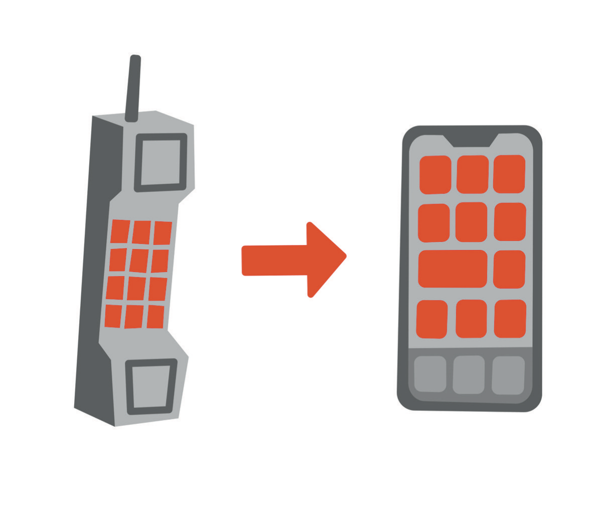

# More Than Burnout

For about a decade I used the word burnout the way I use the word "spot" when a patient points at their forearm: a placeholder that lets the conversation keep moving until somebody looks closely. I put the word in the title of a book. I recorded the audiobook, so I have also said it aloud into a microphone more times than I could count. Colleagues said it to me in hallways and I said it back, and neither of us ever asked what the other one meant. It is a comfortable word. It suggests that you worked hard, that the fault lies somewhere in the schedule, and that a long weekend would put most of it right.

In the first edition I gave the word a definition of my own. "Burnout is a feeling of not having enough money, time or both to do what you love with those you love." A few pages later I made a joke I was proud of: even the word burnout has the word *out* in it, as though the blame belonged to the outside world, when the real work was on the inside. I meant it. That joke was the thesis of the whole book compressed into a syllable, and like most compressed things it left a great deal out. It left out the possibility that the inside could break in ways that had nothing to do with attitude.

The World Health Organization has a definition too, and it is more careful than mine was. In the eleventh revision of the International Classification of Diseases, burnout appears as an occupational phenomenon rather than a medical condition: "a syndrome conceptualized as resulting from chronic workplace stress that has not been successfully managed."[^c06-1] It has three dimensions: exhaustion or depleted energy; a growing mental distance from the job, or cynicism about it; and a sense that you are no longer any good at the work. Then comes the sentence I had never read closely. The term "refers specifically to phenomena in the occupational context and should not be applied to describe experiences in other areas of life." There is a fence around that definition, and for years I had been grazing on both sides of it.

By that standard, what I had in surgical training was probably burnout in the strict sense. I was exhausted, I had begun to resent work I had wanted for most of my adult life, and I had started to doubt whether I was any good at it. The fix, in the end, was occupational: I changed specialties, and the exhaustion and the cynicism did not follow me into dermatology. That is roughly what the WHO's definition predicts. Chronic workplace stress, unsuccessfully managed, then successfully managed by walking out of the workplace.

What happened to me in the years after the first edition does not fit inside the fence at all. My work was the one part of my life that kept functioning. I operated in the mornings, read my own margins under the microscope, and reconstructed what I had removed, and my professional efficacy, to use the WHO's phrase, was intact. Whatever was wrong with me, it was not that the job had worn me down. The job was the last floor that held. Calling it burnout was not just imprecise; it pointed the search in exactly the wrong direction, toward my calendar, when the problem was in my head.

* * *

The National Institute of Mental Health describes major depression in plain language. To be diagnosed, a person must have symptoms most of the day, nearly every day, for at least two weeks, and those symptoms must include a depressed mood or a loss of interest or pleasure in things.[^c06-2] Two weeks. I had been carrying a version of those symptoms for far longer than two weeks, and I could have recited the list they were on. I had recited it, for exams, on rounds, and in one memorable sentence in my own book.

The sentence is from the first edition, in a passage about a bad moment in surgical training that Chapter 2 has already taken apart. "I've never had major depressive disorder. As a physician, I know all the diagnostic criteria for clinical depression." I want to add only what strikes me about it now, reading it as a clinician rather than as the person who wrote it. It uses knowledge as an alibi. I know the criteria, therefore I would know if I met them, therefore I do not meet them. Every step of that little syllogism is wrong, and if a medical student had said it to me about a patient I would have caught it in about four seconds. Knowing the criteria for a disease has never once protected anyone from having it. It only changes the quality of the excuses.

Doctors are famously bad patients, and I was a textbook case. We take medication from the sample closet instead of making an appointment. We read our own labs, interpret our own imaging, adjust our own doses, and we call this efficiency. In the first version of this book I called it the hypocritical oath, and I meant the fried chicken and the cigarettes, the things we tell patients not to do and then do ourselves on the drive home. I did not think to include the more dangerous version, which is treating your own mind with the confidence you earned treating other people's skin.

The habit was already on the page in 2021. Describing the months of Adrian's treatment, I wrote that I put on a brave face at work and that many of my patients did not have a clue what was happening at home, and I wrote it as a point of pride. Mental illness, in my private taxonomy, was something that happened to patients, a category of people I referred elsewhere. It was not something that happened to a Mohs surgeon with a full schedule and a book about mindset.

Suppose a patient had described my nights to me across the surgical drape. She wakes before dawn with fear already running in her body, fully formed, before any thought has arrived to explain it. The fear is about money and about a legal matter she cannot control and will not discuss. She has told almost no one. She is still at work every morning, competent, pleasant, on time. I would not have said burnout. I would have stopped what I was doing, asked the questions I was trained to ask, and made a referral before she left the room. That is what the training is for. The training simply never told me that the patient could be the one holding the scalpel.

* * *

The word flatters us, and that is most of its power. Burnout says you worked too hard. Depression says something is wrong with you. Among ambitious people the first is close to a credential and the second is a liability, so we reach for the first every time, and the people around us, who are also ambitious, nod along. Founders talk about burnout over dinner the way surgeons talk about call. It is a story in which the sufferer is the hero and the villain is the calendar, and nobody has to see a doctor at the end of it. I have watched people in my own profession accept the label gratefully, the way you accept a diagnosis of "a virus" from a walk-in clinic: it may be true, and it will get you out of the room.

There is a second reason high performers prefer the word, which is that it is temporary by construction. Burnout has a cause you can name and a cure you can schedule. Take the vacation, change the job, fix the workflow, hire the assistant. I believe in all of those, and a later chapter is about designing them, because a great deal of real suffering in demanding careers is structural and should be treated structurally. But when the structural fixes do not work, or when there is nothing structural to fix because the work is the only thing that still works, the word starts covering for something else. A vacation does not treat depression. It relocates it.

* * *

The first edition had a chapter called "Mindset Over Matter," and it opened with a phone. You know the message: the new operating system is incompatible with your old hardware. I wrote that a scarcity mindset was a person endlessly trying to update software when what they needed was new hardware. A paragraph later I wrote that while you cannot swap out your brain ("yet!"), you can choose to live in an abundant world, and that choosing to do so upgrades your mental hardware, and that this takes you "from You 1.X to You 2.0." I have reread that page several times. Somehow the hardware ended up on both sides of the analogy, which should have told me something about how well I understood it. Then, apparently, I named this edition after it.

Here is the version I would write now. The brain is hardware. I once described the body as a meat bag held up by sticks, and the brain is the wettest part of the bag: it runs on glucose and sleep, it is bathed in whatever you put into your bloodstream, and it inherits its wiring from people you have never met. Mood is a thing the hardware does. Mindset, the stories you tell about your circumstances, where you point your attention, the gratitude I had worked hard to get good at, is software, and good software matters enormously. Most of this book is about it.

But no software update fixes a cracked board, and anyone who has kept an old phone alive knows the cruel part: it keeps offering you the update. The home screen looks the same. From across the room, the thing works.

When my father's heart condition was diagnosed during Adrian's treatment, nobody suggested he fix it with gratitude, and nobody told me to reframe my fifty percent chance of carrying the same variant. A heart is hardware, and the correct response to hardware is a cardiologist. I extended that courtesy to every organ except the one I was using to think about it.

* * *

So what was the hardware problem? I do not have a single answer, and I have learned to distrust people who do, including the version of me who wrote the first edition. What I have is a list of contributors, and the honest thing is to take them one at a time and say, for each, how sure I am.

Start with the obvious one. For a long stretch I lived under severe financial and legal stress of a kind I had never experienced and had not believed could happen to me. The previous chapter tells that story and I am not going to tell it again. What matters clinically is its shape: chronic rather than acute, uncontrollable rather than solvable, and aimed at my identity rather than my bank balance. Stress is not a diagnosis. It is, in my experience, the most reliable way to find out what a person's brain was already inclined to do under load, and mine had inclinations I did not know about.

Depression is the second, and about this one I am no longer uncertain. I met the description the NIMH gives, and I met it for far longer than two weeks. I kept working through it, which I would once have offered as proof that it could not be depression, and which I now understand proves nothing except that I am stubborn and had a full clinic. The depression was largely hidden, so well hidden that almost nobody understood how bad it was. A hidden depression is in one respect worse than an obvious one. No one can treat what they cannot see, and that includes the person carrying it.

Fear I count separately from worry, because worry is a thought and what I had was not a thought. I would wake at night, or in the dark before a call with attorneys in the Midwest whose mornings began before mine, with terror already present, fully assembled, before any idea had shown up to justify it. The idea would arrive a moment later, usually about money, and then the two would feed each other until it was time to shower and go to work. The body can be afraid on its own, without consulting the mind; I knew this as a fact about patients. Learning it as a fact about myself was a different kind of education.

Sleep belongs on the list by itself rather than folded into the others. The early calls took the front of the night and the fear took the middle, and what was left was not enough to run a brain on. Every intern knows from the inside what sleep deprivation does to judgment and mood, and every intern also believes it is not happening to them. It makes each of the other items on this list worse, and each of them makes it worse in turn, which is how a person ends up in the dark before dawn certain that the numbers are what they are and that no one can help.

Secrecy goes on the list as a contributor and not merely a symptom, because it behaved like one. A mind under this kind of load needs outside checks: someone to notice that the trend line is going the wrong way, someone who is not inside the fear and can say so. I had removed all of them, deliberately, in the name of not burdening anyone and not admitting anything. The next chapter is about why. Here I will only note the clinical part: a depressed person who tells no one is a depressed person with no one to notice.

The sixth contributor I did not know about at the time and came to understand only later, with help. I probably have an underlying bipolar vulnerability. I want to be exact about those words. Probably, because I am describing an understanding I arrived at slowly, and not alone, rather than a verdict I am prepared to stamp on my own chart in a book. Vulnerability, because it names a tendency of the hardware rather than a diagnosis I would hand to a reader. As I understand it, the tendency means that the same load that makes one person tired can move another person's mood in ways that are out of proportion to events, in either direction, and that the second person may be the last to notice.

I am not going to go back through the years before the crisis and diagnose the man who lived them; I distrust retrospective diagnosis even when I am the one performing it. What I will say is that some of what I wrote about myself in 2021, the certainty and the speed of it, reads differently to me now, and that the possibility changes what kind of help is appropriate. In my own field the label determines the treatment. I have no reason to think the mind is simpler than the skin.

Then there is a medication. Around the period of the depression I had been taking samples of a drug I prescribe, Otezla, whose generic name is apremilast. I took it the way physicians take things from the sample closet: no one weighed the risks and benefits on my behalf, because the physician who would have done the weighing was the patient, and the patient was busy. I am not going to say what I took it for. It is not relevant here, and it is mine.

What is relevant is the prescribing information, which I had read the way you read the label of a drug you have prescribed many times, which is to say quickly. Under Warnings and Precautions, it states that treatment with Otezla is associated with an increased incidence of depression. It advises prescribers to carefully weigh the risks and benefits in patients with a history of depression or suicidal thoughts or behavior, and it asks patients, caregivers, and families to be alert to the emergence or worsening of depression, suicidal thoughts, or other mood changes and to contact their provider if they notice them.[^c06-3]

The numbers behind that warning are small, and I want to state them accurately rather than dramatically, which means giving you the ones that cut against me as well. Across the controlled trials, depression or depressed mood was reported in roughly one percent of the people taking the drug and just under one percent of the people taking placebo, with the exact figures differing by which condition was being treated. Among the 1,441 subjects exposed to the drug, depression was reported as serious in 0.2 percent, three people, and four discontinued treatment because of it, against none on placebo in either case. Instances of suicidal ideation and behavior were observed in that same 0.2 percent, three of the 1,441, against none of the 495 on placebo. And here is the sentence I would have left out if I were building a case rather than describing one: in those same trials, two of the subjects taking placebo died by suicide, and none of the subjects taking the drug did. Three out of 1,441 is a small number unless you are one of the three, and I have no way of knowing whether I was. I am not saying the drug caused anything, and I would push back on anyone who said it for me. I am saying that a physician with a history of exactly the kind of thought the label warns about took a drug carrying that label out of a closet, told no one, and monitored himself with the same instrument that was malfunctioning. If I had done that for a patient, I would have deserved every question that followed.

The last contributor is the one I am least certain about and most often asked about, so I will go slowly. In the years before the crisis, in ceremonial settings, I drank ayahuasca. I am not going to describe the experiences. They were meaningful to me, and descriptions of such experiences tend to persuade in exactly the way evidence does not. What I wonder is this: whether a serotonergic brew, taken by a man with a bipolar vulnerability nobody had detected, unmasked something, or accelerated it, or interacted with it in a way that made the years that followed more dangerous than they would otherwise have been.

What the literature says is this. There are published case reports of people with bipolar disorder switching into mania after drinking ayahuasca. A systematic review of the human studies found that psychotic or manic episodes after ayahuasca appear to be rare, in ritual settings and outside them, and its authors gave the standard advice: people with a personal or family history of psychotic illness or of mania should avoid hallucinogens.[^c06-4] There is a pharmacological reason for that caution. The harmala alkaloids in the brew are reversible inhibitors of monoamine oxidase A, and DMT acts on serotonin receptors. That is a plausible mechanism for concern, and it is not proof of anything in any one person, including me.

What I wonder and what the literature says are not the same thing. I have kept them in separate paragraphs, and I would ask you to keep them in separate places in your head as well.

* * *

I want to be careful about what I am claiming and what I am not. Mindset matters. Half of this book is about it, and the gratitude, the meditation, and the habit of asking what my next move could be were real assets that I still use every day. But I had every tool in the first edition's kit, and I was using all of them during the exact months I have just described. I meditated through the depression and practiced gratitude through the terror. The reframes I produced were good ones, and they made about as much difference as a screen protector on a phone with a failing battery. A good mindset is a wonderful thing to bring to a hardware problem, in the sense that it might get you to the clinic. It is not the clinic.

I also wrote, in 2021, that your mindset is the one thing no one can take away from you. No person can; I still believe that. An illness, I have since learned, can borrow it for a while, and the borrowing is quiet enough that you may not notice until you reach for it and it is not there. The 2021 version of me would have heard that sentence as defeatism. The current version hears it as anatomy. There is a reason cardiologists do not treat arrhythmias with affirmations, and it is not that cardiologists lack imagination.

Precision is not pedantry; in my work it is the entire job. When I take a skin cancer off someone's nose, I do not send the tissue away and hope. I read the margins myself, and the words I use for what I see under the microscope determine what happens next: another layer, or the reconstruction, or a conversation nobody wanted. If I called every pink patch irritation I would miss cancers. If I called every dark spot a mole I would miss melanoma. The vocabulary is not decoration. It is the instrument that tells you which room to send the patient to. A spot is what you call something until you have looked at it; after that, you owe it the real name.

Burnout, in the WHO's sense, sends you toward your schedule and your employer and the design of your days, and for actual burnout those are the right rooms. Depression sends you to a clinician. A bipolar vulnerability sends you to a different clinician with a different prescription pad. A medication effect sends you back to the label, with someone reading it beside you this time. Calling all of it burnout sent me nowhere, which is where a man ends up when he has appointed himself his own doctor.

I am a dermatologist. Nothing in this chapter is a substitute for the judgment of someone who treats minds for a living; if anything, it is an argument for finding one. I have tried to describe my own case with the same discipline I would want from a colleague describing a patient: the findings, the differential, the degree of certainty attached to each item, and the honest admission that some of it will never be settled. A clean answer never arrived. What I got was a list, and a list turned out to be enough to act on, which the single flattering word never was.

* * *

If you recognized yourself somewhere in that list, I am not going to tell you what you have. Diagnosing myself did not go well, and I am not going to attempt it on a stranger through a page. What I will tell you is what I would do now, and what I wish I had done then. See a clinician, an actual one, with a license and a chart, and tell that person the whole list, including the parts that embarrass you and the parts you are certain are irrelevant, because you are not the one who gets to decide what is irrelevant. I was certain the sample closet was irrelevant. Tell one person in your life the true version, in sentences that cannot be mistaken for a joke.

If you are in the United States and the thought has moved from wanting it to stop to how to make it stop, call or text 988, the Suicide and Crisis Lifeline, or chat through its website. It is free, confidential, and open at every hour, including the hours I have described in this chapter.[^c06-5] Outside the United States there is a number for your country, and it is worth knowing it before you need it.

The later chapters of this book are about building a life that can hold ambition without consuming the person generating it. None of them will be any use to someone who is not alive to read them, and I say that as a man who very nearly was not. The order of operations matters. Precision first, so that you know which kind of help you need. Help second, from someone whose job it is. The redesign of your life comes after that, and it will go better once the hardware is being looked after by somebody other than you.

I have spent this chapter on words because words were where I failed first. The criteria were in my head and the label was in my hand. Looking at my own nights the way I look at a slide, and saying plainly what I saw, was well within my competence, and I did not do it, for reasons the rest of this part of the book will try to explain. The hardest part was never the diagnosis. It was saying any of it out loud.
