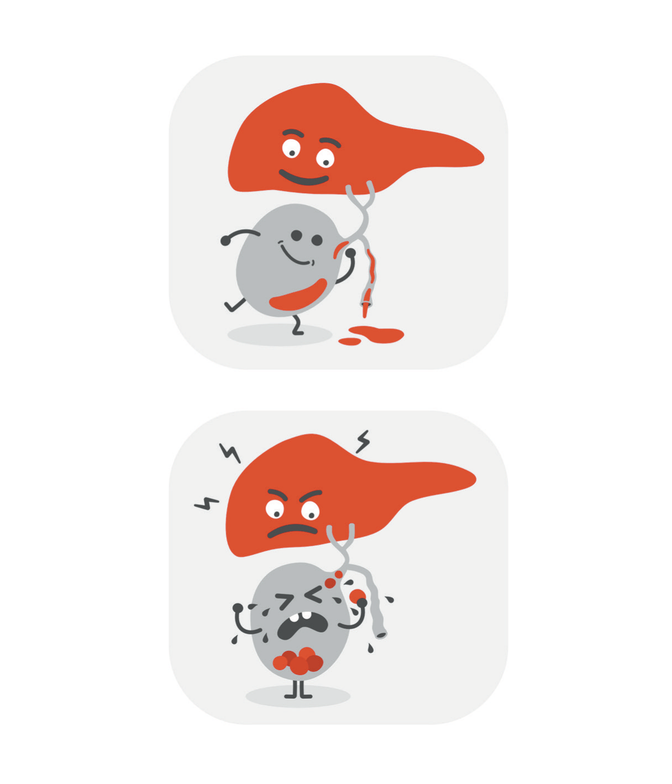
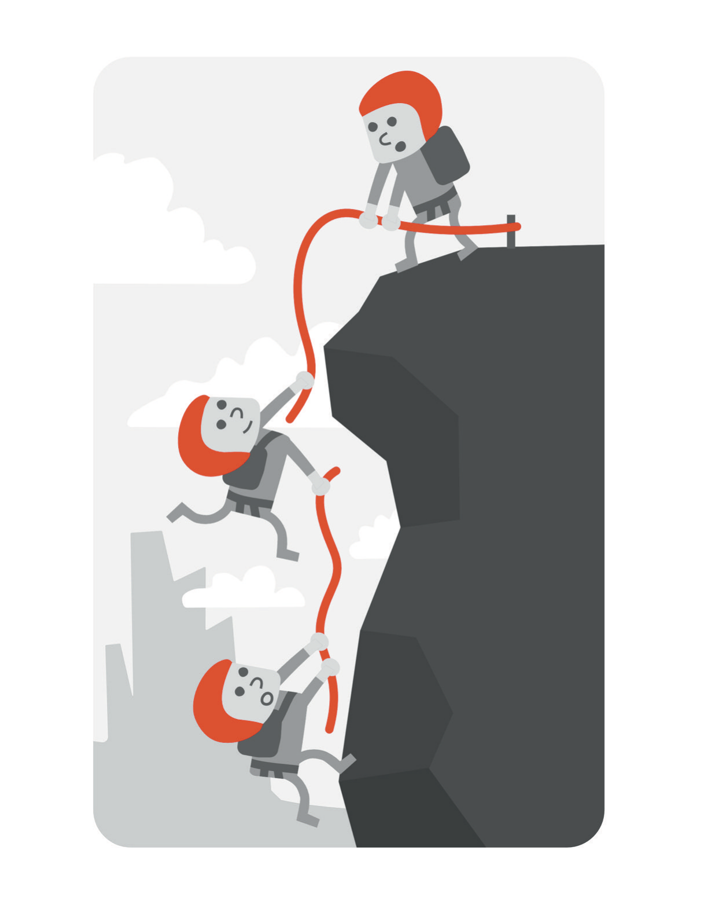

# Shame Loves Secrecy

Every physician in America has the same exchange four or five times a day. Someone passes you in a corridor and says, "How are you?" and you say, "Good, busy." Nobody has ever followed up on "good, busy." It's not a lie, exactly; it's a handshake with words in it. In the worst months of my life I said it to colleagues who would have driven across the state for me, and they said it back to me, and we both moved on to the next room.

That is where I want to start, because when people talk about hiding a crisis they imagine something elaborate, and it isn't elaborate at all. It's a two-word answer, given hundreds of times, by a person who is genuinely busy and genuinely good at his job.

The rest of the machinery is just as ordinary. A calendar that is full is a calendar that explains itself; nobody asks a man with a full schedule why he isn't available, and if the schedule is full enough it also removes the unstructured hours in which somebody might have gotten a real answer out of him. Crisp answers help. Any question about how things are going can be met with an accurate, specific, forward-looking sentence about the deals or the practice, and specificity reads as candor. Humor helps most of all. I could make a joke about my own situation that was funny and true and told you nothing, and the laugh closed the subject more effectively than a refusal would have. A refusal is a door somebody might knock on. A joke is a wall with a picture hanging on it.

None of this required planning. That is what I most want to get across. I didn't sit down and design a concealment strategy; a set of habits I'd built for other reasons turned out, under load, to be a perfect one. Competence is camouflage. It's not that competent people are better at hiding, though we're. It's that the ordinary daily evidence of competence is accepted by everyone, including the person producing it, as evidence of soundness. My surgical schedule was, among other things, a machine that manufactured proof I was fine and delivered it fresh every morning.

* * *

Underneath the mechanics is the reason, and the reason is shame, which is a more specific thing than most of us use the word for.

Guilt and shame aren't synonyms, and the difference is the whole subject of this chapter. Guilt says *I did something bad*. It refers to an action, it has an object, and it points somewhere useful: apologize, repair, do it differently next time. Guilt is uncomfortable and productive, and I've never had trouble with it. Shame says *I'm bad*. It refers not to what you did but to what you're, and it points nowhere at all, because there is no action that repairs being a certain kind of person. All you can do with shame is manage who sees it.

The two sentences at the center of my crisis were "I made a series of bad decisions" and "I am a fraud who fooled everyone." The first is a claim about behavior, and it's arguable; some of the decisions were bad, some were merely unlucky, and a couple were fine. The second is a claim about my existence, and it isn't arguable at all, which is exactly why it was the one that ran at three in the morning. You can't cross-examine a verdict. You can only hide the defendant.

I've explained how I came to be so vulnerable to that particular swap. In one line: when your identity is fused to your output, a bad outcome can't stay an outcome. It becomes a bulletin about you. A quarter isn't a quarter, a deal isn't a deal, and a set of unresolved legal documents isn't a set of unresolved legal documents. It's a report card, and I'd spent thirty years being a person for whom report cards were the primary way of knowing whether I was all right.

Here is the part that makes shame self-sealing, and it took me a long time to see it. Shame doesn't merely make you want to hide. It makes hiding feel like integrity. Telling someone would have felt to me like inflicting myself on them, like handing a competent friend a problem he couldn't solve, like asking to be carried. I'd have described my silence, if you had asked me, as consideration. It wasn't consideration. But it felt so much like consideration from the inside that I couldn't have told the difference, and I doubt most people can.

There is one practical move I've found for this, and I offer it without any promise that it's sufficient. When a sentence arrives about yourself, ask what kind of sentence it's. Facts can be checked and are usually specific: I signed six agreements, three of them are in dispute, I haven't slept more than four hours in eleven days, my accountant hasn't returned my call. Verdicts can't be checked and are always global: I'm a fraud, I have ruined everything, I've always been this way. Both kinds arrive in the same voice and at the same volume, particularly at night, and telling them apart is a skill rather than an insight.

What sorting them doesn't do is make you feel better, and I want to be honest about that, because in the first edition I'd have promised more. Writing down that three agreements are in dispute isn't comforting; three agreements in dispute is a bad situation. What it does is restore the possibility of a next action, because a fact has one and a verdict doesn't. You can call the accountant again. There is nothing you can do about being a fraud, which is precisely why the mind under load prefers that sentence: it closes the file, and a closed file requires nothing further, and a person who is exhausted will take a terrible answer over an open question.

* * *

Something else about shame is that it's old, and it borrows a voice you have had for a long time.

In the first edition of this book, in a section about being kind, I made a list of the things I'd said to myself over the years. I put it in print because I suspected other people had a similar list and never said so. It runs like this:

> You're fat. You're short. You're too Asian. You're not Asian enough. You don't deserve to be here. Who said you could do that? What's wrong with you? Why can't you do anything right? You'll never be good enough. You're nothing. You're trash. You're scum. You deserve this horrible situation you're in. You're ugly. Nobody will ever love you. Maybe it'd be better if you were dead.

I wrote that list as a description of a voice I believed I had beaten. It sits in a chapter about kindness, offered in the past tense, as an example of the sort of thing a person can leave behind by working on himself. The last item is there in the original. I put it on the page, in a book about avoiding burnout, in the middle of a passage about how far I'd come, and neither I nor anyone who read that manuscript stopped on it.

It would be easy to turn that into a tidy piece of foreshadowing. It isn't tidy. Plenty of people have that sentence in their inventory of ugly self-talk and never come near acting on it. What I'm claiming is narrower and, I think, more useful. I had a documented catalogue of the exact way my mind talks to me when it turns, and I published it, and I didn't treat it as information about myself. I treated it as material. A man who knew the diagnostic criteria for depression, who had a written record of his own worst voice, and who had already once stood in a parking garage and reasoned his way out of what he saw there, still had no working model of his own risk. Shame is why. You can't study something you're busy hiding, and I was hiding it even in the act of printing it, by putting it safely in the past.

* * *

There is a piece of anatomy I've been using to think about this since medical school.

The gallbladder's job is to hold bile the liver has made and then to squeeze it out when fat arrives in the intestine, where it does the work of breaking that fat down. The system depends on flow. When the gallbladder doesn't empty, when the bile sits, the components begin to come out of solution and crystallize, and the crystals aggregate, and eventually you have stones. The stones themselves may cause nothing for years. The trouble starts when one moves and lodges in a duct, and then you get pain that people describe as unlike any other pain, and inflammation, and infection, and occasionally you get a very sick patient in an operating room at two in the morning.

I used this in the first edition to talk about resentment: hold on to bitterness and it hardens and eventually blocks something. That is a decent metaphor and I stand by it. It works better for the thing I was actually doing, which was holding facts about myself that were meant to circulate.

The particular part I'd emphasize now is the timing. Nothing hurts while the stones are forming. The formation is silent, it takes a long while, and the patient feels entirely well throughout. What that means in the version of this that lives inside a person is that the correlation between how bad your secret is and how bad you feel today is close to zero. I didn't feel each week's worth of concealment. I felt one night, much later, in which the whole thing moved at once.

* * *

I have described what the silence cost me. I owe an account of what it cost the people on the other side of it, because that is the part I didn't consider at all, and because it's the argument that finally worked on me when nothing about my own welfare did.

Start with the practical. Every person who might have helped me was working from a false picture, which meant that all of their decisions about me were made with bad data. They didn't check on me, because I looked fine, and their not checking was rational. They asked me for things, because I was the person who could absorb things, and their asking was rational too. When somebody is running a competent performance, everyone around them adjusts to the performance, and the adjustments compound into a world in which nobody is positioned to notice.

Then there is what it does to the relationship itself. Being kept out of something that large isn't a neutral experience for the person who is kept out. It's the discovery, afterward, that you were being managed. That the version of your friend or your son or your colleague you were talking to was a deliberate construction, and that your closeness, which you experienced as real, was operating on a partial file. I've watched people absorb that news about me, and the expression isn't anger. It's something more like vertigo, and then a question that has no good answer: what did I miss, and what does it say about me that I missed it? I put that question into the heads of people who had done nothing to deserve it. My silence, which I had experienced as sparing them, turned out to be a bill I was postponing and enlarging.

And there is the last thing, which I can only state plainly. If it had gone the way I intended, they'd have been left with the version of me I had constructed, and no way of ever understanding what had happened, and the rest of their lives to think about it. Concealment doesn't end when the concealer does. It's inherited.

* * *

So why not just ask for help?

Because asking for help is a skill, and skills require practice, and I had arranged a life with almost no practice in it. Consider what my training actually rewarded. A medical student's job is to make the resident's life easier. A resident's job is to have the answer. An attending surgeon's job is to be the person the room turns to when things go wrong. Twenty-five years of education, and at no point did anyone assess me on my ability to say, out loud, to another adult, *I'm not okay and I need something.* I'd never once been graded on it. I'd been graded, repeatedly and formally, on its opposite.

There is also a technical problem that nobody warns you about, which is that the sentence is genuinely hard to construct. Most of what a person in that state can produce is either too small to convey anything ("things are rough right now") or so large it stops the conversation ("I have been thinking about killing myself"). The first gets a sympathetic nod and a change of subject, which then confirms that nobody wants to know. The second is accurate and almost impossible to say, and the difficulty isn't only emotional; it's that you can see, in advance, the face of the person receiving it, and you're already managing their reaction before you have opened your mouth. I ran that simulation many times. In every version, I decided to spare them.

When the sentence finally got said, out loud, to someone who loved me, it was harder than the roof had been. That hour belongs to more people than me, so take the mechanics, which are the part that might be useful to somebody holding a similar sentence right now.

It was shorter than I expected. Everything I had rehearsed, the context, the sequence of the deals, the explanation that would make it make sense, turned out to be unnecessary and mostly a way of not saying the thing. What was needed was a state and a number: how little I was sleeping, and what I was thinking about at night. Second, nothing was fixed. Not one item on the list changed that day; the documents were exactly as unresolved as they had been that morning. What changed was that the file was no longer mine alone, and the difference between one person holding a thing and two people holding it turns out to be enormous, and not for any reason I can explain by arithmetic. Third, the person didn't fall apart. All my modeling of how unbearable this would be for them was wrong, and it was wrong in a specific direction: I'd been assuming that the people who loved me were fragile, which is a strange way to describe love, and also faintly insulting to everyone involved.

* * *

What I'd tell you to build, if you build anything out of this chapter, isn't a feeling. It's a structure. The word I use for it now is reachable.

Reachable isn't the same as surrounded, and confusing them is the characteristic error of successful people. In 2021 I was as surrounded as a person can be. I had a practice full of staff, patients who were glad to see me, a peer group I paid to be part of, an audience for a book, and a phone that never stopped. Not one of those relationships was designed to receive bad news about me, and most of them were designed to receive the opposite. Surrounded is a headcount. Reachable is a property of the channels.

A channel is reachable if three things are true. Somebody has standing to ask you the real question, and both of you know it. There has to be a time when the question can actually be asked, which means unstructured time, which means that a fully optimized calendar isn't a neutral fact about your life. And the other person needs some way to know when you're lying, usually because they've known you long enough to hear it, or because the two of you have agreed in advance on what an honest answer sounds like. I'd built a life with almost no channels meeting those conditions and a great many meeting none of them, and I'd done it without noticing, because every individual decision that produced it was reasonable.

The first edition has a drawing of a climber on a rock face lowering a rope to another climber below, and the passage next to it is about elevation: you get up the mountain, then you throw the rope down to somebody who hasn't made it as far as you have. I liked that idea enormously. I liked being the man with the rope. It fit everything I'd been taught about who I was, and it had the additional advantage of putting me permanently above the other end of the line.

What I didn't consider is that the picture has two people in it, and that one day I'd be the one at the bottom. It's a different experience. Reaching up requires admitting that you're down there, which is the entire difficulty compressed into a physical gesture, and there is nothing dignified about it. Some of the people who reached down for me were people I had once reached down for, which was its own small humiliation, and which I now think is the actual design of the thing rather than a flaw in it. A rope only works because it goes both ways. The version where you always hold the top end isn't generosity. It's a way of never being in a position to need one.

I got very lucky. The channels I needed hadn't been fully dismantled, only neglected, and when the time came a few people turned out to be closer than my behavior deserved. Luck isn't a plan, and I'd rather you didn't rely on it. Build the channels now, while you're well and it costs you nothing, because the person who will need them won't be in any condition to build anything.

* * *

The first edition of this book had a chapter called "The Victim Mindset," and it's the chapter I'm least comfortable with today. Its argument was that a great deal of suffering among capable people comes from telling yourself a story in which things happen *to* you, and that the way out is to take ownership. There is something real in that, and I'm not going to disown it entirely.

What that chapter couldn't see is the case I've just described: a man who had taken so much ownership that he couldn't put any of it down, who treated a legal and financial catastrophe as a verdict on his worth, and who nearly died of the belief that everything was his fault. That isn't a victim mindset. If anything it's the opposite, taken past the point where it does any good.

So the idea needs rebuilding from the ground.
