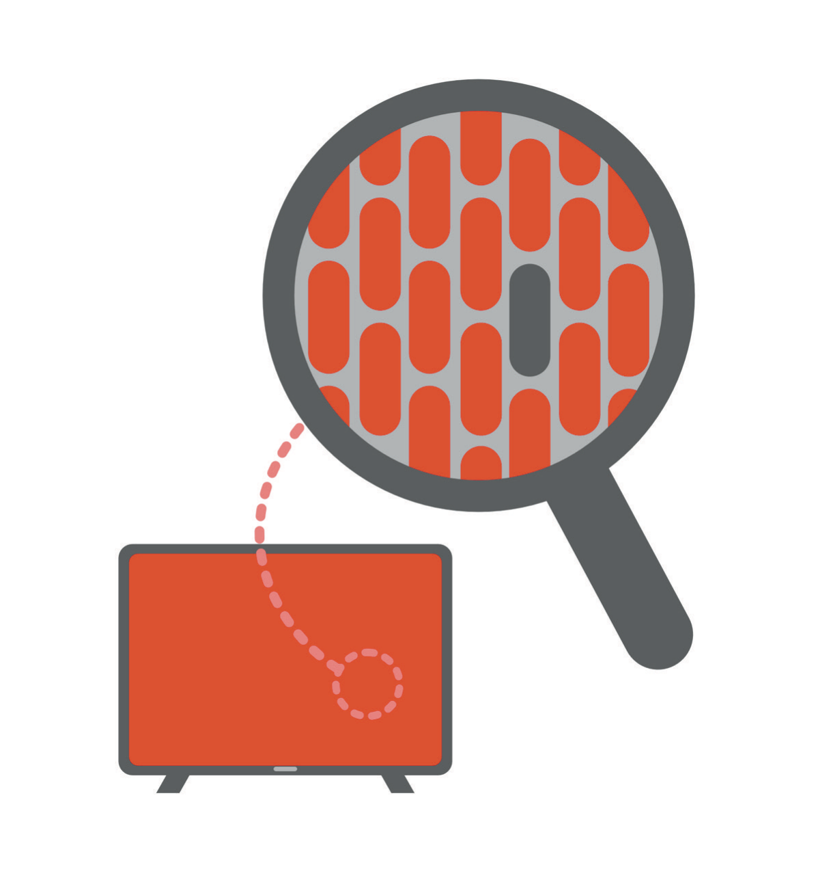

# Agency Without Self-Blame

The first edition of this book had a chapter called "The Victim Mindset." I reread it before starting this one, which I don't recommend. It opens with a complaint about how doctors are scapegoated, runs through the resentful things physicians think about luckier colleagues, and then turns on the reader with a challenge. What would your life look like if you dropped the story? What if you stopped asking why these things were happening to you and started asking how they were happening for you? The line I was proudest of was this one: if I'm going to bitch and moan it, then I'd better own it.

I still like that sentence. It has the right shape, and it came out of a real place: a young surgeon-turned-dermatologist who had spent more than a decade being told where to stand and when to speak, and who had finally noticed that the schedule on the wall was in his own handwriting. Ownership did change things for me, fast. Once I stopped treating my life as something being done to me, I could see the levers: the specialty, the town, the hours, the people. The chapter was right that a person who believes he has no moves won't look for any, and that the belief is very often wrong.

What the chapter got wrong took several years and a hospital to see. Somewhere between "own it" and the end of the chapter, ownership became blame. Not blame of other people, which the chapter was careful to discourage, but a total, quiet, airtight accountability in which everything that happened to a person was in some way a report card on that person. If you were miserable in your job, you had chosen the contract. A broke doctor had never been taught the wealth mindset and hadn't gone looking for it. And if your son had cancer, well, the book had an answer for that too, and the answer was to ask how it was happening for you.

I wrote that last one about myself and not about anyone else, and I meant it. "Happening for me" was how I got through the months of Adrian's treatment without coming apart. It gave me something to do with fear. But I understand now that the sentence has two uses. One is a real reorientation: whatever this is, there is something for me to do inside it. The other is a way of refusing to be powerless, which is a different thing from being powerful. When I said that Adrian's cancer was happening for me, I was, in part, declining to admit that a thing had happened that I couldn't affect and that I hated. Sometimes "happening for me" is a lie you tell to keep control of a room you don't control.

So I'm retiring the phrase "victim mindset." I no longer use it about other people, and I'll say why later in this chapter. First, the story the old chapter got closest to right, because it holds the version of ownership I still believe in.

* * *

At Berkeley, first semester, I took Chem 1A. It was a weeder course, roughly fifteen hundred of us, more than half of whom were expected to drop, and nobody was going to notice if you fell behind. General chemistry was material I mostly knew. I went to lecture, did the minimum, never touched the tutors or the office hours that were sitting there for free, and got an A.

Second semester was Organic Chemistry, and I treated it the same way, because I was a smart kid and had the transcript to prove it. Doing the bare minimum had produced an A; why would this be any different? It was different because it was new. I'd no framework for it. The molecules didn't care what I had scored in high school, and retrosynthesis might as well have been another language. I phoned it in anyway. Then I got the first midterm back.

In red ink at the top of the page: 115/155. I'd never seen a number like that attached to my name. My first semester I had earned a 3.95, and the A-minus that kept it from being perfect came from a music class I'd also phoned in, which I had blamed on the instructor and my music partner. Now, in Organic, for the first time in my life, I was a C student. My immediate move was to find out who had done this to me. The instructor wasn't good, I decided. He had a melodic French accent, and I concluded that the accent was part of the problem. It wasn't part of the problem.

Then he did something I've thought about ever since. He announced that he was going to write down the initials of the students with the top scores. A.J., 153 out of 155. J.S., 151. I sat there looking at those initials and thought: that is the caliber of student I've been my whole life. That is where I belong. How do I get there? So I emailed the graduate student instructor, told her I hadn't done as well as I had hoped, and asked her how to get the high score.

She wrote back one sentence. "Do practice problems."

So I did practice problems, all of the homework and then some, and I read the textbook and taught myself the chapters. When I couldn't figure something out I went to the tutor, or read the section again, or found a similar problem and worked backward from it. I went to office hours. On the second midterm I didn't get the highest score in the class, but I got the second highest, and the graduate student instructor was, I think, more pleased than I was.

In the first edition I told this story as the moment I understood that I was an active participant in my own life, and I still think that is true. But I attached a moral I now want to peel off. I wrote that talent and entitlement aren't the point, that you deserve the A once you've gotten through the grit, and that there is no shame in ordering takeout if you haven't put in the hours to cook. I meant it as encouragement. Read it again and it's the achievement machine talking: your grade is a verdict on your character, and your character is a verdict on what you deserve.

The lesson of the red ink was never "you are a C student." It was also never "you are an A student," which is the verdict I was trying to get back to. Neither of those sentences would have helped me with the second midterm. The sentence that helped had no verdict in it at all. Do practice problems. A graduate student looked at my situation, ignored the question of what kind of student I was, and told me the next action. That is what ownership is, or the part of it worth keeping: not a judgment you accept about yourself, but the willingness to ask what the next move is, and then to make it.

One thing the freshman I was couldn't have added: the reason the story works is that the next move was available. There was a textbook, a tutor, a second midterm. A great deal of what I'd later call other people's victim mindset was people describing situations in which the second midterm didn't exist.

* * *

The other story in that chapter was about Modesto, and it also holds up, with a correction.

When I finished fellowship in Mountain View I could have stayed on the Peninsula, where I had trained and where, as I put it at the time, you can't live comfortably without also being a tech millionaire. I chose instead to go about ninety minutes inland, to a city no one would describe as a bustling metropolis. It had no opera and no fine dining to speak of, and not much of a community of people who thought the way I did. It also had very few dermatologists, which meant more patients who actually needed a Mohs surgeon, and it had houses with room for a small boy to run around in. Patients told me I looked twelve and then referred their friends anyway. In fairness, nothing but my own feelings about opera had ever kept me from the opera. I wrote in 2021 that I woke up every day choosing the life I lived, and I was careful to add that nobody needed to move to Modesto to stop feeling like a victim. The point, I wrote, was that you have the freedom to create a life of your own choosing.

Most of that is still true, and I'm glad I wrote it. What needs correcting is the silent implication of that last sentence, which is that a life you've chosen is a life you have secured. I chose the town. The specialty was my choice too, after a costly detour through another one, and so were the early mornings, the practice, and, for that matter, the rooms I'd later walk into and the deals I'd later sign. And then things happened in that chosen life that I didn't choose. My son developed a tumor that no one chose. Several of the commercial transactions I had entered turned out to be connected to a person I had trusted, who was later convicted of bank fraud in federal court and sentenced to prison. I chose to sign; I didn't choose what the public record would later say about someone else. The point of the Modesto story was that choice is real. The point I missed is that choice isn't total, and a person who believes his choices have made him safe is a person who will experience the unchosen as a personal failure.

You can choose your life and still be blindsided. Both halves of that sentence are true at once, and the first edition only had room for one of them.

* * *

What I use now, instead of a mindset, is a sorting exercise. It's not original, and I'm not going to draw it as a diagram, because diagrams end up on slides and slides end up ignored. When something is wrong, I try to sort it into four piles: what I control, what I influence, what I have to accept, and what I should leave.

The version of this I learned first was surgical, which is probably why it stuck. In Mohs surgery you control the margin you take, how carefully you read the slide, and whether you go back for another stage when you see tumor at the edge. You influence a great deal that you don't control: whether the patient keeps the wound clean, whether the staff have what they need, whether the daughter in the room trusts you enough to let you put a blade near her ninety-year-old mother's face. You have to accept the pathology. The cancer is where it's and as deep as it is, and no amount of confidence changes what is under the microscope. And there are cases you should exit: a tumor that belongs with a different specialist. None of this is philosophy. It's Tuesday.

Applied to a life, the piles look like this. What I control is small and specific: my next move, my honesty, and whom I tell. The influence pile is larger and less certain: the systems I work inside, my relationships, and, crucially, the deal before I enter it. Before the signature, I influence almost everything about a transaction. After the signature, I influence very little, an asymmetry I understood in theory and ignored in practice. Acceptance covers a diagnosis, a market, and the public record about another person, which I can neither change nor take as an account of my own life. And the exit pile is a category the first edition barely had: a job, a room, a partnership, a version of my ambition that was burning on the floor instead of in the fireplace.

The old chapter treated exit as a failure of attitude. If you hated your contract, you had signed it; if you hated the hospital, you could always leave, and the implication was that a person with the right mindset would either stop complaining or go. I now think leaving is a legitimate and often wise move, and that the reason high performers make it late is that it feels like quitting. It's not quitting to leave a room in which every voice agrees with you. It's not quitting to end a partnership because you can't see the whole structure. Exit is one of the four moves, not the thing you do when the other three have failed.

The sorting matters more than the mindset for a reason I couldn't have given before. A severe depression rearranges the piles. What I actually couldn't control, the outcome of a legal matter I didn't fully understand, my mind filed under "control," and therefore under "my fault." What I could actually control, which was picking up the phone and telling one person the truth, my mind filed under "impossible." The map was inverted. I made myself responsible for other people's decisions and then treated my own next move as if it belonged to someone else. That is what self-blame does. It takes agency and points it at the wrong pile.

Sorting doesn't cure that; medicine and people did more for me than any exercise. But it gives you something to check against. When a thing is keeping you up, the question isn't whether you're to blame for it but which pile it belongs in, and whether that is the pile you've put it in.

* * *

The clearest word I have for the distinction comes from medicine.

A surgeon is responsible for his patient. That responsibility is total. If the wound opens, if the margin is missed, if the patient bleeds at two in the morning, it's his to answer for and his to fix. He didn't, however, cause the cancer. Nobody thinks he did. Responsibility and causation live in different parts of the building, and every clinician learns to hold them apart, because a doctor who believes he caused every disease he treats won't last a year, and a doctor who believes he is responsible for none of them shouldn't be allowed near a patient.

The first edition collapsed the two. "Own your life" became, in the small print, "you caused your life," all of it, including the parts that arrived by mail. This version keeps the responsibility and gives up the causation. I'm responsible for what I do next about the fact that I signed those documents, in the sense that the next move is mine and nobody else's. I'm not the author of every consequence that followed, and I didn't make the choices other people made. Both are true. A person who can't hold both will either abdicate, which the old chapter correctly warned against, or drown, which the old chapter never imagined.

I said I'd explain why I retired the phrase "victim mindset," and this is the place. Three reasons. The first is that when I was the one who felt trapped, in the months of calls with attorneys and in what came after, the phrase would have been used on me, and it would have been wrong. I wasn't indulging a story. I was ill, and I was in a situation with real constraints, and the sentence "stop being a victim" would have added shame to a person already running on it. The second is that I've since listened more carefully to the people I once privately diagnosed with the condition, and they were mostly describing real things: a schedule they didn't set, a debt they couldn't refinance, a boss who wouldn't leave. Their next move existed, usually, but it was smaller than mine had been and it cost more. The third is that the label ends the conversation. Once I've decided someone has a victim mindset, I no longer have to ask what their piles look like. I have my answer, and it's about them.

What I kept is the question. What is my next move? I ask it in the first person and only in the first person. Asked about someone else, it's an accusation; asked about yourself, it's the beginning of something.

* * *

Somewhere in the first edition, in the chapter about connection, I told a story about a television. I'd bought a very large one, larger than any reasonable person needs, and I loved it, in part because each of its several million pixels lights itself and the picture stays crisp even with sun on the screen. Then I asked the reader to imagine that one pixel had gone dark. That, I wrote, is a personal problem, the moment you get caught up in your own head and your own story. Look at the whole screen and you'd never notice; it's one dot in a sea of dots that are all still shining, and together they make the movie of your life.

I still think the proportion in that image is right, and I still think I used it badly. The paragraph was written by a man who believed he had already absorbed the worst thing that would ever happen to him, and who had converted it into gratitude within a page. It carries the faint impatience that a person who is coping has toward a person who isn't. Zoom out; your problem is one dot among millions. It's the kind of thing that is true and useless at the same time, and if you say it to someone in the middle of a real failure, you'll teach them to stop mentioning the pixel.

The version I'd write now goes like this. One dead pixel isn't a broken screen. That much is true, and in the worst months I needed to hear it, because the whole screen felt black. A failed deal isn't a failed life; a diagnosis isn't an identity; a bad year isn't a verdict. But the pixel is also really dead, and pretending otherwise isn't proportion, it's denial with a positive attitude. The person who knows what to do about a dead pixel is the technician who looks at exactly that spot, at exactly its size, and asks whether there are others, whether the panel needs replacing, and whether this one can be left alone. Proportion isn't the refusal to look. It's the ability to see a thing at its true dimensions, neither the whole screen nor nothing.

Mohs surgery is proportion as a job. A cancer on the nose isn't a reason to remove the nose. You take the tumor and a thin rim of tissue around it, you read the slide, and where the edge is positive you go back for more, exactly there and nowhere else. A surgeon who took the whole face because one margin was positive would be treating the pixel as the screen. A surgeon who ignored the positive margin because most of the slide was clear would be treating the screen as if it had no pixel. Neither one gets to keep operating for long.

Self-blame is the first mistake, the removal of the whole face. When I believed I had failed catastrophically, I wasn't looking at a positive margin; I was looking at a man, and the man was the failure. Everything I'd done, from the yearbook quote forward, was reread as evidence. Identity-level verdicts work that way: they aren't proportional and they aren't meant to be. The first edition's mistake was the second one, the cheerful refusal to look, and I made that mistake for years before I made the other. Agency lives in between, at the scale of the actual problem.

* * *

The Introduction to this book puts the thesis in a sentence: agency is the belief that your next move still belongs to you. I'd rather develop that than repeat it, because as a slogan it's exactly the kind of thing the old chapter would have printed on a mug.

The next move is small. That is the first thing to know about it. In Organic Chemistry it was an email to a graduate student. In the worst period of my life it was, on some days, making one phone call I'd been avoiding, or letting one person see how I actually was, or getting to an appointment. None of those moves fixed anything. They weren't supposed to. The requirement on the next move is that it be a move, that it be mine, and that it be in the right pile. Whether it works isn't part of the specification.

The second thing is that the next move doesn't require a verdict first. The high-achieving mind wants to settle the question of what kind of person you're before it will act, because the verdict is what it has always used for fuel. I spent many hours trying to rule on whether I was a C student or an A student, a fool or a victim, someone who had failed or someone who had been failed, as though the court had to adjourn before the patient could be treated. It doesn't. The graduate student didn't rule on me. She told me to do practice problems. You can make the next move while the question of your worth remains open, and I'd go further: you usually have to, because the question doesn't close on schedule, and sometimes it doesn't close at all.

The third thing is that the next move belongs to you even when almost nothing else does. In 2021 I'd have found that claim too modest, because back then almost everything seemed to belong to me. It's the opposite of modest: the last thing standing when the rest has gone, and it turned out to be enough to build from. The outcome wasn't mine to control, and neither were the record, the market, or the past. I had the next move, and the next move was to tell someone, and then the next was to get treatment, and then the next was to take the treatment, and each of those was ordinary and none of them was inevitable.

Agency without self-blame, then, isn't a softer version of the old chapter. It's a more demanding one. The old chapter asked you to own everything, which is impossible, and which most people quietly stop attempting. This one asks you to own something narrow and to keep owning it: the next action, the honest sentence, the choice of whom to tell. It asks you to sort the rest, to accept what belongs in the accept pile without pretending you put it there, and to leave what belongs in the leave pile without calling it defeat.

None of that can be done from inside a story. The sorting requires you to look at what is actually in front of you, which sounds simple and isn't, especially for people trained to see the next milestone instead of the present room. Before any of this is possible, you have to be able to stand in the room you're actually in.

* * *

None of this is your fault, and your next move still matters. Hold both of those at once. Let go of either one and you'll be no use to yourself.
