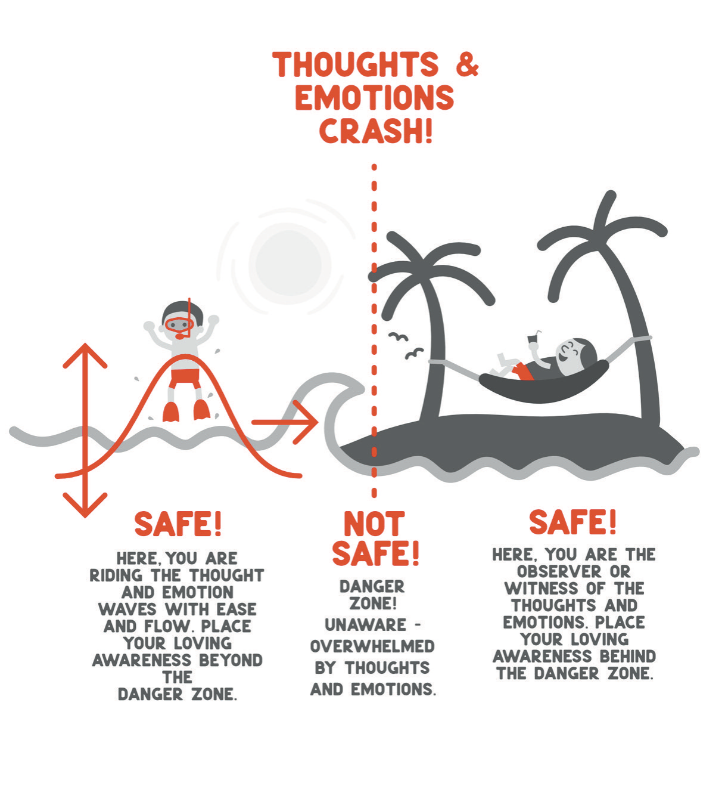
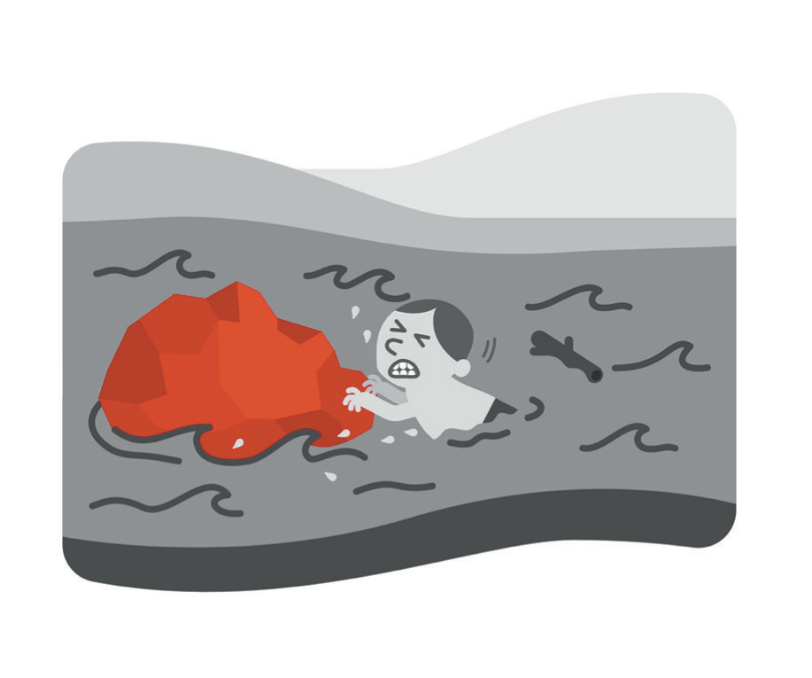
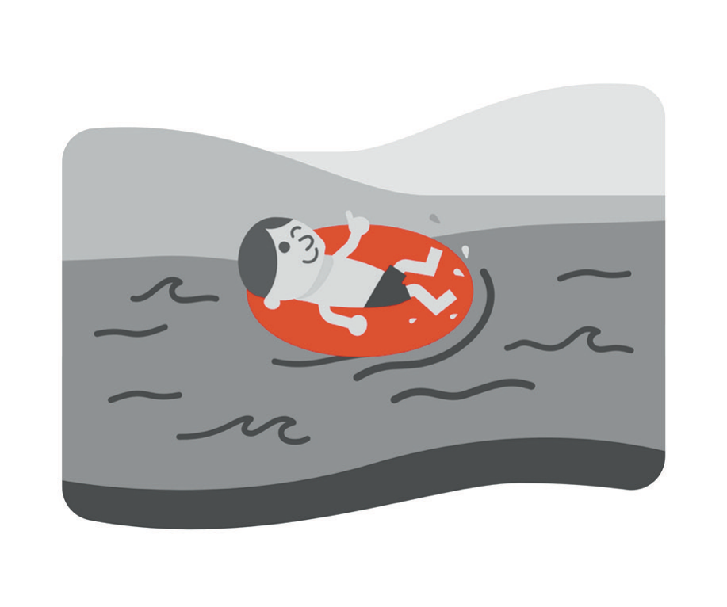

# Here and Now

The first edition of this book had a chapter with this title. I reread it before starting this one, and I want to report what was in it. It opened with a startup I nearly joined, something like Uber for Botox. It moved on to my mother's rental houses, then to the duplexes I had bought, then to the strip mall and the office buildings, with a stop at a business coaching group along the way. Near the end there was a paragraph about living in the now. One paragraph. I have kept the title and thrown out almost everything underneath it, and I am starting here because the man who wrote a chapter called "Here and Now" and filled it with commercial real estate had not yet understood his own title. He thought presence was something you earned after the deals closed.

What he did have, to be fair to him, was a practice. I had started sitting at home in the months after Adrian got sick, badly, the way most people start: the phone in the next room, ten breaths of attention, and then twenty minutes of planning the day with my eyes closed and calling it meditation. Then came the retreats, one in late 2020 and a longer one over two nights early the next year. Chapter 4 already told you about the sentence that came through at the first one, so I will not repeat it, except to say that the universe was correct. What I want to describe here is the second retreat, because it is the closest I have come to the thing this chapter is about, and because I described it so badly the first time.

On the second day we were in a circle for a long meditation, and somewhere in it I stopped sitting and lay face down on a mattress while everyone else stayed upright. I could hear the teacher. Underneath that voice I could hear the room breathing, all of those lungs filling and emptying nearly in time with one another, and after a while I could not tell which breath was mine. It felt as though I was not separate from anyone in that room. It felt as though the ego I had been carrying since kindergarten had been set down on the floor beside the mattress and nobody, including me, needed to pick it up for a while. I had not known that kind of quiet existed.

In 2021 I wrote that I felt infinite joy, love, and bliss simultaneously while recognizing the oneness of everything, and I said that trying to describe it was like trying to describe sex to a virgin. I stand by the experience. I do not stand by the paragraph. What I would say now is only this: it felt as though. I experienced it as. That is the grammar I use for anything that happens inside my own skull with my eyes closed, and I use it not because the experience was small but because I have since learned how convincingly my skull can lie to me. Chapter 6 covered what I mean by that. Here I only need you to know that I can hold both facts at once: something real happened on that mattress, and I do not know what it was.

What the daily practice gave me is easier to describe than what the retreat gave me, and more useful. It gave me a half-second. A patient's daughter questions the plan for the third time in ten minutes, and I feel the flush arrive at my collar, and there is now a gap between the flush and my mouth in which I can notice that I am irritated and decide what to do about it. Before I sat, there was no gap; the feeling and the reaction were one event. That half-second is the whole product. Years went into building it, and it is the most valuable thing I own. It works on irritation, on craving, on the itch to check my phone during dinner, on the urge to say yes to something I should decline, on any emotion that behaves like weather. The thing that came later did not behave like weather.

* * *

Here is what I believed in 2021 without ever writing it down: a person who could do this could not be taken apart from the inside. I had watched my own mind from a safe distance and assumed the distance was permanent. I thought the practice was a floor, and I thought floors held.

In the months I described in Chapter 5, the practice did not leave me. I knew how to sit and put my attention on the breath the way I had been taught, and when I did, the fear sat down next to me and put its attention on the breath too. My thoughts were all available for observation, and I observed them with tremendous clarity. Observing did not change what they said, and it did not change the fact that I believed them. Somewhere in those months the observer went under with everything else. I do not have a better sentence for it than that. The part of me that had learned to watch the wave was in the water.

A practice is not a treatment. I want to handle that sentence carefully, because I have heard it used to dismiss meditation, and I am not dismissing it; I still sit most days, and I would sit even if it did nothing for me but the half-second. But when the organ doing the observing is the organ that is sick, more observing is not the cure. You would not treat pneumonia with breathing exercises. Breathing exercises are good for you. They are not antibiotics. It took a very bad stretch of my life to learn the difference between a discipline that helps a healthy mind and a discipline that a sick mind uses to convince itself it is handling things.

That is what I would now write in the margin of everything I said about awareness the first time. Awareness is real, and I am grateful for it every day. It is a floor. It is not a wall, and it was never going to be one, and nobody who has been in the water would tell you otherwise.

* * *

Medicine taught me the right order of operations long before I applied it to myself. When a patient who was lucid at dinner is confused at three in the morning, nobody on the night team starts by asking about his childhood. Someone checks the sugar. Someone checks the oxygen and the medication list, looks for an infection, and asks the nurse whether he has slept. The story about who this patient is comes after the labs, and any intern who gets that order wrong is corrected in front of the whole team. State first. Then story.

I got the order wrong about myself for a long time. At four in the morning, on almost no sleep, with a call to attorneys in the Midwest already waiting on the calendar, I would lie in the dark and compose the story of my life, and the story was always the same: I had been a fool, I had lost what I had been given, I was finished. I treated that narrative as a finding. It was a symptom. A story you tell yourself at four in the morning on no sleep is not a story about your life. It is a story about four in the morning.

So now I run the checklist on myself before I am allowed to run the narrative. Sleep first: how many hours, and was it real sleep or the kind where you review a contract with your eyes closed. Food next, because I am a physician and I still forget that a man who has not eaten since noon will find the world darker than it is by nine at night. After that, light, meaning have I been outside, and then movement, meaning anything at all. Then whatever a clinician has prescribed, taken as prescribed, which is a sentence I would have skipped past in 2021 and now consider load-bearing. Only after all of that do I get to have an opinion about what my life means. If I have slept under five hours, the rule is that I am not permitted to draw conclusions about my character before noon. I break the rule. Having it still helps, because when I break it I at least know that I am breaking it, and a man who knows he is breaking a rule is not the same as a man who thinks he is seeing clearly.

The early hours are where this plays out for me, and they have changed hands more than once. In the first edition I wrote that I had been waking at four or five in the morning and that those hours were better than rest because they were mine: my patients were asleep, my email was quiet, and I could meditate and think and write. That was true. Then for a long stretch the hour belonged to the lawyers, and I woke into it the way you wake in a hospital, already knowing where you are before you open your eyes. It belongs to me again now, and I do not use it the way I used to. I used to spend it building. I spend the first part of it now taking inventory. Did I sleep? Have I eaten? Is the fear here this morning, and if it is, does it have a reason in the world or only in the hour? Most mornings the answer is the hour, and I have learned to wait for the sun the way you wait for a lab result, without deciding anything until it comes back.

* * *

Emotions are like waves. I wrote that in 2021 and I still think it is the most useful thing in the first edition, so I am going to keep it and then tell you where it stops being true.

When I was a child I got knocked down by a wave in an unsafe stretch of beach. I remember the cycle exactly: the wave smacked me down and dragged my cheek across shells and sand, then pulled me back toward the water with salt in every crevice of my body, and before I could stand up the next one arrived. That is what an emotion feels like when you are standing at the tide line. The point I made then, and still make, is that you are not the wave, and you do not have to stand where it breaks. Put your attention somewhere else. Watch from up the beach, where the same wave that would have flattened you at the waterline arrives as a sound. Or go the other direction, past the break, out to where the water is deep and the wave is a swell you rise over instead of a wall that hits you. Anger fed grows. Pain fought stays. What you resist, persists. Every wave, pleasant or not, has the same shape: it builds, it peaks, it subsides, and the ocean takes it back.

The footnote is this. Waves subside. Some water does not. In the years I have been describing, the level came up and stayed up, for weeks and then for longer, and the advice to walk up the beach became meaningless because there was no beach; the water was in the house. I say this not to discard the map but to add a warning to it. If you have watched the wave the way you were taught and it has not peaked and it has not subsided and it has been a long time, that is not a failure of your attention. It is information. Weather has a shape. What I had was not weather, and the one honest test I know of is duration.

I also want to retract one small thing. In 2021 I illustrated the wave with a claim that lottery winners and amputees both return to their previous level of happiness within a year. I had read it somewhere. I did not check it, and I am not going to repeat it here as though I had. The wave does not need the statistic. Notice the shape of your own feelings for a week and you will have better evidence than I gave you.

* * *

The river is the other picture I kept. Your experience of being alive runs in one direction, like a river, and the suffering I had in mind when I first drew it comes from clinging: to a grudge, to a version of the past, to the way things were supposed to go. Hold on to a rock in a river and the water does not stop for you. It piles up against your chest, and the effort of holding becomes the whole of your life. Let go, and the current does the work.

I believed that fully when I drew it, and I still believe the mechanics. What I did not understand was who I was talking to. "Let go" is good advice for a man with a grudge. It is a cruel thing to say to a man who is drowning, and in the worst of it I was not clinging to a rock out of stubbornness; the rock was the last thing keeping my head above the water, and it was called being someone who did not fail. Telling that man to let go is telling him to go under. Instruction is not what he needs. He needs someone on the bank.

This is the line I would add to the drawing now. A person floating still needs someone on the bank. Not to pull him out every time, and not to lecture him about the current, but to be there, visible, so that letting go of the rock is not the same as letting go of everything. In the first edition the river had one person in it, and I thought that was the point. It was the whole problem, and it took Chapter 7 to say why, so I will leave it there.

* * *

The body is where the first edition was most right and where I have the most to add. In January 2020 I looked in a mirror and did not see myself. I saw a man who was the heaviest he had ever been, who had stopped fitting into clothes that used to fit, who felt the seat belt hug him tighter than it used to, and who had recently undone a belt notch at dinner because he had not stopped eating when he was full. That man had also, by then, been giving people health advice for a living for years. The first edition called this the hypocritical oath, and I am keeping the phrase: doing the things you tell your patients not to do, and knowing better the entire time.

I know what fit feels like. In the preclinical years of medical school I trained in martial arts twice a day, and the best fighter in the room was fifty-five years old, a former Navy SEAL who moved faster than everyone (except me, of course) and who was plainly committed to staying in shape long after he had retired. He taught me without saying a word that the body's expiration date is later, and more negotiable, than my patients assume when they tell me not to get old. They tell me this every day, and I have retired the joke I used to answer with. They also tell me I look twelve, so I take their estimates of age with some salt. The man in the mirror in January 2020 was not, in other words, a man who lacked information. He had all of it. He lacked a body he was paying attention to, because his attention was on everything he was building instead.

What changed is not the weight, although I lost weight. In 2021 my body was a project: a thing to fix, to optimize, to be ashamed of at the belt and proud of at the beach. Since then it has become an instrument. I mean that in the plain sense. It is the thing I use to read a face for skin cancer and to close what I remove, and it is the thing that registers, before my mind will admit it, when something is wrong. The fear I described in Chapter 5 lived in my chest and my gut long before it had a name. My sleep went before my judgment did. When I write "state before story" I am talking about the body, because the body reports state and the mind writes story, and the body is the more honest of the two. The name I gave it in 2021 still stands: a meat bag held up by sticks. I have simply stopped treating the meat bag as an afterthought to the mind it carries around.

I am not going to tell you what to eat. When I wrote the first edition I had just bought a juicer, which I loved, and I promised the reader I was not filling the void with juice; sometimes my mind wanted fried chicken and that is what I fed it. That is still my policy. The change is not in the menu. It is that I now ask the body how it is before I ask myself who I am, and I have stopped being surprised when the two questions turn out to have the same answer.

* * *

The first edition also had exercises, and I still do them, so here they are, in fewer words than I used the first time.

The first is sound. Wherever you are, find the smallest thing you can hear. Not the loudest; the smallest. The refrigerator, the ventilation, a car two streets over, your own pulse in your ears if the room is quiet enough. Put your whole attention on it for the length of a few breaths. You cannot hold that sound and rehearse a grievance at the same time, and I say that as someone who has tried. The exercise takes less than a minute and it is the fastest way I know to find out whether I am in the room I am actually in.

The second is the floor. Feel the pressure of your feet against it, both of them, and notice which parts of each sole are carrying the weight. Then let the weight go down through the feet as if you were heavier than you are. One of the teachers on the retreats gave me this as a grounding technique, and I was skeptical of the word until I noticed that it worked in exactly the situations where nothing else did: in the car before a hard conversation, in the hallway outside an exam room where I am about to tell a man that the spot on his nose is a cancer and that I will have to take more of it than he wants to hear, in the dark at four in the morning with my feet on the cold floor of the bedroom. It can be done standing in line at the pharmacy. Nobody can tell.

The third is taste, and it is less an exercise than a correction. Whatever you eat next, eat the first bite as if you had never tasted anything. Fried chicken, champagne, a tomato out of somebody's garden; it does not matter which. Notice that you have taste buds at all. In the first edition I pointed out that if you burn them on a gulp of hot coffee you lose the whole world until they heal, and that you never once thanked them for their service before that. That still holds. It is the cheapest gratitude practice there is, and it comes with lunch.

I also, in the first edition, gave you an acronym. Intention, attention, retention: IN-AT-RE, which I pointed out sounds like the word innate, and, if you add an imaginary U, like the word nature. I was very pleased with it. I am telling you this so that you understand the kind of man who wrote the first edition. The three words are still fine. Decide what you mean to do, be present while you do it, and remember afterward what you decided. The acronym I release back into the wild.

* * *

Before enlightenment, chop wood, carry water. After enlightenment, chop wood, carry water. I quoted that in 2021 too, and I think I quoted it correctly then and understood it only later. After the second retreat, after the mattress and the breathing and the quiet I had not known existed, I drove home. I put my son to bed. I went to work the next morning and cut skin cancers off of people's faces and put the faces back together. Nothing about the wood or the water had changed, and I wrote that down at the time with a kind of pride, as if the saying were about how grounded I had stayed.

After the years this book is really about, the same thing was true, and it was harder. There was no mattress. There was a slow, unglamorous stretch in which I got up, checked my state, went to work, came home, and did it again, and in which the only evidence that anything was getting better was that I kept doing it. Presence, it turns out, is not a place you arrive at and then describe to people from a distance. It is the wood and the water. It is finding the smallest sound in a room you would rather not be in, and feeling your feet on a floor you did not choose, and telling the truth about what the body reports before you let the mind narrate. I no longer expect it to save me. What I expect is that it tells me, accurately and early, when I need saving, and that is a smaller job and a more important one.

I said at the start that the first edition's "Here and Now" was mostly about real estate, and I have been a little hard on the man who wrote it, so let me be fair to him one last time. He was not wrong that money belonged in a book about staying in your life. He was wrong about what it was for, and he was wrong about how much of it he understood. Presence is cheap. Margin costs money. The next chapter is about money, and it is not the chapter I wrote the first time.
