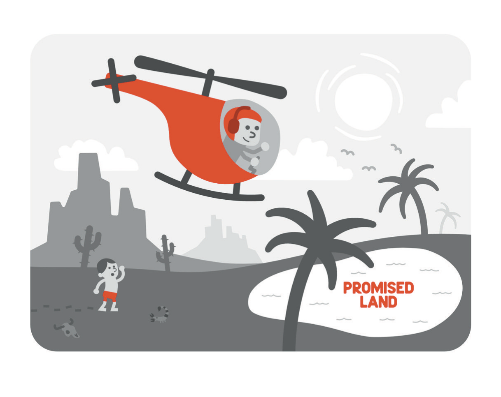
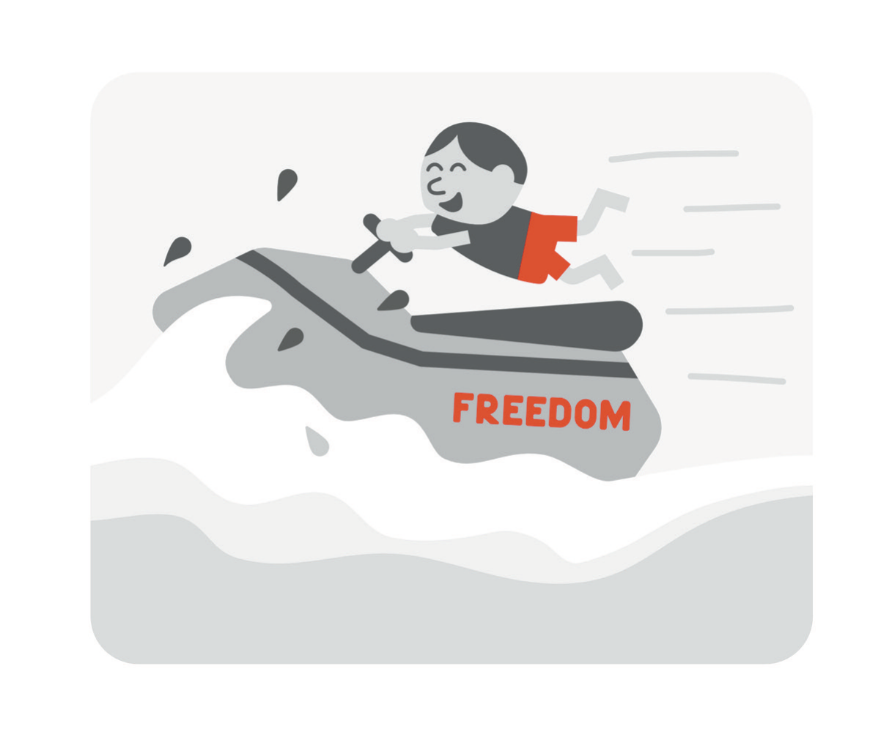

# Money Creates Margin, Not Meaning

The foreword of the first edition made a promise I want to read back to you, because I wrote it and because it's the most honest sentence in that book about what I thought I was selling. I said the book wasn't a textbook on real estate or a get-rich-quick scheme, and that I thought of it more as an illustration of the Promised Land: you were the one who would have to cross the desert, but I didn't think it needed to take forty years. I'd rather you took helicopter flying lessons, I wrote, and got there in a day. There was a cartoon to go with it, and I was pleased with both.

Then came the introduction, which admitted that a piece of the solution to burnout was financial, named the acronym I'd been reading about for years, the one that stands for financial independence and retiring early, and described my real-estate portfolio with a large number and a lot of pride. "I'd be lying if I said money wasn't, in some ways, an antidote to burnout," I wrote, and the sentence still has a certain swagger when I read it now. Later in that book, in a chapter about mindset, I announced that I "commanded" a portfolio, gave the figure again, and explained that I'd gotten there by claiming an identity of wealth. My objection to that number isn't that it was false. My objection is that the number was the whole argument, and I've since learned what a number can and can't hold up.

So this is the money chapter, rewritten by a man who has been on the wrong end of his own advice. I should say once, dryly, that nothing in it is personal financial advice, that I'm a dermatologist, and that anyone who takes investment instruction from a dermatologist has already made the first mistake. What I can offer is something I didn't have to offer the first time: a specific account of how an intelligent, well-trained, careful-in-his-own-field person made catastrophic financial mistakes, written by the person, without the part where he gets to be the hero.

* * *

Let me start with what was right, because a fair amount of it was right, and the years that tested it didn't overturn it. Money buys time. When the imaging came back on my son, I took three weeks off with no notice, the schedule was rebuilt around my absence, the bills got paid, and the reason was money: there was enough of it that three unpaid weeks were a problem for the calendar and not a problem for the mortgage. I'd chosen a high-deductible insurance plan with a health savings account the way young, healthy people do, because the arithmetic favors you right up until the day it doesn't, and when that day came the account was there. Never once did I sit in a hospital corridor doing the math on whether I could afford the next admission, and I've no doubt that other parents on those same floors were doing exactly that math. Nothing I say in the rest of this chapter should be read as an argument that money doesn't matter. It matters enormously, and it matters most at the bottom.

In 2021 I wrote that what I loved about having money wasn't the trips to the Apple Store, though I did love those, but knowing that if the hot water heater died tomorrow I could buy a new one and have it installed without thinking twice. That is still the best sentence about money in the first edition. It's also the smallest, and I didn't notice at the time that its smallness was its point. The freedom the hot water heater buys is freedom from a particular kind of fear, the fear that one ordinary breakdown will start a chain of breakdowns you can't stop. Money, at the level where most people actually live, is a shock absorber. It converts emergencies back into errands.

Where the first edition went wrong was in assuming that the shock absorber scales. If a little money bought freedom from the hot water heater, more money would buy freedom from the hospital, and enough money would buy freedom from having a boss, a schedule, or a bad year at all. That is the logic of the helicopter. I believed it, and I'm still not sure I was wrong about the middle of the range. I was wrong about the top, where the mechanism reverses, and I didn't know it reversed until I had gone through the ceiling.

My first teacher on the subject was my mother, and I learned the wrong lesson from her too. She was the first physician I knew and one of the first real-estate investors, and her business was single-family houses in California, close enough to drive to. I couldn't have been more than ten, and I remember the tenants: the ones who stopped paying, the ones who left the place trashed, the ones whose demands meant she spent far more of her weekends inside those houses than she had ever intended. Somewhere in there a child absorbed a sense memory so strong that more than twenty years later, when I bought my first income property, I hired a property manager without a moment's deliberation, the way you pull your hand back from a stove. I was proud of that. I thought it was the lesson.

The lesson was larger, and I missed it. What my mother's houses were teaching me was what ownership actually involves: that the person whose name is on the loan is the person on the hook, that a tenant's problems become your problems the moment the tenant stops paying, and that the paper describing an asset and the asset itself are two different things, with the difference showing up at the worst possible hour. I took from those weekends the idea that the trouble with real estate was toilets, and that toilets could be delegated. The trouble with real estate was never toilets. The trouble was that I'd eventually sign things whose consequences no property manager could take off my hands.

* * *

Now the failure, taken apart calmly. You know about Matt Onofrio's conviction, and about the line between what the record establishes and what nobody has audited. I'm not going to reopen those registers, name anyone, or narrate how any of it resolved. This chapter is about the decisions that were mine, because those are the ones I can learn from and the ones you can use. A conviction on someone else's record tells you nothing about how to run your own life. The decisions do.

The first was speed. I closed on my first income properties in the summer of 2020, four of them at once, having sold a good deal of what I held in stocks and cryptocurrency to make the down payments, on the theory that if I was in for a penny I might as well be in for a pound. Twice I had signed up for a real-estate course aimed at physicians, and twice I had failed to finish it, because I felt certain I could figure the rest out on my own. That fall I joined a business coaching group, where a nurse anesthetist I met introduced me to commercial property: corporate tenants on long leases, tenants who handle their own maintenance and never call about a toilet. What needed to change, he suggested, wasn't my strategy but my thinking. I needed to think bigger.

By the following January I owned a strip mall, and by the time the first edition went to print I was describing office buildings and medical facilities and using the phrase "corporate tenants" with the relish of a man who had recently learned it. From duplexes to a strip mall in about five months. In medicine that pace has a name, and the name isn't "ambitious." Nobody would have let me operate on a face five months after I first picked up a scalpel, and the people who wouldn't have let me were right.

The second was leverage, and I want to describe it plainly, because I had described it plainly in 2021 and then behaved as if I hadn't. Debt is asymmetric in a way that feels symmetric. When you borrow to buy something, the gains, if they come, are yours in proportion to the whole asset, which is why leverage is so attractive, and so are the losses, which is the part the brochure prints smaller. A loan doesn't know why you took it. It doesn't care that your intentions were good, that your spreadsheet was careful, or that everyone at the table seemed to know what they were doing. It comes due on the date printed on it.

In the first edition I actually wrote a little speech to an imaginary hotel owner who had borrowed too much and was about to lose the building. In the speech I swooped in with cash, explained that in twenty years his hotel would have been a fine investment but that he wouldn't be around to own it, and closed by observing that he had gained a life lesson about being over-leveraged and might in future be more careful about keeping reserves for a rainy day. I wrote that speech. I delivered it, in print, to a man I made up. Then I went and became him.

The third was liquidity, which is the same failure seen from the other side. I told you in that book to keep an emergency fund, and I compared it to a box of matches you could use to relight your fire when it flickered. I believed that, and I kept a box. The trouble is that I sized the box for the life of a salaried physician with a mortgage and a toddler, and then went and built a life whose emergencies were an order of magnitude larger, and I never went back and resized the box. Illiquidity is a peculiar kind of poverty: you can be, on paper, richer than you have ever been and unable to write a check, because everything you own is inside something that can't be sold this month. When the crisis came, what I needed wasn't more assets. I needed cash I could reach in the dark, and I hadn't kept enough of it where I could reach it.

The fourth was complexity. Commercial deals arrive as structures: entities, assignments, guarantees, side agreements, and a closing binder thick enough to be its own asset class. I'm a person who reads the prescribing information. I've read pathology reports at a level of attention that would bore most people to tears, because I know that the one line I skip is the one that matters. In these transactions I didn't read that way, partly because there was too much to read, partly because I was moving too fast, and partly, I think, because the documents were written in a language whose fluency I had mistaken for my own. I understood every word. I didn't understand what the structure did under load, and a structure you can't see all of isn't an investment. It's a bet on the people who can.

Which brings me to the rooms. I've already taken apart the idea that you're the average of the five people you spend the most time with. This is where it did its practical damage. The rooms I described in 2021 with such gratitude, full of people worth ten or a hundred times what I was worth, were rooms where everyone was buying. Everyone was leveraged. Everyone had a bigger number than mine and a story about how the number had gotten bigger, and the stories agreed with one another, and the agreement felt like evidence.

A room that agrees with you isn't information. It's an echo, and the echo gets louder as the room gets richer, because the people in it have the most reason to believe the thing you're about to believe. Nobody in those rooms was paid to tell me no. I should have noticed that I wasn't paying anyone to tell me no either.

Underneath all of it was a single mistake, and it's the one I most want you to recognize, because it's the one high performers make. I took confidence I had earned in one field and spent it in another. By 2020 I'd spent years removing skin cancers and rebuilding the faces they came out of. I was good at it, I knew I was good at it, and I was good at it for reasons I could name: more than a decade of training, a fellowship, a mentor who had watched me do it, and a system of margins and slides and second stages built specifically so that my confidence would never be the only thing standing between a patient and a mistake. None of that came with me to the closing table. What came with me was the feeling. The feeling of being the person in the room who gets things right is portable; the competence that produced it isn't, and the feeling doesn't tell you when you have crossed the border. I sat in those rooms with the calm of a Mohs surgeon and the judgment of a first-year resident, and I couldn't tell the difference from the inside, because from the inside they feel identical.

* * *

The first edition also contained the two words that should have saved me: trust but verify. Due diligence, I called it, and I defined it as understanding the full picture of what you're buying before you sign. Do not, I warned, spend everything you have on a shopping center and then discover, after closing, that it's infested with termites or that no tenant has stayed for more than a year. There was the old joke, too, that everyone else in your deal is involved, the way the chicken is involved in breakfast, while you're the pig, which is to say committed. And there was a line I still believe and would set in stone if I could: the only person who will be the best steward of your money is you. Every one of those sentences was correct. I recited them the way a student recites the signs of a disease he has never seen in a living patient, and knowing the signs turned out to be no protection at all.

If I had to reduce what I'd do differently to one practical sentence, it would be this: have an attorney and an accountant who aren't in the deal. I don't mean the deal's attorney, who is competent and paid by the transaction, or the accountant somebody at the table recommends. I mean your own, chosen by you, compensated by you, with no stake in whether you sign, whose only job is to read what you're about to do and tell you what it does. In medicine I'd never operate on the strength of a single opinion when a second was available, and the second opinion is most valuable precisely when it's inconvenient. In real estate I outsourced my judgment to the people whose interests the judgment was supposed to check. That isn't a subtle error. A second-year medical student could have spotted it. I could have spotted it in anyone but me.

There is a second reading of that sentence about stewardship, and I missed it too. I read "the best steward of your money is you" as a statement about ownership: nobody else will care as much as you do, so take charge. It's also a statement about liability. You are the steward whether or not you're paying attention, and if you aren't paying attention, the stewardship doesn't pass to someone else. It simply goes unperformed. In the first edition I made a point about doctors being targets: the insurance salesman with the expensive policy you don't need, the contractor who quotes higher once he learns what you do for a living. I was right about that, and I told it as though the targets were other doctors. What I should have said is that the ideal mark is the one who has read about marks and is sure he is too smart to be one, that a high income plus no time plus a strong opinion of your own intelligence is the profile, and that I fit it precisely.

Warren Buffett's famous first rule is never lose money, and his second is never forget the first. I quoted both in the earlier book, as everyone does. I could recite them. Reciting isn't the same as obeying, and what I understand now about the first rule is that it isn't really about money. It's about survival. The rule says that a loss large enough to take you out of the game is a different kind of event from a loss you can carry, and that avoiding the first kind is worth giving up a great deal of upside on everything else.

I didn't think that way. I thought in terms of growth, because everyone in the room did, and because in those two years every chart went up. The seduction of rapid success isn't that it makes you greedy. It's that it makes you confuse the size of your transactions with the size of your wealth, when they aren't the same measurement and can move in opposite directions. I'd never been through a downturn with anything at stake. I had a large number and a lot of pride, and I didn't think hard enough about how much of the number was borrowed.

At one of those physician real-estate courses, another student stood up and told the room that within a single year her portfolio had become enormous. She had started with one house, gotten a taste for it, and kept going, and I wrote about her in the first edition as evidence that abundance was available to anyone willing to claim it. What I didn't do was ask the questions I'd ask about a case report in a journal. What is the denominator? How many people started with one house that same year, did roughly what she did, and aren't standing up in front of a room? A single spectacular outcome isn't data, and any physician knows that, and I forgot it the moment the outcome was one I wanted. Intelligent people make catastrophic financial mistakes not because they stop being intelligent but because they stop applying the intelligence to the thing they want. The wanting does the thinking, and it's very good at sounding like analysis.

* * *

I rode a jet ski for the first time when I was five years old. I remember the waves and the vibration of the engine coming up through the handlebars into my hands, and the feeling stayed with me for thirty-odd years and became, somewhere along the way, the dream of owning one. In 2021 I confessed that I could afford it and still hadn't taken myself down to the store, and I turned that fact into a small lesson about how being rich gets less exciting after a certain age. Then I spent a paragraph on the grander vision behind it: the ocean at a moment's notice, the salt air, a house on the waterfront, lunch after a morning on the water. The life I was describing was one in which nobody could tell me where to be.

As of this writing I still don't own a jet ski, and I've stopped pretending that this is discipline. The dream was never about the jet ski. It was about being the kind of person who could ride whenever he wanted to, and the thing that stood between me and that person was never money. It was a calendar, and a temperament, and a set of beliefs about what I had to accomplish before I was allowed to stop.

A jet ski costs less than a number of things I bought without a second thought during the same years. I bought a white Tesla Model X with the falcon-wing doors that people turned to look at all over Modesto. There was a house that came with a hot tub, and the late-afternoon soak became, in my own published words, a crucial part of my self-care. The television was seventy-seven inches, so that movies at home would be like movies in a theater except that the popcorn cost ten cents. And there was a juicer. I regret none of these purchases individually, and the juicer in particular has held up. What I regret is the arithmetic I wasn't doing while I made them.

Lifestyle inflation is the quietest of all financial errors, because every step is defensible. The car is safer. A bigger house is for the family. Movie night is where the family gathers. A man whose child has just been given the diagnosis of his life, and who has spent more than a decade training for a salary he only recently started to earn, has an unanswerable case for every one of these things, and I made the case, out loud, to anyone who would listen. The bill arrives later, and it doesn't arrive as a bill. It arrives as a fixed cost, a level of spending the household now depends on, so that when the year turns bad the first thing to go isn't the television but the margin. Nobody buys a used hot tub for what you paid for it, and no attorney accepts one.

* * *

The first edition drew a distinction between being rich and being wealthy that I still find useful, though I have had to move the line. Rich, I said, was simple: a lot of money, however much your idea of a lot happens to be. Wealth was more complicated. Wealth was family and friends and passions and, above all, a mindset that let me believe in my own wealth no matter what, such that you could take away all the zeroes in my bank account and I'd hustle and make it all back. The last part of that sentence has already been dealt with. What I want to do here is keep the distinction and change what it measures.

Wealth is the width of your margin, not the size of your number. I mean margin in the sense a surgeon means it: the clear tissue around the tumor, the distance between what you have committed and the edge of what you could lose without the loss changing who you're. A person with a modest income and a year of expenses in the bank, no debt he can't service if the income stops, and a life he could run on half of what he currently spends has a wide margin. A person with a large number, much of it borrowed, all of it illiquid, and a household that requires every dollar of the salary to keep running has almost no margin at all, and the size of his number tells you nothing about that. He can be rich and one bad year from ruin. I know, because when my own bad year came, the number turned out to be no protection at all, and I'd been measuring the wrong thing all along.

Margin is also the difference between a bad outcome and a catastrophe, and then the difference between a catastrophe and an identity. This is where money and the rest of this book meet. A bad year with margin is a bad year: you absorb it, you learn, you resize the box of matches, you go on. A bad year without margin becomes a catastrophe, because every problem starts a chain of other problems and there is nothing to break the chain. And a catastrophe, for a certain kind of person, becomes a verdict. You've seen what happened when a financial problem turned into a problem about who I was. I don't believe that transformation would have happened if the financial problem had stayed the size of a financial problem. Margin is what keeps it that size.

I ended the money chapter of the first edition with the line that you must get on the board before you can play the game. Decide first, then act. I got on the board. I got on it fast, with borrowed money, in a game whose rules I'd read but never watched enforced, surrounded by people whose certainty I mistook for experience. Deciding first and acting is still good advice for most things in life; it got me through organic chemistry and into surgical training and out of it again. It's bad advice for the things you can't undo. There are two kinds of decisions, the ones you can walk back and the ones you can't, and the entire discipline of not losing money consists of noticing which kind is in front of you and slowing down, disproportionately, for the second.

So what is money for? Margin, first, so that a bad year doesn't become a catastrophe and a catastrophe doesn't become who you're. Then time, in the specific and unglamorous sense of three weeks off when your child is diagnosed, and a hot water heater replaced without a second thought. Money is also for the ability to leave a room, a job, or a deal because it's wrong, rather than staying because you can't afford to be right, and for the sleep that comes from knowing the box of matches is where you left it and that it's full. That is a shorter list than the first edition offered, and there is no beach house on it. It has turned out to be enough, and "enough" is a word the earlier book didn't know how to use.

I no longer believe money is an antidote to burnout, or to depression, or to any of the things this book is really about. There were months in which I was very poor in spirit with a great deal of paper wealth, and there have been slow years since in which I felt a steadiness that had nothing to do with the number. What money can do is give the rest of your life room to work. It can't supply the meaning, only the margin. And margin isn't only money. The widest margin I have is people, and I nearly lost them by protecting them from the truth.
