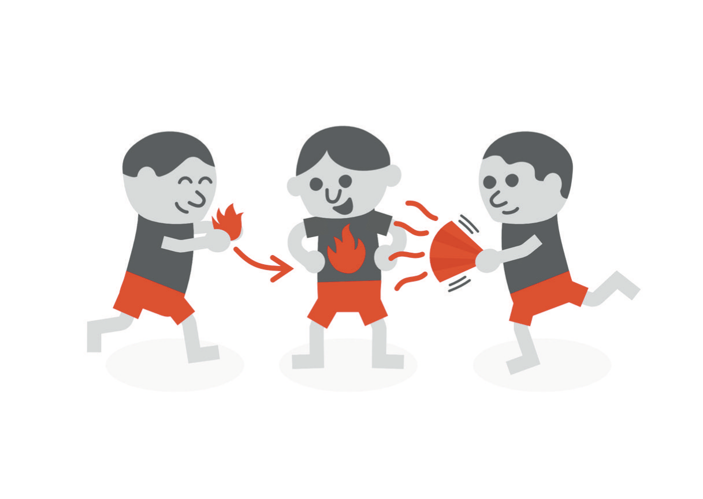
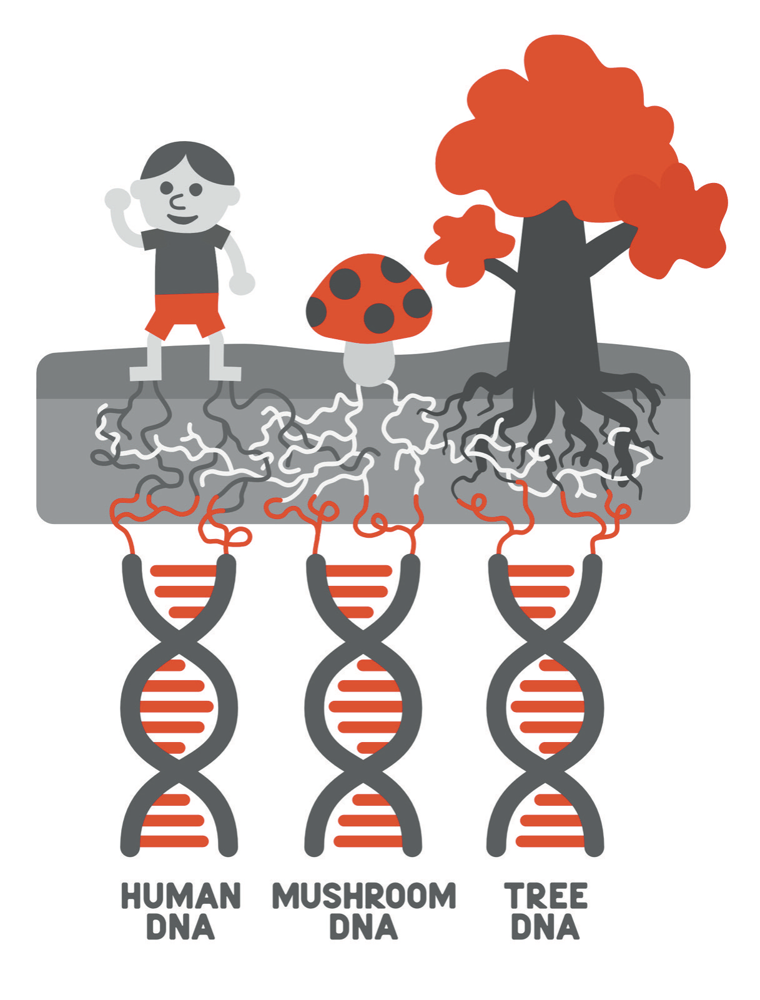

# We're All in This Together

Someone once told me that if your biggest problems are your personal problems, you need to get bigger problems. I liked the line enough to open a chapter with it in 2021, and then I listed my problems, to demonstrate how well I was following the advice: a pandemic, a real-estate portfolio I described with an adjective I will not repeat, several companies, a trilogy of books, a coaching program, an album I was producing with my brother, a father newly diagnosed with a heart condition that might be in my genes and my son's, and a two-year-old with cancer. I meant the list to be reassuring. Look how big my problems are, it said, and look how few of them are about me. Reading it now I see a man who had made himself the busiest person in every room he entered and had mistaken the size of his commitments for the size of his life.

The advice still has a use. For the ordinary personal problem, the slight, the rude email, the colleague who got the credit, it works exactly as intended: put the thing next to something larger and watch it shrink. What I did not understand when I quoted it is that some personal problems are the biggest problems there are, and that the advice, taken as a rule, will train you to keep shrinking them until they are small enough to ignore. A child's tumor is a personal problem. So is a mind that has stopped working properly, and so is a fear that arrives before you are awake. In the worst year of my life I followed that advice with great discipline. The bigger problems came, and every one of them was personal.

In the same chapter I wrote that most of my problems were problems of communication. If I found myself in a conflict with someone, I said, there was a ninety percent chance it came down to a miscommunication, and only after that was cleared up could I get to work on the other ten percent. I stand by the number, more or less. What I would add is that the largest communication failure of my life was not between me and another person. It was between me and everyone, on the subject of myself. For months I conducted an argument about whether I was finished as a human being, and the other parties to the argument were never informed that it was taking place. That is a miscommunication too, and the ninety percent applies to it. Most of what went wrong between me and the people who loved me in those months was that they were working from a version of me I had stopped being and had not corrected.

Chapter 10 ended with a sentence I want to pick up here: the widest margin I have is people, and I nearly lost it by protecting them from the truth. This chapter is about people as margin. Not as a sentiment, and not as a pillar in an acronym, which is how I treated the subject the first time, but as infrastructure: the part of a life that holds when the rest does not, provided you built it before you needed it and did not wall it off from the truth once you did.

* * *

The first edition of this book was written to an audience. I do not say that as a confession, since every book is. But I had an audience in the wider sense as well: a coaching community, a podcast, a growing number of people who knew me as the dermatologist who talked about real estate, and a count of Facebook friends that I compared, in the afterword, to the five true friends a person could call at three in the morning. I made the comparison in favor of the five. I made it, I now think, as someone who had never had to call.

Here is the difference as I have come to understand it. An audience consumes your competence. It arrives for the version of you that is working, and it is not wrong to; that is the deal. People are the ones who would notice the absence of that version and want to know where you had gone. The two groups overlap, and it is easy to mistake the size of the first for the depth of the second, especially if you are the kind of person who is good in front of a room. During the crisis I had, by any count, more people around me than at any other point in my life. Nearly all of them had come for the performance, and the performance was the one thing I could still reliably deliver, so I delivered it, and they applauded, and I went home.

What surprised me afterward was how small the second group turned out to be, and how good. Fewer than I would have guessed in 2021, when I thought I knew a great many people. Better than I deserved, given what I had put them through by making sure they knew nothing. The people who were actually there at the end were not, for the most part, the ones I had cultivated. Some of them were people I had known before I was good at anything, and I will come back to what that means.

An audience is not a moral failing. I like an audience; I recorded the audiobook of the first edition myself, and I am writing this one to you. The mistake is structural. If most of the people in your life are there for your competence, then the one thing you cannot afford to lose is your competence, and the first thing you will hide is any evidence that you are losing it. The hiding is rational. That is what makes it dangerous.

* * *

I grew up in a family that was extravagantly invested in achievement and turned out, when it mattered, not to be interested in it at all. My parents came across an ocean and built careers in medicine and dentistry, and Chapter 1 told that story, so I will only say here that a family like that gives you two things at once: a standard you can never quite meet, and a set of people whose regard was fixed before you had done anything to earn it. My sister teaches kindergarten, and my brother plays the piano for a living. Neither of them has ever needed me to be a surgeon, and it is a strange fact about my own psychology that the people least impressed by my credentials were the people I most wanted to protect from the news that the credentials were no longer holding me up.

The clearest teacher I have on this subject is small. In 2021 I wrote that I took Adrian to Costco, sat him in the seat at the top of the shopping cart, and watched him beam at people. I also wrote that I had already talked too much about Costco, that I was a dad who lived in a house in the suburbs and spent a lot of time at Costco, and I see no reason to revise any of it. What I described then was a toddler with no hair and a feeding tube in his nose, in the middle of chemotherapy, turned fully outward toward strangers. People looked twice. They saw the tube and the missing hair, and then they saw the delight, and nearly all of them smiled and waved back. I called it love energy at the time and said it came back to him. I do not know about energy. A child who had every reason to turn inward did not, and strangers answered him, and that is the simplest demonstration I have ever seen of the thing this chapter is about. He was not performing; there was nothing to perform. He was reaching, and the reaching worked.

I could not do what he did, at two years old, with a tube in his nose. Years later, with every advantage he lacked, I turned inward and stayed there. The comparison is not fair to me, and I make it anyway, because I had a great deal more to reach with than he did and used almost none of it.

My staff taught the same lesson from the other direction, and I had the evidence years before I needed it. During Adrian's treatment the people who worked in my clinic were kind in ways I did not ask for and could not have scheduled. They gave gifts, generously, out of paychecks a good deal smaller than mine. In Chapter 5 I said that my staff needed me fine so the schedule would run. That was true and also unfair, because these were the same people who had shown me exactly what they would do with hard news if I gave it to them. I had the data. I filed it under gratitude and kept the later news to myself.

One gift I have never been able to put down. Linda was the histotechnician in my Mohs practice, which means she was the person who turned the tissue I removed into the slides I read; nothing in my day happened until she had done her part. Her father had died the year before, and she had not been able to set it down. One morning she came in and told me about a dream from the night before. In the dream her father was at the clinic. She knew he had died and was not sure whether any of it was real, so she went to find a colleague to introduce him to, and the colleague she found was me. Her father shook my hand, she said, looked me in the eye, and told me, "Your boy's going to be okay." She woke up at peace with him for the first time.

In 2021 I wrote that this meant the universe was radiating love in my son's direction. I would not write that now, not because I have decided it is false but because I have no way of knowing, and I have learned to be careful about sentences that begin with "the universe." What I can say is smaller and carries more weight. I do not know what her dream was. I know what it was to be told. A woman carrying her own grief walked into the clinic and handed me the one sentence I most needed, from a man I had never met, at a time when the people who were paid to know could not promise me anything, and she did it because she had noticed what I needed and had something to give. That is connection with no metaphysics attached, and it was enough.

* * *

When I was in medical school, one of my classmates was murdered.

Paul DeWolf was not a close friend, but I knew him, and he wore the same backpack I did, which made us, in my private accounting, a pair of brothers: the backpack twins. He lived in one of the medical fraternity houses in Ann Arbor. In July of 2013 the house was broken into, and Paul was shot in his room and died. He was twenty-five, on an Air Force scholarship, planning to use his medical education in the service. Three men were later convicted or pleaded guilty. What they took was a game console; in the first edition I named the brand and appear to have gotten it wrong, which is a small thing to correct, and I am correcting it anyway, because the point of the story is that a life ended over an object, and the object's name does not matter.[^c11-1]

We cried at his funeral. At the memorial his sister played the piano, combining two pieces that had no business together, a Yiruma piece and the theme from *The Office*, and it was beautiful, and I cannot hear either one now without being back in that room. Then the trial came, and I saw a photograph in the newspaper of one of the defendants, probably younger than I was at the time, laughing. Rage like that I have felt once in my life. You ended my classmate's life for a game console, I thought. What is wrong with you.

I want to be honest about what I did with that question in 2021, because it is a good example of how I used to write. In the space of a paragraph I turned it into a question about the man's life: what had gone wrong for him, what had brought him to that house. Then I concluded that I had to find love in my heart for Paul's killer, and I offered the reader a mini-challenge about letting go of hate. That passage is not one I disown. I do think I got to the end of it too quickly, and that the speed was a habit, the same one I have described elsewhere in this book: convert the unbearable thing into a lesson before it has finished happening.

What I hold onto now came from Paul's father. Thom DeWolf read the chapter before the first edition went to print, and he responded with an account of his own anger, which had been intensified by the men's conduct in court and which he came to see was damaging only him. He described a distinction he had learned while helping other bereaved families: forgiveness does not condone an action. The consequences stay in place, and the people responsible are still held accountable, and only once he understood that could he begin. He also described sitting in the courtroom with the families of the men who had killed his son and realizing that they were losing their sons too. I am paraphrasing a man who has earned the right to be quoted, and I have tried to do it faithfully.

That distinction turned out to be the most useful sentence anyone gave me for the years that followed, and not because of Paul. A reader who has come this far will want to know whether I have forgiven the person at the center of the transactions I described in Chapter 5. The question assumes I know exactly what there is to forgive, and Chapter 5 explained why I do not; there are things about those deals that no one has audited, including my own part in them. What I can say is that Thom's version does the work the question is asking about. Consequences were the court's business, and the court attended to them. Whatever the truth of the rest, the anger I carried in the worst months had two addresses, and the one that did the most damage was my own. Forgiveness, in the sense Thom taught me, does not require a verdict. It requires deciding that you will not let a thing keep eating you while the facts are still being sorted, and that turned out to be a decision I had to make about myself before I could make it about anyone else.

Paul's family set up a scholarship in his name at our medical school. I have given to it, and each year someone gets to attend a place he loved and worry a little less about money because of him. There was no time to build a friendship with Paul while he was alive. In some way I do not fully understand, I have been building one since, and none of it would have been possible if I had stayed where the newspaper photograph left me.

* * *

In 2021 I had a life coach and what I called a high-level peer group, and I was proud of both. When something in the real-estate business was going wrong, the peer group would get real with me: "Dude, this is a dumpster fire if you don't fill that vacancy." I wrote that down as an example of accountability, and in a sense it was. They were good at urgency. What they were not positioned to do, and what I never asked them to do, was tell me not to do the deal. Most of the people in that group were in the same kind of deals I was, pointed in the same direction, cheering the same climb. When a room like that says you are moving too slowly, that is accountability. When a room like that never once says you are moving too fast, that is not the room's fault. It is the room's design.

There is a line often attributed to Rumi that I put in the first edition: set your life on fire, seek those who fan your flames. I still like it, and I would now add a second sentence. The people who fan your flames are not the same as the people who will tell you the fire has spread to the curtains. You need both, and a successful life fills up with the first kind automatically, because success makes people want to be near it, while the second kind has to be recruited and protected on purpose. Most of the people I added to my life in the years before the crisis had a reason to want me to keep going: they worked for me, or they were in my deals, or they wanted to be. None of that made them bad people. It made them useless as brakes.

In Mohs surgery the surgeon reads his own margins. It is part of what drew me to the field, and it is efficient: no waiting on a pathologist, no handoff, the loop closed inside one person. It is also exactly the structure I recreated in the rest of my life, without noticing, and without the years of training in reading slides that make it safe in the operating room. I had become the only person checking my own work in every domain at once. In medicine that arrangement is called a fellowship-trained specialist. In everything else it is called a blind spot.

So I keep what I now call, with some embarrassment at the corporate ring of it, a personal board of directors. Nothing about it is formal, and there are no meetings. It is a short list of people who can say no to me and who are not in my deals, chosen for that combination rather than for how much I enjoy their company, though I do. One or two knew me before I was good at anything, which means my competence was never the reason they showed up and its loss would not be a reason to leave. One or two are in my field but have no stake in my business, so they can tell me when a plan sounds like a surgeon's confidence exported to a subject he does not understand. At least one is a professional whose job is to know things I do not and whose fee does not depend on my saying yes; Chapter 10 said what that means in practice, and I will not repeat it. And one person, always, knows my actual state, in the sense Chapter 7 described, and has permission to ask the second question when the first one gets "fine."

What the board is for is dissent, and dissent has to be preserved deliberately because everything about a successful life erodes it. Chapter 4 talked about the average-of-five-people idea and what it cost me; here I will only add that five people who agree with you are not a board. The measure of the list is not whether they support you. It is whether, in the last year, at least one of them has told you something you did not want to hear and you kept them anyway. If nobody has, the problem is not that your life is going well. The problem is that you have arranged it so that nobody can.

* * *

The first edition made a large claim in this chapter, which I am going to shrink. I wrote that we are all connected, and I said I meant it literally: you, me, the trees that made the paper, all of it one thing. I built the case from biology and then left biology behind for something I called oneness, and those are not sentences I would write now.

What remains when the metaphysics is removed is still, to me, astonishing. Every living thing we have ever examined uses the same four-letter chemical alphabet, reads it in the same three-letter words, and builds itself from the same twenty-odd amino acids, with a handful of dialect differences. The tree outside the window, the fungus that will eventually eat it, and the man looking at both are running the same code. I learned this as an undergraduate at Berkeley and did not think about it again until my son started talking to trees. He runs up to them on walks, puts his hands on the bark, shouts "Hello?" and then stops and listens. In 2021 I wanted the tree to be saying something back. I have stopped needing it to. The fact of the shared code is enough, and it does not require me to believe anything I cannot check.

A fact about biochemistry is not a relationship, though, and this is where the first edition's version of connection let me down. Believing that I was one with everything did nothing for me at four in the morning, because oneness does not pick up the phone. The connection that held was not cosmic. It was specific people, with names, who knew where I lived.

Chapter 7 already made the case for being reachable, so I will be brief. The people who found me did nothing sophisticated. They asked how I was, got the answer everybody got, and then asked again, which nobody else did. They came when it would have been easier not to and stayed when there was nothing to do, and staying turned out to be the whole job. For years I had built a life that would not need them, and when the life came apart they were what was left. They are not named in this book because the who is theirs. The acknowledgments say the rest, and I have tried to say it to each of them in person, badly, more than once.

Connections need feeding. I wrote that in 2021 too, and it is one of the sentences I got right the first time: they are living things, and you have to try. What I did not add is that the trying has to be built into the structure of your days, because the version of you that most needs people is the version least able to reach for them, and no amount of believing in connection will make the call for you. That is a design problem, and it is the subject of the last part of this book. None of this survives contact with a bad calendar.
