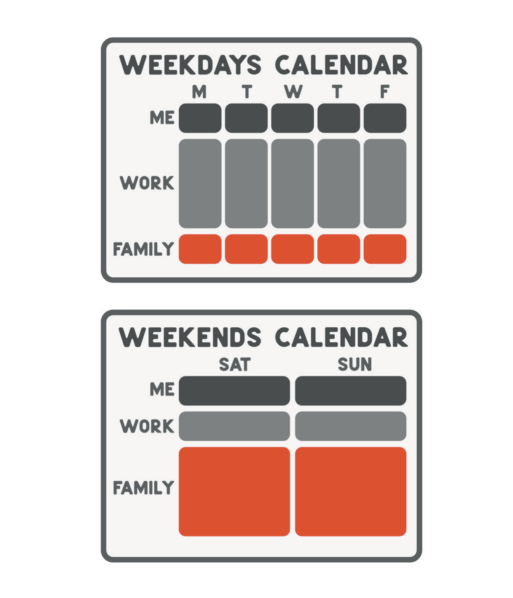

# Design Beats Willpower

One of the worst chart notes I have ever read had, in the physical exam section, the sentence "Patient remains intubated and sedated." The plan the day before had been to take the breathing tube out, and someone had carried out the plan; the patient was awake, alert, and speaking. That exam had been copied forward from the previous day and never updated, and there it sat in the record, describing a person who no longer existed.

I used that story in the first edition of this book as evidence for a complaint: the electronic medical record was soul-sucking, the boxes and the smart phrases and the long useless blocks of text were burning doctors out, the signal was getting lost in a sea of noise. I stand by the complaint. What I would add now is that the note was not the product of a lazy doctor but of a system working exactly as designed. Copying forward was the default, the default was fast, and writing an honest exam from scratch took time the schedule had not allotted. Nobody involved lacked willpower. The residents I trained with had more willpower than any group of people I have met before or since. The design won anyway, because design always wins over enough repetitions.

That is the whole argument of this chapter, and I want to make it before I make it complicated. If a result keeps happening to you, look at the system that produces it before you look at your character. A bad calendar is a system. So is a chart that lies, and so is a phone that sleeps where you sleep. High performers do this instinctively for everyone else's problems and almost never for their own. We redesign the clinic workflow and then try to fix our own sleep by wanting it more.

The World Health Organization, whose definition of burnout I quoted in Chapter 6, describes it as "chronic workplace stress that has not been successfully managed." The stress is chronic, which is a statement about the environment. It is workplace stress, which is a statement about where. And it has not been managed, which is a verb about design and not about grit. Nothing in that sentence says the exhausted person needed to try harder, and when I wrote the first edition I already knew this part. I wrote that the hospital's emails encouraging us to drink more water and get more exercise did not work, that all the free yoga classes and seven p.m. "cheers to our medical heroes" in the world were not going to stop anyone from bleeding to death. Slapping a Band-Aid on a bullet wound, I called it, and that line survives this revision intact, because it has only become more true.

Where I went wrong was in what I did with the diagnosis. I concluded that since the organization was not going to fix the structure, the answer had to come from within, and I spent most of the first edition on the within. But I had skipped a category. Between the systems the organization owes you and the mindset you owe yourself sits a third thing: the systems you owe yourself. These are not attitudes but arrangements of time, defaults, people, and reserves that operate whether or not you feel strong that day, and they are the subject of this chapter, because on the days I needed them most, I did not have them.

* * *

The systems the organization owes you are not mysterious: safe staffing, schedules a human being can survive, documentation that tells the truth, a way to say no that does not end your career, and someone above you who has to answer for the pattern rather than for each incident. You are not going to fix those with meditation, and I no longer pretend otherwise. You can influence them, accept them for a while, or leave, and I have written about that choice already. What I want to do here is the other side of the ledger, the part that stays with you when you change jobs, because it turns out that a person can leave a bad system and carry a worse one out the door with him.

Let me start with the document I trusted most. In the first edition I wrote, with what I now recognize as swagger, that I knew exactly where I would be at three p.m. next Wednesday because I treated my schedule with respect. I described the constraints honestly enough: a surgeon in private practice who does not work has a staff who does not work; a six-week trip announced the day before is a betrayal, while the same trip announced in January is a plan. Then came the blocks I had drawn on my week: a block for work, a block for family, a block in the early hours for me, and a line about guarding that boundary with my life.

I put the blocks on the calendar after I understood that nobody else was going to. A calendar is the only honest document most of us keep, because it cannot be spun. You can tell yourself you prioritize your health while the calendar shows you have not seen a doctor in three years. You can tell yourself your family comes first while the calendar shows where the hours went. When I had the blocks, they worked. The practice knew my hours, the people I talked to most knew when I would not answer, and the weekend belonged to a small boy who liked me flat on the carpet so he could run Hot Wheels cars over my legs as though I were a road.

Here is what I did not understand about that document: it is honest about time and silent about the person. During the worst period of my life, my calendar looked almost exactly like the figure above. The work block was full of surgery, and the family block had me in it. The morning block, my time, had been quietly replaced by a recurring legal call for reasons I have already described, and the calendar recorded that substitution without comment, the way a calendar records everything. Anyone who audited my week would have found a disciplined man with balanced priorities. The document was accurate, and it was also the mechanism by which I hid, from other people and from myself, because a full calendar reads as a full life.

So I have come to think about white space differently. In the first edition, unscheduled time was a luxury that time freedom bought. I now think white space is load-bearing. In Mohs surgery, the margin is the rim of tissue around the cancer that you examine under the microscope, and whether it is clear is what tells you the operation worked. A schedule with no margin fails the same way: it looks complete, and it is not. The first unexpected thing, a fever in a child on chemotherapy, a call from an attorney, a mass on an imaging study, collapses the whole week onto itself, and everything that was merely important gets cut to save whatever is urgent. The blank space on the calendar is not rest. It is the reserve that makes the rest of the calendar survivable, and I have stopped filling it just because it looks empty.

* * *

The second system is one you already have, whether you designed it or not. Every recurring situation in your life has a default, meaning what happens if you do nothing. The phone charges where it charges; the sample closet at work is unlocked or it is not; the call recurs at the hour someone else picked. Defaults are decisions you made once, or never made at all, and stopped noticing, and they are more powerful than any decision you make on purpose, because you make them every day without spending anything.

Mine, in the months when I was waking long before I meant to, went like this. The phone slept on the nightstand. When I woke in the dark, it was the first thing my hand found, and by the time I was fully conscious I was reading. Nothing in the inbox at that hour was ever good, and I did not once decide to read it; I only failed to decide not to. The sample closet in a dermatology office is a default too, and I have written in an earlier chapter about what I took from mine and what I still wonder about it. The standing call was a default of the purest kind: an appointment that recurred without anyone choosing it again, and that I would have defended as necessary on any given morning, which is exactly how defaults defend themselves.

You do not fix this by winning the argument every morning. You change the default so that there is no argument. Move the phone out of the bedroom, which is a smaller change than it sounds and worth more than every resolution about screen time I ever made. Ask, of anything that recurs, what happens if you do nothing, and whether you would choose that outcome if you were choosing it fresh. Most of the time nobody chose it at all; someone else's convenience, or your own on a single afternoon years ago, set the default, and you have been living downstream of it ever since. High performers are particularly bad at this because we can override a bad default with effort, which means we never feel the pressure to fix it. We just pay for it, daily, in a currency we do not count.

* * *

There is an order of operations for changing a system, and getting it wrong is the most common mistake I see ambitious people make, myself included. Delete first. Then delegate. Then automate. Only then optimize. The instinct of every high performer I know runs the opposite direction: we optimize first, because optimizing is fun and feels like progress, and we end up with a beautifully efficient way of doing something that should not have been done at all.

Delete means asking whether the thing needs to exist. In the first edition I wrote that I had a million ideas and wanted to execute them all now, and I wrote it as a boast. Most of those ideas did not deserve a calendar block, and the ones that did deserved it only because I had said no to the others. Saying no is deletion applied to the future. It is also the hardest of the four for someone whose identity was built on saying yes to everything and then outworking the consequences, and I am not going to pretend I have become good at it. I have become slightly less bad.

Delegate means finding the person whose job this should be. The first delegation I ever did well is the one I described in Chapter 10: a property manager, hired reflexively, because of what I had watched my mother's tenants do to her weekends when I was ten. What I would note here, with the benefit of everything that came after, is that I delegated the toilets and kept the decisions, and the decisions were the part where I needed help. In my practice the same instinct produced a staff who made it possible for me to do the one thing only I could do, which is what a surgical team is for. Delegation is not handing off tasks. It is designing so that the task never reaches you, and so that when the thing that does reach you is a hard judgment, you are not too tired to make it.

Automate means letting a machine hold the routine so a human does not have to remember it. I have less to say about this than the productivity books do. An automatic transfer to a reserve account, a recurring order for the thing you always run out of, a note that writes itself from a template you actually reviewed. The chart note that opened this chapter was automation without review, and it is the cautionary version: automate the routine, and keep a human on the part that changes.

Optimize last, and only what survived the first three steps.

* * *

The first edition contained a small technique I want to keep, for a reason I did not have when I wrote it. Pick something you have been putting off. Do not try to do all of it. If the sink is full, wash one dish. Set an alarm for eight p.m., after dinner and before you are too tired, wash the dish, and count it as a win. Make a chain of it, the way Jerry Seinfeld is said to have told younger comedians to write one joke a day, mark the calendar with a red slash, and never break the streak. One dish, one page, one hundred words.

In the first edition I offered that as a trick for building momentum toward massive action, which was a phrase I liked then. I offer it now as something else: a design for the days when there is no willpower to be had. When you are well, one dish is trivially small and the technique looks like a gimmick. When you are not well, one dish is the entire achievable universe, and a system that asks for one dish is the only system that will still be running. The point of the chain was never the streak. The point is that the bar has been set, in advance and on a good day, low enough that a bad day can still clear it. Willpower is what you reach for when the design has failed. A good design assumes that some days you will have none.

I learned the other half of this from a story the monk Ajahn Brahm tells in his book *Opening the Door of Your Heart*, which I will paraphrase as I did the first time. An abbot is building a new hall at his monastery, and the rains come and stop construction. A visitor sees the half-built structure some days later and asks when it will be finished. "The hall is finished," the abbot says. The visitor looks at the missing roof and the debris and asks what he can possibly mean. "What's done is finished," the abbot says, and goes off to meditate.

The surgeon in me hates this story. We do not leave the wound open and call it finished; we close, we dress, we go home. But a life is not a wound, and the work in a life is never finished, and I built my first several decades on a system that required completion before rest. Dishes accumulate because you eat. Patients accumulate because people keep getting skin cancer. Ideas accumulate because you are the kind of person who has them. A system that grants rest only when the work is done is a system that never grants rest, and I ran on one until it stopped running.

* * *

Around the time of the first edition I bought a house with a shower stall whose floor had been patched. A couple of handymen told me that replacing it would be expensive and more trouble than it was worth, and that the sensible thing was to wait until one of the patches failed. I decided to tear it out anyway, partly because I could afford to and partly because I had noticed a few other patch jobs around the house I wanted cleaned up. Behind the shower stall, and behind the other patches, was black mold. The insulation came out, everything got bleached, concrete went over the places where the mold had grown, and a new shower went in. I remember the relief: my son was in and out of the hospital with an immune system that chemotherapy had knocked flat, and he was going to breathe the air in that house.

In the first edition the lesson was about wealth: do it right, not the easy way. I would now say it more plainly. A patch is a system too. It is a system for not knowing what is behind the wall. The handymen were not wrong about the cost of the repair; they were wrong about the cost of not looking, which they could not have known, because the whole point of a patch is that nobody looks. I spent years applying patches to my own state and calling the result functioning, and the wall looked fine from the hallway. Clean air was not a luxury that year. It was the difference between a house my son could live in and one he could not, and I had to open the wall to find that out.

* * *

The first edition had a passage about boundaries that I have to rewrite, because I was right about the principle and wrong about the tone. I wrote that spending time with me was a luxury, that I was booked out eight months, that the people who yelled at my staff or left one-star reviews over a wait time or a parking ticket had shown me they did not see my time as valuable, and therefore did not see me as valuable. I compared them to people who scream at a flight attendant and then turn on the charm for the CEO of the airline. And I wrote that because I had time freedom, I could tell such a person to go see somebody else.

Rereading it, the part that makes me wince is how much of it is about my time and my value. A person who screams at a receptionist is choosing a target who cannot answer back, and the receptionist's afternoon is not a moat around the doctor. Staff are not there to absorb what people would never say to my face. When I wrote that if you are rude to my front office you are rude to me, I had the direction backward: if you are rude to my front office you are rude to them, and they are the ones who need the practice to have their backs. A practice that will end its relationship with a patient who abuses its people, and will do it properly, with notice and with the patient's care handed on, is a practice that has decided in advance whose afternoon it is protecting. The flight-attendant comparison holds for the same reason. The airline's rule is a design, not a mood. Nobody on the plane has to be brave. The boundary was drawn on a calm day, and the bad day only has to consult it.

That is what a boundary is, structurally: a decision made in advance so that it does not depend on how strong anyone feels at the moment it is tested. The first-edition version of me treated boundaries as a display of status. I now think of them as a kindness to the future version of yourself and to everyone who works with you, none of whom should have to relitigate, at four in the afternoon on a hard day, whether they deserve to be spoken to like people.

* * *

The last category is one I want to describe in words I would have found too dramatic when I wrote the first edition. Engineers who build things that must not fail talk about resilient systems, and they mean something specific: redundancy, so that no single failure takes the whole thing down, and reserves, so that a surge does not exhaust the supply. Ambitious people build these into their businesses. Almost none of us build them into ourselves, and the reason is the same blind spot that runs through this whole book. We are the component that has never failed, so we never design for our own failure.

Redundancy, for a person, means two people who know your actual state. Not one, because one can be traveling, or tired, or fooled, and one is easy to manage. Two people who have been told the truth and given permission to compare notes make a system, and it is the one I most conspicuously did not have. I had a great many people who knew my schedule. Almost nobody knew how I was actually doing, and for a long time that was not an accident of circumstance. It was a design, and I had designed it.

Reserves mean margin in every currency that matters. Money, which I have written about already and will not reargue here. Time, which is the white space above. Sleep, which is the reserve most high performers spend first and which no amount of mindset replaces, because the body has requirements and does not accept arguments. And medical care, by which I mean a physician of your own who is not you. In the first edition I joked about doctors who take the hypocritical oath, doing the things they tell their patients never to do, and I did not notice that I was describing the purest form of it: a doctor with no doctor. A physician who is not you is a system, because a physician who is not you will ask the questions you have arranged never to be asked, and will write down the answers.

The version of this that I trust most is a standing appointment that does not get canceled for work. What the appointment is for matters less than its standing. It exists on the calendar before the week fills, it is with someone whose job is to ask how you actually are, and it is protected by the same rule that protects a surgical block: it is not available to be traded for something that seems more urgent on the day. A recurring appointment is a default pointed in the right direction, which is the whole idea of this chapter in one line. Set it once, on a good day, and let it recur through the bad ones.

None of these systems is impressive. Nobody is going to invite me on a podcast to talk about where a phone should charge. But when I list them together, the phone out of the bedroom, the white space, the two people, the reserve account, the doctor who is not me, the appointment that recurs, the policy written before it was needed, they start to add up to something a physician would recognize. There is a word for a sequence you follow when your judgment is the faculty that has failed, and it took me a long time to accept that the word applied to me.
