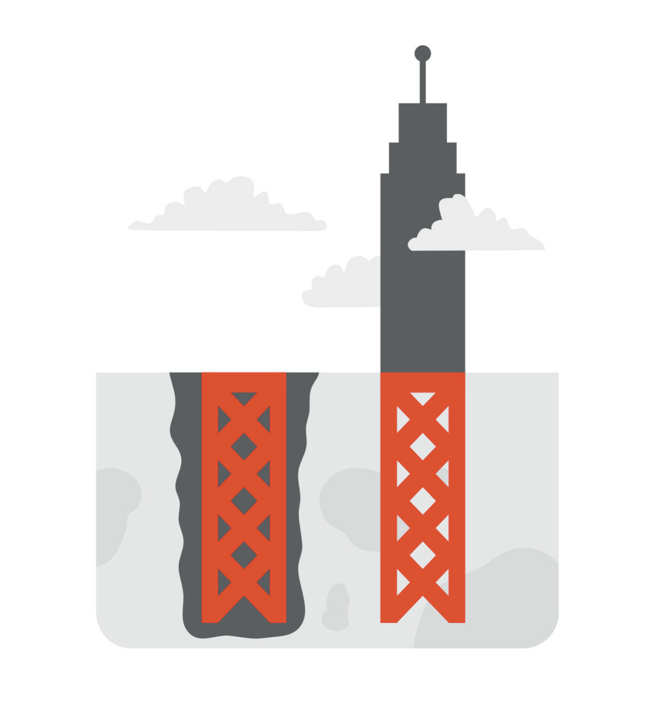
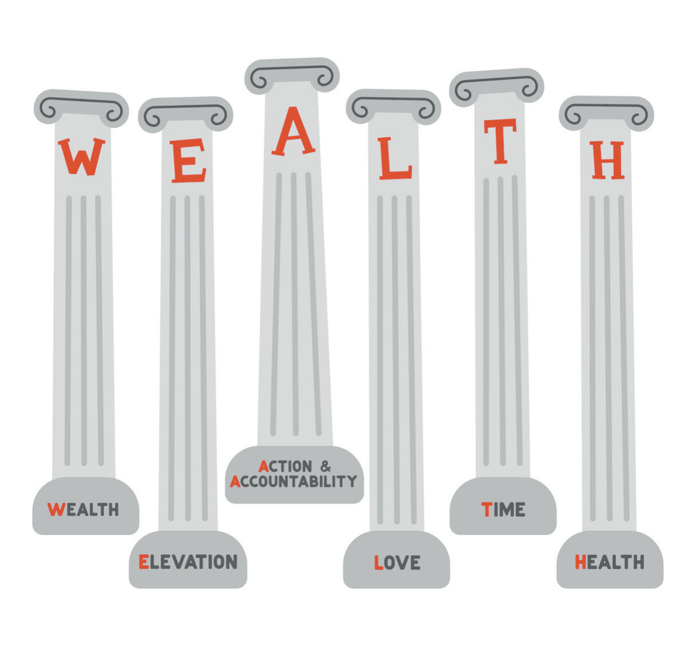

# The Burn In Protocol

I resisted the word for a long time. A protocol is what you hand to someone who can't be trusted to think. It's the laminated card on the crash cart, the pre-printed order set, the sequence a nurse can run with no physician in the room. I'd spent two decades becoming a person who exercised judgment, and the whole appeal of judgment is that it belongs to you. Nobody frames a protocol and hangs it in the office.

Then I thought about where protocols actually live in medicine, and why. When a patient's heart stops, the team doesn't hold a discussion. Somebody starts compressions, somebody reads the algorithm, and the most experienced person in the room follows the same sequence as the least experienced, because the moment that most requires good judgment is the moment when nobody has any. Before I cut anyone, someone in my operating room says the patient's name, the site, and the procedure out loud, even when I've just spent ten minutes with that patient talking about her grandchildren. The time-out isn't for the day I'm confused. It's for the day I'm certain. Mohs surgery, the operation I spent a fellowship year learning, is itself a protocol: take a layer, map it, process it, read the margins yourself, go back only where the map says, and then, and only then, reconstruct. The sequence exists so that a tired surgeon on his ninth case of the day does exactly what a rested surgeon would do on his first.

I knew all of this. *The Checklist Manifesto* was on the reading list at the back of the first edition, filed under Action and Accountability, and I'd read it as a book about other people's errors. The man who compiled that list was sure of a great many things: that he could fix any problem by working on it, that no one needed to know how a problem was going, that he knew the diagnostic criteria for the conditions he was quietly failing to apply to himself. Certainty, it turned out, was the state I most needed a protocol for. You build a protocol for the person you become under load, because that person isn't going to be reachable by argument. A protocol also has a property I had underrated, which is that it's external. It lives on a card, or in a colleague's hands, and not inside the head that is failing. That is the design principle behind everything that follows.

So I used the word. What follows is the protocol as I now understand it: three moves in a deliberate order, then an honest look at the six pillars I built the first time, then one page for anyone who is where I was. I tried, for about an afternoon, to make the three moves spell something. They don't. I have a history with acronyms, and the last one is coming up later in this chapter, so I let it go. The three moves are connect, recover, and build, and the order is most of the content.

* * *

Connect comes first because I did everything in the reverse order, and the reverse order nearly killed me. In the years of the crisis I attacked the numbers first, because numbers were the kind of problem I knew how to work. Then I tried to manage my sleep, badly, as a logistics problem. The truth about my actual state came out last, after the worst had already happened, when it could no longer be kept in. Every step of that sequence felt responsible at the time. A high performer's instinct is to fix the thing before anyone sees it broken, and the instinct is exactly wrong, because the fixing gets done in the dark, alone, at the hours when judgment is worst.

By "connect" I mean something narrower than it sounds. I mean that one person, chosen in advance, gets told the actual state. I don't mean the summary, or the version with the joke attached. The actual state is usually one sentence long and usually embarrassing: how many hours you slept, what you think about when you wake up, what you're afraid of, with the number in it. Mine, in that period, would have been something like this: I wake up already frightened, I haven't slept through a night in longer than I can remember, and I believe this ends with me losing everything. I never said that sentence to anyone. I said things adjacent to it, in tones that made them easy to wave off, and people waved them off, because I'd spent a career teaching everyone around me that I was fine.

The person you tell isn't there to fix it. That took me a long time to understand, because in my world a problem stated is a problem assigned, and I didn't want to assign anyone the problem of me. The person is there to hold the sentence, so that it exists somewhere outside your own head, where it can be compared against reality by a brain that is sleeping. A sentence that lives only in the mind of the person it's about will get revised every night, and the revisions all go one direction.

Connect also means a clinician who isn't you. Physicians are terrible at this, and I was worse than most, because I could recite the criteria and therefore believed I was applying them. You can't examine your own abdomen for a mass; the hands are attached to the patient. The same is true of the mind, more so. A clinician of your own, seen while you're still functioning, is the difference between a diagnosis and an autopsy. I don't say that to be dramatic. I say it because I know how narrow the margin was.

The rest of connection is the board I described two chapters ago, people who can say no to you and aren't in your deals, and the plain discipline of staying reachable, which is a skill and not a personality trait. What connection isn't, and what I mistook it for, is an audience. In 2021 I had a book, a coaching group, and rooms full of people who wanted what I wanted. That is a great deal of contact and almost no connection. An audience receives the version of you that you decided to send. A person sitting across from you sees the version that arrived.

* * *

Recover is second, and it begins with the most practical sentence I know, and I won't apologize for reusing it: state before story. Before you decide what the crisis means about you, find out whether you've slept. Before you conclude that you're a fraud, or finished, or a disappointment to the people who crossed an ocean for you, eat something, go outside in daylight, and check whether the conclusion survives. Frequently it doesn't. The story you tell about your life is generated by an organ, and the organ has operating conditions.

Sleep is the non-negotiable, and I write that as someone who spent his twenties being trained to regard sleep as a character flaw. Surgical residency doesn't teach you that sleep is optional; it teaches you that needing it's a weakness other people have. The crisis completed the lesson. The early mornings I'd written about as my time went to attorneys whose workday started before mine, and the nights belonged to a fear that was already awake when I was. I have described those nights elsewhere and won't do it again here, except to say that everything downstream got worse as the sleep went, exactly as I'd have predicted for a patient, and that I didn't once apply the prediction to myself. If you're sleeping four hours a night and making decisions with a lot of zeroes in them, the decisions are the second problem.

Recovery also means treatment when treatment is indicated, including medication. I'm aware of how physicians hear that sentence. We prescribe for other people with a clear conscience and then treat our own charts like a confession. If a clinician you trust recommends medication for your mind, the correct response is the one you'd want from your own patient: take it seriously, take it as prescribed, and report back honestly, including about anything else you've been taking, especially the things you prescribed yourself.

Then margin, of two kinds. Financial margin got its own chapter, and its shortest summary is that a bad year shouldn't be able to become a catastrophe. Temporal margin is the same idea applied to the calendar: white space that is nobody's, and a standing appointment that survives a busy week, because the week you most want to cancel it's the week it exists for. In the first edition I compared an emergency fund to a box of matches for relighting your fire. I still like the image. I'd add now that the matches have to be somewhere you can reach in the dark, and that not all of them are money. A friend who will pick up at five in the morning is a match. An afternoon with nothing in it is a match. A physician who already knows your history is a match you don't have to strike while explaining yourself.

The standing appointment deserves its own sentence, because it's the item I resisted longest. An appointment you keep when you feel fine is the only kind that will still be there when you don't, since nobody makes a new one from inside the state that needs it. The person who books it's the well version of you, and the well version has to be willing to do a small, slightly humiliating favor for the other one. Put it on the calendar the way you'd a case: a fixed hour, a real name attached, the kind of block that a busy week has to work around rather than through.

Recovery is slow and it's boring. Nobody films it. In the years since, the things that actually helped have all been unglamorous, repeated, and small enough to fit on a calendar, which is how I learned that the size of an intervention has nothing to do with its importance. I'd spent my life looking for the large move, the one that would settle the matter. Recovery doesn't have one of those. It has Tuesdays.

* * *

Build comes last, and I want to be honest about why I put it there: it's where I always started. Given a problem, my reflex is to construct something, and construction had been my answer to every discomfort I had ever felt, including the discomforts that construction was causing. The protocol puts building third so that it happens on a foundation and not instead of one.

Building, in the sense I mean, is what the previous chapter was about: design over willpower, systems that hold when you don't, defaults that do the right thing while you're busy or tired or lying to yourself. It's also the deliberate containment of ambition. Here I'll only say that the container has to be built while the fire is small, by a person who isn't yet convinced he needs one.

In the first edition, on the same page as a promise to go to the moon, build a real-estate empire, and pursue enlightenment at the same time, I wrote this: when building a skyscraper, the height of the building is determined by the depth of its foundation. That which is built up must first be built down. I kept the sentence because it's the truest thing on that page, and because I read it now in a way I couldn't have then. A foundation is the part of a building nobody sees. You can't admire it from the street. No one has ever complimented a developer on his footings. In the years before the crisis I was adding floors, quickly, in a market where every floor seemed to hold, and I didn't go back down to check what the building was standing on. The collapse did the checking for me.

"Built down" now has a second meaning for me. After a collapse, the first building you do goes downward: back to sleep, back to a physician, back to one person who knows the actual state. That isn't a detour from ambition. It's the footing. Ambition, when it comes back, gets re-entered on purpose, at a deliberate pace, with the people from the first step watching the gauge, and the moment to start isn't the moment you feel ready. Feeling ready was never a reliable signal for me. Feeling ready is how I bought things.

## The Pillars, Revisited

The first edition organized wealth into an acronym, and I want to give it a fair hearing rather than a burial, because most of what it said was true and the problem was the load. WEALTH: Wealth, Elevation, Action and Accountability, Love, Time, Health. Six pillars holding up what I called the temple of your body and soul. That is a lot to ask of six columns, and I distributed the weight badly.

The W carried too much. An acronym for wealth whose first pillar is Wealth tells you where the author's attention was. I wrote that you're still you no matter the number of zeroes in your bank account, and I believed it in the way that a man who has never had the zeroes threatened believes it. When they were threatened, I didn't feel like me at all. I felt like a verdict. The sentence was true, and I wasn't yet the person it was true of, and writing it down hadn't made me that person. I'd keep the pillar, shorter, with a different job: money is margin, so that a bad year stays a year.

Elevation assumed that the direction was up. That section was full of mountains and summits and a tribe of people cheering you toward them, and it never occurred to me to ask what the pillar had to say on the day the correct direction was down: to bed, to a physician, to the foundation. Nobody writes a pillar called Descent. I'd now. The rooms I was elevating in were rooms where everyone's chart pointed the same way, and a room like that can't tell you when yours has turned.

Action and Accountability cracked along the seam between the two words. Action I had in abundance; the first edition's adjective for it was "massive," and massive action, taken by a sleep-deprived man in the wrong rooms, is just a bigger error. Accountability I defined correctly, as people willing to hold up a mirror when you aren't looking your best, and then I staffed it with people who wanted what I wanted. That is a fan club with homework. The friend who tells you that you look terrible is a different person from the one who tells you to fill the vacancy, and I had many of the second kind.

Love, Time, and Health were right, and I under-weighted all three. Love I called "very straightforward," which is what you say about a subject you haven't been tested on; I treated it as a thing to have rather than as the people who would need to be told the truth. Time was the pillar I was proudest of. I wrote, with a straight face, that spending time with me was a luxury. I'd like that sentence back. What I was describing was a calendar I respected, and the calendar was real, right up until it filled with calls I hadn't chosen at hours I hadn't chosen, and I discovered that time freedom is only as strong as the margin behind it.

Health I wrote about at length, the meat bag held up by sticks, the taste buds, the juicer, and I never once mentioned the organ inside the bag that does the deciding. I said that health is your first wealth and you only miss it when it's gone. Correct. I meant the body. The brain was the part that went.

If I rebuilt the columns today, Love, Time, and Health would carry the roof. The W would be a footing, below ground where it belongs, and Elevation would be allowed to point in more than one direction. I'm not going to rename the acronym. It served its purpose, and the letters were never the problem.

## If You Are Where I Was

This is the page I'd have skipped. I know that, and I'm writing it anyway, briefly, in the order I'd want it read by someone who is functioning, producing, smiling, and running a temperature nobody can see. If that is you, or if you suspect it might be, here is the protocol at its shortest.

- In the United States, if you're thinking about ending your life, call or text 988. It's free, confidential, and answered at every hour, and you don't have to be sure it's bad enough.[^c13-1]
- See a clinician who isn't you, this week, while you're still functioning. Functioning isn't the same as well.
- Tell one person the actual state, in one sentence, with the number in it.
- Sleep. Treat it as a prescription, because it's one.
- Make no major financial decisions until the state is better. Do not sell, sign, refinance, or double down. This is the only sentence about money in this chapter that resembles advice, and it's advice to do nothing.
- Keep no secrets from your physician, including what you're taking and what you prescribed yourself.
- Put white space on the calendar and defend it as you'd a surgery.
- Give one person your passwords and your truth, so that if you go quiet, someone can find you.

The list is in that order on purpose. The first item is the one you take when there is no time for the rest; the rest exist so that you never need the first. Item three is the hinge. Once the sentence has been said to one person, the other items stop being admissions and become logistics, and logistics I've always been good at.

None of that is a cure. It's the crash-cart card, the thing you follow when judgment is the faculty that has failed. I didn't have it, or rather I had every item on it and did none of them, because each one looked like an admission and I had organized my life around never making admissions. I'd trade a great deal to have run that list even once.

* * *

The definition comes last, because a protocol without one is just a list, and because I want you to leave this chapter with something short enough to carry.

Burn In, as I understand it now, means keeping your fire and building the container first. It means staying reachable to the people who can tell you the truth, treating the body and the brain as the instrument everything else runs on, and building margin before you build height. It means that when the fire gets onto the floor, and it will, you say so, out loud, to a person, while you can still say it. The first edition understood burning in as turning inward until the outside world couldn't touch you. This edition understands it as building a life, inside and out, that a person can stay in, including on the nights when he doesn't want to.

A protocol will keep you alive, and that is the whole of what it promises. It doesn't tell you what to build once you're standing again. I'm still ambitious, more carefully than before but not one degree less. The next chapter is about what that means now.
