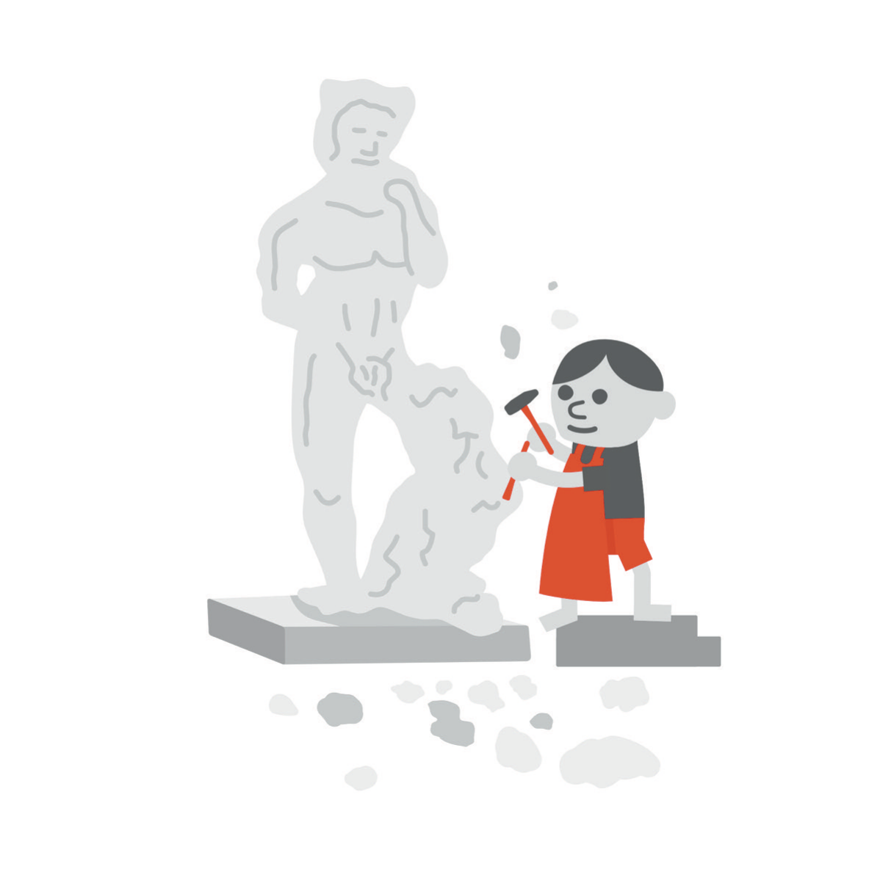
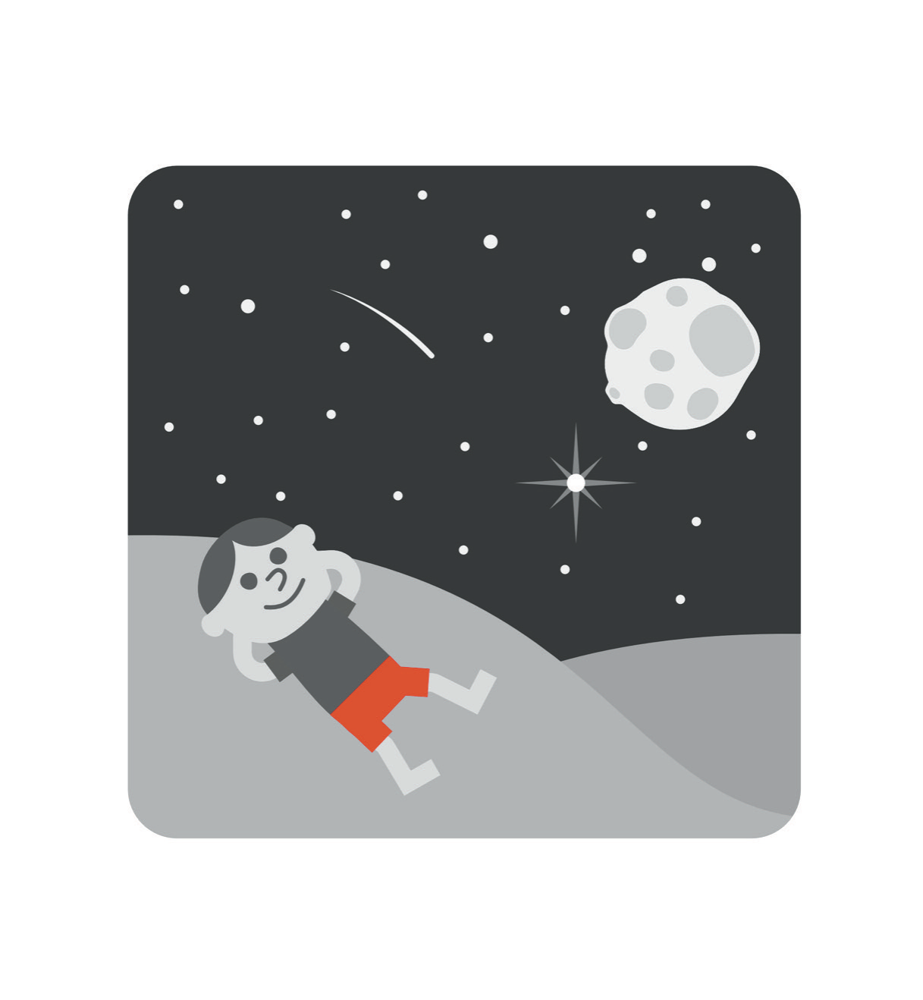

# Ambition After Collapse

I would like to be able to tell you that I came out of the worst years of my life wanting less. It would make a tidier book. The man who wrote the first edition wanted everything at once, and a reader who has followed him through the middle of this one has every reason to expect the sequel to end with a smaller, quieter person who has learned to want nothing more than a quiet garden. I am not that person. A man who once wrote an entire book about how to solve a Rubik's Cube faster is not going to be cured of wanting to solve things, and I have stopped apologizing for the appetite. What I have done instead is spend several years learning what it is for and where it is allowed to burn.

I still love building. I love a repair on a face that closes the way I drew it on the skin ten minutes earlier, with the tension where I wanted it and a patient's daughter exhaling in the corner. I love a good idea at four in the morning, and new technology, and the peculiar satisfaction of a spreadsheet that finally balances, and the company of people who look at the current version of anything and assume it can be improved. None of that went away when I got sick, and none of it went away when I got well. If anything, recovery sharpened it, because for a while I could not build anything at all, and a man who cannot do the thing he is made for learns exactly how much of him it was.

So this chapter is not a renunciation. The first edition held that ambition was fine and the world was the problem; the middle of this book holds that the world was part of the problem and so was the way I was running. What remains is to say what ambition looks like once you have watched what it can do when it gets loose. The introduction put it in one image: fire in a fireplace heats the house, and the same fire on the living-room floor burns it down. I want to take that image apart here, because it turns out to be more mechanical than it sounds, and the mechanics are where I went wrong.

* * *

In 2021 I wrote about the fire as something to be protected. A lit candle, I said, could be blown out by a draft or a closing door, and the work of burning in was to shelter that small flame and feed it, with paper, with wood, with rocket fuel if you had it, until it was strong enough to keep a house full of people warm. Read that passage again with the middle of this book behind you. Every sentence in it is about the fire going out, and not one is about the fire getting out. I had identified the wrong risk, with the confidence of a man who has never watched a room burn.

A fire needs fuel, oxygen, and heat, and it will take all three from wherever it can get them. What a fireplace does is not make the fire smaller. A fire in a good fireplace can burn hotter and longer than a fire on the floor, because the flue pulls air across it and the smoke has somewhere to go. What the fireplace does is decide, in advance, what the fire is permitted to consume. The hearth is stone because stone does not burn, and the firebox is lined with material that can take the heat without becoming fuel. A screen stands in front because a fire throws sparks whether or not you approve, and a chimney rises above because the by-products of burning are poisonous in a closed room. Every one of those parts was designed by someone who took the fire seriously enough to assume it would misbehave.

Put a life into that picture and the parts have names you already know from earlier chapters. The stone floor is margin, the money and the white space that do not burn when the year goes badly. A flue is the one person who gets told the actual state, so that what the fire produces leaves the room instead of filling it. Screens are boundaries, decided on a calm day and enforced on a hard one. And the chimney is a physician who is not you, because the by-products of running hot are exactly the ones you cannot smell from inside. None of these parts limits the fire. I want to be precise about that, because I spent years believing that anyone who told me to build a container was telling me to burn smaller. They were telling me to burn on stone.

I did not have to look far for a model; there was one in the room where I work. Fire is a listed hazard in operating rooms, and surgeons are trained to think about it, because the cautery I use to stop bleeding is an ignition source, the skin prep is often alcohol-based, and oxygen may be flowing under a drape near a patient's face. Surgery's response to this was not to give up cautery. It was to let the prep dry before the first cut, to keep the oxygen away from the spark, to know where the saline is, and to make it everyone's job to say something. The profession assumed, in other words, that a controlled burn would sometimes get out of control, and it designed the room accordingly. I had been designing my life as if that could not happen to a competent person. Competence had nothing to do with it. Fuel, air, and heat do not check credentials.

How you know the fire is on the floor is the hard part, because the flame itself looks the same. The surgery goes well, the deals close, the calendar is full, the book comes out. For a while the room is warmer than it has ever been and everyone who walks in comments on it. You do not learn that the fire is on the floor by looking at the flame; you learn it from the smoke, and the smoke in my case had a specific composition. Sleep went first. The hour that had been mine went next, to other people's schedules. After that, decisions with a lot of zeroes in them were being made by a man who had been awake since three, and the rooms I spent my time in stopped containing anyone who disagreed with me. Finally I stopped telling anyone the actual state, not because I decided to, but because there no longer seemed to be a version of it that would fit in a sentence. Each of those was visible from outside, and each was explained away from inside as the cost of doing something ambitious.

That is why the last piece of the container is a rule about who is allowed to say so. In an operating room, the rule I trust is that anyone in the room can call it, including the person who has been there a week, because the surgeon bent over the field is the one person who cannot see the drape smoldering behind him. The same rule has to hold in a life, and it has to be set in advance, because the person with the fire is the least qualified judge of it. I have given two people the standing right to tell me the fire is on the floor, and I agreed, on a calm day, to treat what they say as information rather than as an attack. I would like to report that I take it gracefully. I take it. That will have to do for now.

* * *

There is a version of intensity I learned in training and a version I learned later, and the difference between them is the difference between the floor and the hearth. Surgical training taught me to binge. You stayed until the work was done, you slept when the work allowed, and the reward for surviving a stretch like that was another one. I do not say this to complain about residency, which I have done elsewhere, and the people who trained me were doing what had been done to them. I say it because the binge model followed me out of the hospital and into every other room I entered. I wrote the first edition of this book at four in the morning, at speed, in the same months when I was buying property at speed and walking into new rooms at speed, and I called all of it discipline.

The other kind of intensity I already had and did not recognize. A day of Mohs surgery is not gentle: case after case, each one a cancer to remove, margins to read under the microscope myself, and a face to rebuild before the next patient's anesthetic wears off. Every case takes everything I have for as long as it takes. Then the day ends, and the next morning there is another one, and I can do it again, because nothing about the day borrowed from tomorrow. That is the whole test, and it is simpler than anything in the first edition: can I do this again tomorrow, and the day after, without taking the fuel from sleep or from the people who live with me? Binge intensity always borrows. Sustainable intensity is paid for as it goes. The fire is exactly as hot either way; the difference is what it is standing on.

* * *

Surgical training has a ritual for failure that I wish the rest of my life had: a regular conference at which the complications of the week are presented, by the surgeons who had them, in front of everyone. The case is described plainly, the outcome is stated without softening, and the question on the table is what should have been done differently. A surgeon who presents a case is not, by presenting it, a bad surgeon. A surgeon who never has a case to present is either the luckiest person in the building or is not telling anyone, and the room understands the difference. The whole institution rests on the assumption that failure, examined in public, is among the most valuable things a hospital produces.

I did not have that conference for the collapse. I had the opposite: a set of events I discussed with attorneys and almost no one else, at hours when nothing gets examined and everything gets rehearsed. It took me years to present the case to myself in the register I would use for a patient, and when I finally did, it was short. A surgeon with earned confidence in one field entered transactions in another, at a pace set by people whose charts all pointed up, on very little sleep, in rooms without dissent, and told no one his actual state. Findings: exposure he believed could approach ten million dollars, a depression nobody was permitted to see, and a fall he did not expect to survive. I have told that story already and will not tell it again here. What I want to add is the last line of any good case presentation, which is not a verdict on the surgeon but a list of what changes. The pace changes. So do the rooms. Secrecy ends. Sleep becomes a vital sign. Nothing on that list requires me to want less, and every item on it requires me to burn on stone.

The trap, and I have written a whole chapter on it, is to hear a case presentation as a sentence. "I am a failure" is not information. It is a mood dressed up as a finding, and it tells you nothing about what to change, which is exactly why it is so easy to say at four in the morning. The information is in the particulars: this pace, these rooms, this many hours of sleep, this many people who knew. Particulars can be changed. A verdict can only be served.

* * *

I closed the first chapter of the first edition with Michelangelo. I wrote that he had not carved the David from a raw block: another sculptor had been commissioned decades before Michelangelo was born and had given up halfway, others had tried over the years to finish the work, and only Michelangelo, "when he took over the project in 1521," had the vision to complete the story. Then I told the reader to be the creator of his own life and to chisel it out of marble like the precious work of art it was.

The record is better than my version of it, and different in ways that matter. The block was quarried for Florence Cathedral. Agostino di Duccio began working it in 1464 and abandoned it. Antonio Rossellino took it on in 1476 and also gave up, reportedly because of the quality of the marble itself. The block then sat in the cathedral workshop yard for about twenty-five years, already cut into, before it was given to Michelangelo in 1501, and he finished the statue in 1504.[^c14-1] There was no 1521. I had the date wrong by twenty years, and I had it wrong in the way that people who are sure of themselves get things wrong, which is without checking.

In the first edition I got the dates wrong and the point right. I got the point wrong too. I said: be the creator of your life, carve it from marble. I did not say: the block will have holes in it. By the time you are the one holding the chisel, two other people have already made cuts you cannot undo, the stone has a flaw that made a competent sculptor walk away, and it has been sitting in the weather for a quarter of a century. That was the block Michelangelo actually received, and the thing I admire most about him now is not the vision. It is that he did not send it back. He worked with the cuts that were already there and did not wait for a clean block to arrive, and neither will you, because clean blocks are not delivered to adults. Some of the cuts in mine were made by circumstances I did not choose. The deepest ones I made myself, and I am still carving on the same stone.

* * *

At the very end of the first edition, after the reading lists, I promised the reader three things to carry out the door. Keep a beginner's mind. Be kind. Think critically, for yourself. I have kept all three, and I have already said in this book that I need them more now than I did then. What I want to do here is say what each one costs, because in 2021 I offered them as if they were free.

Beginner's mind, as I described it then, meant looking at a thing as though you were brand new to it even if you had been doing it for thirty years. Patients and diseases do not read textbooks. There are rare presentations of common diseases and common presentations of rare diseases, and a complication rate of one percent is one hundred percent for the patient it happens to. I stand by every word of that and use it daily. The spot that does not look like the picture in the atlas is the one that keeps me in the exam room an extra minute, and the extra minute is most of what I have to offer anyone.

What I did not notice was the paragraph that followed. In the same section, as an illustration of beginner's mind, I praised people in real estate who were doing in a month what the industry said took a year, because nobody had told them it could not be done, and I admired them for being free of the limits that dogma and mediocre results had placed on everyone else. Then came the four-minute mile: for a long time people thought it could not be run, then Roger Bannister ran it in 1954, and others followed. I read that passage now as a warning I wrote and did not hear. Some limits are in the mind. The mile did not get any shorter. Beginner's mind is not the absence of limits; it is the willingness to look at what is in front of you without having already decided what it is, and the hardest thing to look at that way is a chart that has only ever gone up. A beginner would have asked why.

The other place beginner's mind failed me was closer to home. I had a diagnosis ready for myself long before I had examined the patient, and it was a familiar one, the kind I had seen in training and written a book about. It was the wrong diagnosis, or at best an incomplete one, and I have described in Chapter 6 what the fuller picture turned out to be. Call it a common presentation of a rare disease in a physician who only had eyes for the common one. The extra minute I give my patients I did not give myself. That is what beginner's mind costs: the extra minute, spent on the case you are most certain about, which is always your own.

Be kind, I wrote, and be kind to yourself first, and then I printed a sample of what my own head sounded like, which I am not going to reprint here because it has a chapter of its own. What the first edition gave was the instruction; what it lacked was the method, and the method I use is a single test. When the voice starts, I ask whether I would allow anyone to speak that way to a patient in my chair, or to a resident on the first day of July, or to one of my children. The answer is always no, and the no is useful, because it locates the voice as something I am permitting rather than something that is true. Kindness to yourself, it turns out, is not a feeling. It is a refusal to staff the inside of your head with people you would fire.

Then there is kindness to everyone else, and here I owe you the confession I made in 2021, because it is still true of the man I can become. When someone cut me off in traffic, or did not see me in the left lane, or drove too slowly, I would gun the engine, flip them off, honk, brake-check them, and speed away. In the grocery store I sighed loudly at the woman ahead of me who had too many items. I wrote then that these things came from my ego and my selfishness, and they did. I would add now that they were also smoke. A man who brake-checks a stranger is a man running hot with nothing under him, and the unkindness was the earliest and cheapest signal I had that the fire was on the floor. I did not read it then. I read it now, and on the days I catch myself being short with the front desk, or narrating the failings of the driver ahead of me, I have learned to ask not what is wrong with them but how much I have slept.

The other half of the practice is that kindness is not a mood I wait for. Most days I operate on the faces of people in their eighties and nineties, with a daughter in the corner who has driven a long way and is not yet sure about me. What that patient needs from me is not warmth I happen to be feeling. It is a procedure: her name, her hand, the plan explained twice, the truth about how much I am going to take, and my whole attention for as long as she is in the chair. I do it whether or not I feel like it, the way I scrub whether or not I feel like it, and the feeling usually shows up somewhere in the middle. Kindness practiced as a procedure is more reliable than kindness practiced as a virtue, and it survives the days when the virtue is nowhere to be found.

* * *

Think critically, for yourself. In medical school I was taught never to inject lidocaine with epinephrine into a finger, a nasal tip, an ear, or any other site at the far end of its blood supply, for fear that the vasoconstriction would kill the tissue. My fellowship director in Mohs surgery repeated the warning. Plenty of physicians still believe it and use plain lidocaine instead, which is worse on every count that matters in surgery: you lose epinephrine's effect on bleeding, you are limited in how much anesthetic you can safely give, and you operate in a field that keeps filling with blood. The fear was dogma, handed down from one generation of doctors to the next with no valid evidence behind it. A plastic surgeon named Donald Lalonde and his colleagues eventually did the work, following more than three thousand consecutive cases of elective epinephrine use in the fingers and hand, and what they found supported the conclusion that the fear had never had the evidence it claimed.[^c14-2]

There are others. Every textbook says that the way to sample a spot that might be a melanoma is to cut the whole thing out, and most board-certified dermatologists I know, when they are worried about melanoma, do a deep shave instead, because in trained hands it works. That is not an invitation to shave your own; it is a statement about who should be holding the blade. Then there is isotretinoin, the acne drug most people know as Accutane, which many surgeons still believe impairs wound healing so badly that any procedure must wait six months after the last dose. I asked in 2021 for the study that shows this and said I would gladly wait if someone produced it. I am still waiting, and I still suspect it is a theory that hardened into a rule because nobody went back to check.

I still believe all of that, and I want you to notice what the examples have in common. Every one of them is a place where I applied critical thinking to somebody else's rule. I was very good at that. I could spot an unexamined assumption in a textbook from across the room, and I took a certain pleasure in being the person who asked for the study. What I did not do, in the years this book is about, was turn the instrument on myself. I did not ask of my own transactions the questions I ask of a journal article: who ran this, who benefits if I believe it, what would the numbers look like if the conclusion were false, and what happens to the patient in the one percent. I did not ask of my own mind the questions I ask of a patient's: how long has this been going on, has it been like this before, who else has noticed, and what have you been taking. Critical thinking is not a trait. It is a direction you point something, and I had it pointed outward for the whole of the crisis, like a man checking every exit in the building except the one he is standing in.

That includes this book. I said so in the introduction and I mean it more here, near the end, because by now you have spent enough hours with me to be tempted to take my word for things. Do not. I have already shown you one date I got wrong in print and one diagnosis I got wrong on myself, and I have no reason to believe the errors stopped there. Ask for the study. Ask who benefits. Take what survives the questions and leave the rest, and if you find the mistake, I would like to hear about it, which is a sentence the man who wrote the first edition would not have meant.

* * *

The hour I wrote about in Chapter 9, the one that was mine, then belonged to lawyers, and is mine again, is also the hour I go outside. In the first edition I mentioned that on those early walks I might see a shooting star, or a bird, or some new flower in a yard I had passed a thousand times, and that when I went outside I was floored by it. That is still true, and it may be the only paragraph in that book I would not change a word of. The difference is in what I do with it afterward. The man who wrote it would have converted the star into a lesson before he got back to the driveway: the same atoms, the same code, everyone connected to everything. It was not a bad lesson. It was just one more thing I was building.

Now I let the sky be the sky. A shooting star, if I am lucky enough to catch one, is a bit of rock burning up in the upper air, and it is also the most beautiful thing I will see that day, and I do not need either fact to mean anything about me. That, I think, is beginner's mind in its purest form: attention that is not already drafting the conclusion. It is also the one kind of wonder I trust now, because it asks nothing of the universe and makes no claims on my behalf. I stand in the dark for a minute with my hands in my pockets and my fire, for once, entirely contained, and then the light starts to come up over the yards I have walked past a thousand times.

Then I go back inside, because there is a small boy in the house who will be awake soon, and who has taught me more, without meaning to, than the star ever did. Most of what I know now, I know because I am somebody's father.
