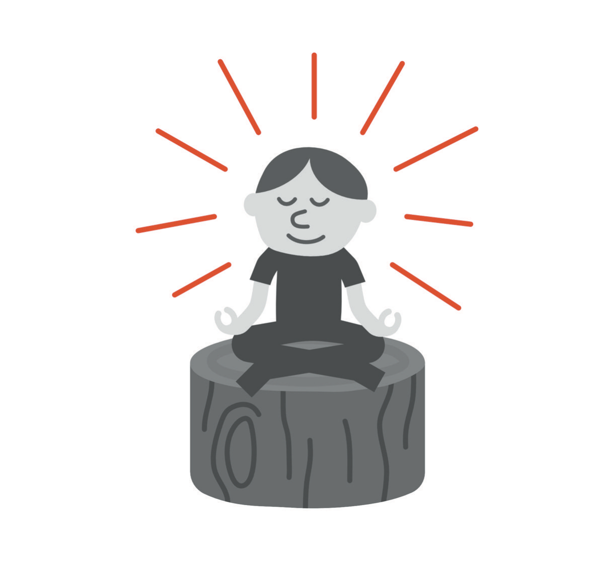

# Still Here

The bush isn't much to look at. It's the kind of shrub that gets planted in quantity around the edge of a parking area because it's cheap and hard to kill and nobody will ever look at it: waxy, dark, unremarkable, the horticultural equivalent of beige paint. Nobody chose it for its qualities. Somebody chose it because it fills space.

I didn't go back for years. When I did, I wasn't on a pilgrimage. I'd been nearby for an unrelated reason, and I found myself walking over the way you drive past a house you used to live in.

There was still a hollow in it. That surprised me more than anything else about the visit. The branches had gone in and never come back out; there was a shape in the middle of that shrub, roughly the size of a man, that the plant had simply grown around. Whatever it does with its remaining years, it's going to do them with that gap in the middle. And down in the hollow, in the space my body made, there were flowers. Small ones. Not planted, not tended, not remarkable to anybody who didn't know what the hole was. They were growing in the one part of that shrub where the light could get in.

I stood there for a while. To report it accurately: I didn't feel much. There was no weeping, no praying, no photograph, and I've never gone back again. What I mostly felt was the ordinariness of it: the sound of cars, the heat coming off the pavement, a piece of landscaping doing what landscaping does. Then I went and got in my car and drove home, and it was a Tuesday or something like a Tuesday, and I made dinner.

* * *

Here is what I've made of it since, and I have had a long time to think about it.

The hollow didn't close. That is the part I keep returning to. Nothing in that plant reached across the gap and knitted it shut, and nothing will. If you cut it down and counted, the missing years would be right there in the structure. It's not that the shrub healed and you can no longer tell. It's that the shrub kept growing, and the hole kept being a hole, and both of those are simply true at the same time.

I spent a great deal of my life believing that recovery meant restoration: you get sick, you get treated, and afterward you're returned to the person you were before, ideally with a lesson attached. That is what I'd have promised you in the first edition. It's not what happened. There is a gap in me where those months are. Certain things are still harder than they were, and certain sounds and hours still get a reaction out of my body before I have a vote. The man who wrote that first book isn't coming back, and for a while I waited for him.

What grew instead grew in the gap. Not over it. I don't have a tidy way to say this without sounding like the kind of author I've been trying not to be, so I'll say it flatly: the parts of my life that I now think are worth the most are in the space that got made. The way I'm with my children. What I'm willing to say out loud to another person, and how quickly. The fact that when a colleague tells me he is fine, I sometimes ask again. None of that existed in me before, and none of it required the hole to be filled in. It required light to get in, which isn't the same thing.

* * *

The other thing I've made of it is duller and, I suspect, more useful.

Time did that. Not insight, not courage, not a decision I made. On the roof I'd lost the ability to perceive a future; the illness had removed it, the way a bad enough fever removes appetite, and I have described how reasonable the conclusion sounded in its absence. Every one of the things that later turned out to matter, the treatment, the sentence said out loud, the slope that only became visible in retrospect, the small boy running cars along my legs, required one and only one ingredient, and it was time. It was the single thing I couldn't manufacture by working harder and the single thing I nearly made permanently unavailable.

That is the whole of what I'd say to someone standing where I stood, and it isn't inspiring, and I don't care. You can't see the future from in there. Not because you're weak or because you have failed to think it through, but because the instrument that perceives futures is the instrument that is broken. Borrow someone else's for a while. Stay for the boring reason, which is that the situation won't hold still, and the only requirement for finding out what it turns into is being present when it does.

* * *

Several stories in this book don't have endings, and I want to leave them that way rather than tie them off.

Adrian's is his. He has a history, and it's written in his own body, and someday he will decide what to do with it and whom to tell. My job is to be a father, not a narrator, and this is where I stop.

The legal and financial one I have deliberately not narrated. Parts of it aren't mine alone to tell, and the parts that are mine are less interesting than everyone expects. What I've given you is the only piece that generalizes: what fear did to a competent man, and how long he could look fine while it did it.

Mine isn't finished either. I still get up early, and I'm still ambitious, more carefully than before but not one degree less; there are things I intend to build, and the pace I intend to build them at would have embarrassed me in 2021, which I now regard as a feature. There is a physician of my own, and there are people who will tell me I look terrible. I keep a calendar with white space in it that I defend like a case, and I haven't always defended it well, and that is going to keep being true.

* * *

The book that gave this one its name had a candle on its cover of ideas: a small flame you protect from drafts until it grows into a fire large enough to warm a house. I still like that image. I'd add only that a fire in a house needs a fireplace, and that the fireplace is the boring part of the story, made of brick and mortar, admired by nobody, and the reason the house is still standing.

So here is Burn In, one last time, in the version I had to survive to arrive at.

Keep your fire. It's not the problem, and the world doesn't need one more capable person talked out of wanting things. Build the container first, and build it out of the unglamorous materials: sleep, a body you look after, money that buys margin rather than proof, work designed so it doesn't depend on your mood, and a small number of people who have standing to tell you the truth and a time in the week when they can. Stay reachable, especially when the performance is going well, because that is precisely when nobody will check. And when the fire gets onto the floor, and it will, say so out loud, to a person, while you can still say it.

That is all I have. Somewhere near a parking structure I'm not going to name, there is a very ordinary shrub with a hollow in the middle of it and flowers growing in the hollow, and it's going about its business without any idea what it did. Nobody tends it. Nobody knows. It will be there this spring, doing the same thing it does every spring, whether or not anyone comes to look.

I'm still here too. Most mornings that is the entire report, and it turns out to be enough to build on.
